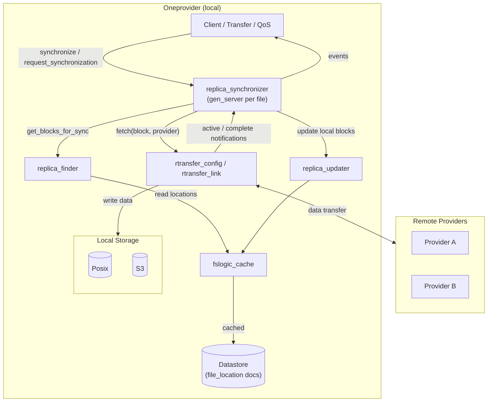

# Replica Synchronizer — Overview

The **replica synchronizer** is the per-file process responsible
for coordinating data replication in Onedata's Oneprovider. When a
file needs to be fetched from remote providers — whether triggered
by a user read, an explicit transfer, or QoS requirements — the
replica synchronizer decides which byte ranges to fetch from which
providers, starts the underlying rtransfer operations, tracks their
progress, and notifies callers when the requested data is locally
available.

## Architecture

## How It Works

You can think of the replica synchronizer as a download manager for
a single file. Here's the high-level flow:

1. **Request arrives.** A client, transfer job, or QoS check calls
   `replica_synchronizer:synchronize/7` (blocking) or
   `request_synchronization/7` (non-blocking) with a byte range.

2. **Process lookup.** The request is routed to the responsible node
   for the file (via consistent hashing) and delivered to the file's
   synchronizer process, which is created lazily on first request
   and registered via `gproc`.

3. **Block assignment.** The synchronizer calls
   `replica_finder:get_blocks_for_sync/2`, which examines all known
   file locations (local and remote), determines which byte ranges
   are missing locally, and assigns each missing range to a remote
   provider. Multiple providers can supply different parts of the
   file — the system naturally supports "torrent-like" multi-source
   downloads when partial replicas exist.

4. **Replication.** For each (provider, block) pair, an rtransfer
   fetch is started. These run in parallel across providers. As data
   arrives, the synchronizer updates the local replica.

5. **Completion.** When all blocks for a request are fetched, the
   caller is notified with the result.

6. **Idle shutdown.** If no requests arrive for a configurable
   period of inactivity and no replication is in progress, the
   process terminates.

## Key Design Decisions

- **One process per file, not per request.** Multiple concurrent
  requests for the same file share a single synchronizer process.
  This enables deduplication — if two callers request overlapping
  byte ranges, the underlying rtransfer job is started only once.

- **Stateless provider selection.** The block-to-provider assignment
  is recomputed from scratch on each call. This simplifies the
  algorithm but means the system cannot learn from past failures
  or balance load across calls (see improvement opportunities in
  [Provider Selection](provider_selection.md)).

- **Batched flushes.** Block updates and client events are cached
  in-process and flushed on timers (default: 1 second), avoiding
  per-block datastore writes.

## System Guarantees and Limitations

- The synchronizer guarantees that a caller receives a reply
  **only after** all requested byte ranges are locally available
  (for `sync` requests) or the fetch has been successfully started
  (for `async` requests).
- Replication from offline providers fails and may be retried with
  exponential backoff, but the system **does not currently check
  provider online status** before attempting a fetch.
- Provider selection **does not balance load** — the same provider
  is consistently preferred due to deterministic sorting by
  provider ID.
- The per-process idle timeout (configurable; see lifecycle docs)
  means that frequent small reads to the same file reuse the
  process, but sporadic reads pay the process startup cost each time.

## Next Steps

- **[Provider Selection and Block Assignment](provider_selection.md)**
  — detailed algorithm walkthrough with diagrams, covering how
  blocks are assigned to providers, multi-provider replication, and
  all improvement opportunities.
