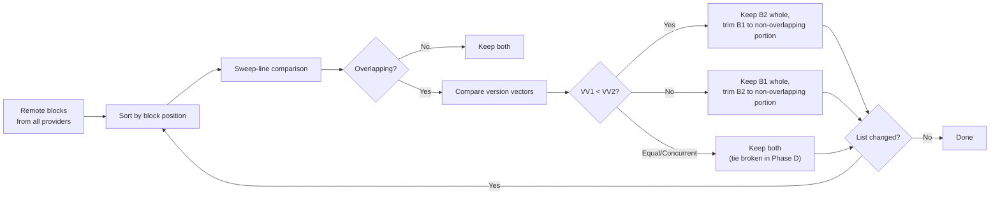
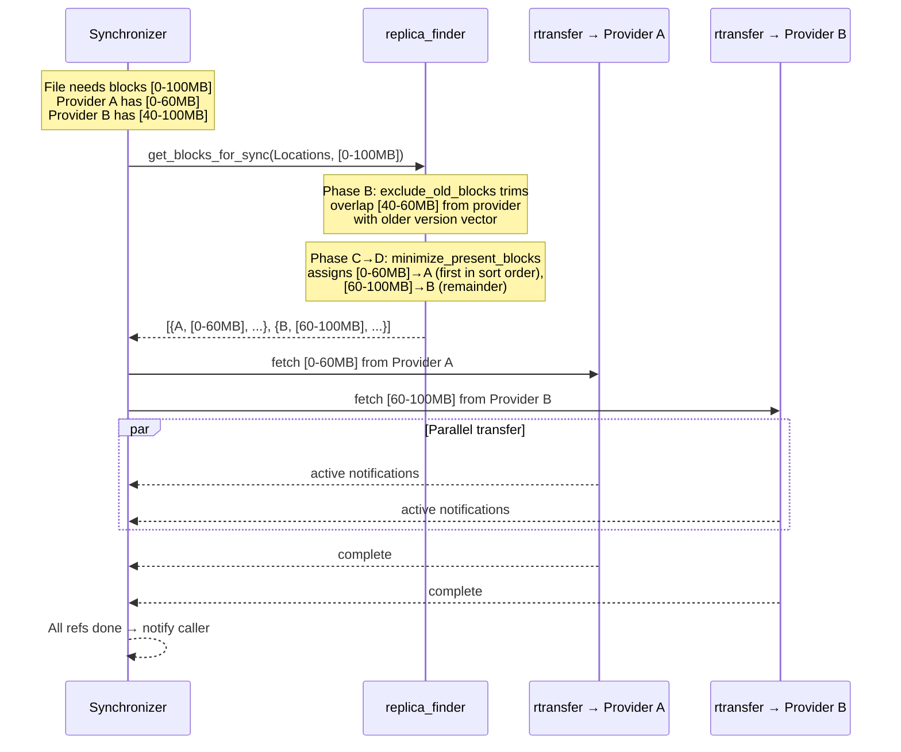
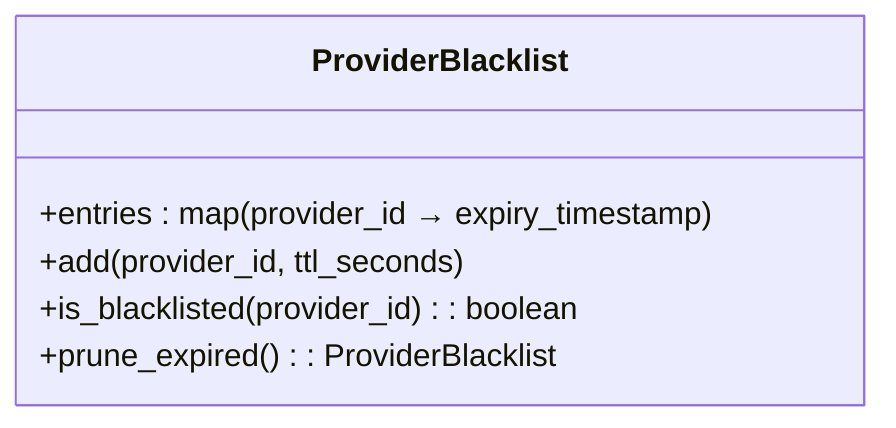
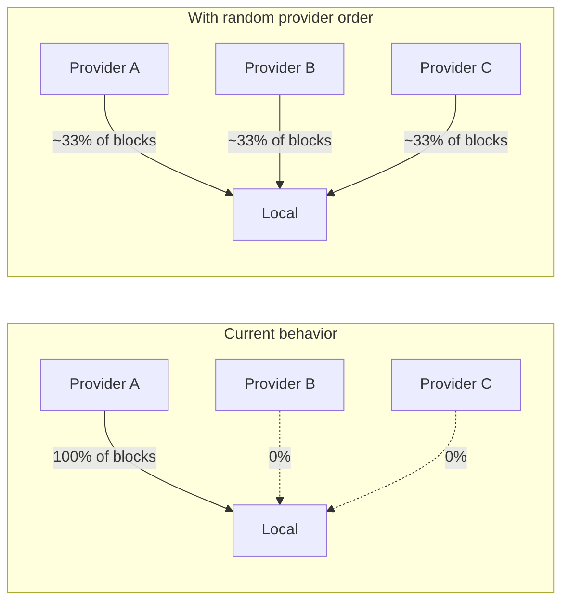

# Replica Synchronizer — Provider Selection and Block Assignment

This document describes how the system decides **which provider to
fetch each byte range from** during file replication. This logic
lives primarily in `replica_finder`, called from
`replica_synchronizer:start_transfers/5`. It is the most critical
area for potential improvements to transfer efficiency, resilience,
and fairness.

## Key Concepts

- **Blocks** — byte ranges represented as `#file_block{offset, size}`
  records. The system operates on sorted, non-overlapping block
  lists.
- **File location** — a datastore document
  (`#file_location{}`) describing which byte ranges (blocks) a
  provider holds for a given file, along with a version vector.
- **Version vector** — per-location vector clock used to determine
  which provider has the most up-to-date data for a given block.
- **Requests list** — the output type of provider selection:
  `[{ProviderId, Blocks, {StorageId, FileId}}]`, specifying
  exactly which blocks to fetch from which provider.

## Algorithm Overview

The provider selection is **stateless** — it reads the current
file location documents from the `fslogic_cache` and computes a
block assignment from scratch on each call. The algorithm runs
inside the synchronizer process (which does hold state), but the
selection itself does not depend on any prior selection history.

The algorithm runs in four phases:

| Phase | Question answered |
|---|---|
| [**A — What do we need?**](#phase-a--what-do-we-need) | Which byte ranges are missing locally and must be fetched? |
| [**B — What do remote providers have?**](#phase-b--what-do-remote-providers-have) | Which fresh blocks does each remote provider hold? |
| [**C — Who can contribute what?**](#phase-c--who-can-contribute-what) | What portion of `BlocksToSync` can each provider supply? |
| [**D — Final assignment**](#phase-d--final-assignment) | Assign disjoint ranges to providers; align to storage blocks. |

The two most critical operations are `exclude_old_blocks` (Phase B,
ensures data freshness) and `minimize_present_blocks` (Phase D,
determines the actual provider assignment).

## Algorithm Detail

### Phase A — What do we need?

The algorithm starts by separating local and remote file location
documents. Local blocks are subtracted from the requested range to
produce `BlocksToSync` — the byte ranges that must be fetched from
remote providers.

Blocks beyond the local file size are also removed
(`truncate_to_local_size`), as the local provider may not yet know
the full file extent.

### Phase B — What do remote providers have?

These steps build a **catalog of available remote blocks**: the set
of fresh, aggregated blocks each remote provider currently holds.
This catalog is built independently of `BlocksToSync`; the
intersection with what we actually need is deferred to Phase C.

#### Exclude Outdated Blocks (`exclude_old_blocks`)

Remote blocks are filtered by version vector comparison. When two
providers have overlapping blocks, the one with the **older**
version vector has its overlapping portion removed. This ensures
that data is always fetched from the provider with the most recent
version.



The comparison uses `version_vector:compare/2` which returns
`lesser`, `greater`, or `identical`/`concurrent`. When versions are
concurrent, both blocks are kept — the tie is broken later by
`minimize_present_blocks`.

> [!NOTE]
> The algorithm is a **sweep-line with recursion**: it re-sorts and
> repeats until the list stabilises. With many pairwise-overlapping
> blocks across many providers this may require multiple passes.

#### Sort and Aggregate

Remote blocks are sorted by `{ProviderId, [Block], StorageDetails}`.
This groups blocks by provider, and within each provider, blocks
are merged into consolidated ranges via `fslogic_blocks:merge/2`.

> [!WARNING]
> This sort is the **key determinant of provider priority**. Since
> sorting is lexicographic on the provider ID (a binary), the
> provider order is effectively determined by alphabetical order of
> provider IDs. This is neither random nor round-robin — it is a
> **static, deterministic order** that remains the same across all
> calls for the same set of providers.

### Phase C — Who can contribute what?

Phase C maps the remote catalog from Phase B onto `BlocksToSync`,
computing what each provider can actually contribute to the sync,
then removes redundancies before the final assignment.

#### Compute Present Blocks Per Provider

For each remote provider, the algorithm computes which portions of
`BlocksToSync` the provider can actually supply. This is the
intersection of what we need with what the provider has:

```
PresentBlocks = BlocksToSync - (BlocksToSync - ProviderBlocks)
```

The double-invalidation computes the intersection without a
dedicated intersection operation in `fslogic_blocks`. The result is
then consolidated (`fslogic_blocks:consolidate/1`) to merge any
adjacent ranges.

#### Consolidate Requested Blocks

Small holes between adjacent blocks assigned to the same provider
are filled if the provider has data covering the hole. This
optimization reduces the number of individual rtransfer requests
at the cost of fetching some already-present data. Controlled by
`rtransfer_min_hole_size` (default: 0; consolidation is active only
when this value is ≥ 2).

#### Filter Small Blocks

If a block from any provider is entirely contained within a larger
block from any other provider in the list, the smaller block is
removed. This avoids redundant fetches when one provider's data is
a strict subset of another's.

Providers with an empty block list after this step are also removed
before proceeding to Phase D.

### Phase D — Final assignment

#### Minimize Present Blocks (`minimize_present_blocks`)

Each provider receives only the portion of its available blocks not
yet claimed by an earlier provider in the list:

```
assigned ← ∅
for each (provider, available, storage) in providers:   -- sorted order from Phase B
    mine ← available \ assigned
    if mine ≠ ∅:
        emit (provider, mine, storage)
        assigned ← assigned ∪ mine
```

The table below shows two typical scenarios. Providers appear in the
order produced by Phase B (lexicographic by provider ID).

**Scenario 1 — overlapping replicas (only partial overlap is
contested):**

| Provider | Available | `assigned` before | Gets |
|---|---|---|---|
| `aaa-…` | [0–60 MB] | — | [0–60 MB] |
| `bbb-…` | [40–100 MB] | [0–60 MB] | [60–100 MB] |

The contested range [40–60 MB] goes entirely to `aaa-…` because it
appears first.

**Scenario 2 — all providers hold the complete file:**

| Provider | Available | `assigned` before | Gets |
|---|---|---|---|
| `aaa-…` | [0–100 MB] | — | [0–100 MB] |
| `bbb-…` | [0–100 MB] | [0–100 MB] | — (skipped) |
| `ccc-…` | [0–100 MB] | [0–100 MB] | — (skipped) |

> [!WARNING]
> **The provider whose ID sorts first lexicographically always wins
> contested blocks.** With identical replicas across N providers,
> one provider absorbs 100% of the load. This is the root cause of
> the load-balancing limitation described in the
> [Limitations](#current-limitations-and-improvement-opportunities)
> section.

#### Storage Block Alignment (`suite_to_storage_block_size`)

The final block list is adjusted to align with the local storage's
block size. Blocks are extended to cover full storage blocks if the
source provider has the data to fill the extension. If extension is
not possible, blocks may be split at storage block boundaries to
allow rtransfer to optimize I/O.

Controlled by:
- `synchronizer_block_suiting` (default: `true`)
- `synchronizer_block_suiting_min_size` (default: 0)

## Multi-Provider Replication (Partial Replicas)

The algorithm **inherently supports** fetching from multiple
providers when no single provider has the complete file:



The case where the file is split across two or more providers
**works correctly** because `get_blocks_for_sync` produces
per-block assignments covering the full requested range using data
from whichever providers have each portion.

## Current Limitations and Improvement Opportunities

### 1. No Online Status Check

**Status: Not implemented.**

The algorithm uses `file_location` documents to determine which
providers have which blocks, but it **never checks whether a
provider is currently online/reachable**. If a provider is offline,
the rtransfer fetch will fail with a `disconnected` error, which
triggers the retry mechanism (if configured).

**Impact:** Transfers to offline providers waste time on connection
attempts and backoff delays before falling back. If `MAX_RETRIES`
is 0 (the default), the transfer for that block range **fails
entirely** — even if another online provider has the same data.

**Recommendation:** Check provider connectivity (e.g., via
`provider_logic:is_online/1` or connection pool status) and
filter out offline providers inside `get_blocks_for_sync`.
This should be done **after** Phase B's `exclude_old_blocks` to
preserve version vector correctness, but **before** the sort and
`minimize_present_blocks` in Phase D.

### 2. Deterministic Provider Order (No Load Balancing)

**Status: Deterministic sort by provider ID.**

The sort in Phase B produces a **fixed order** based on
provider ID. Combined with `minimize_present_blocks` in Phase D
giving priority to earlier providers, this means:

- The same provider is always preferred over others.
- No load distribution across providers with identical data.
- No adaptation to provider load or network conditions.

**Recommendation — Random (simple):** Replace `lists:sort(RemoteList)`
in Phase B with a shuffle. Since the sort is on
`{ProviderId, [Block], StorageDetails}` tuples, shuffling at the
provider level would randomize which provider gets priority in
`minimize_present_blocks` (Phase D). This is trivial to implement
and provides probabilistic load distribution.

```erlang
%% Instead of:
SortedRemoteList = lists:sort(RemoteList),

%% Shuffle at provider granularity:
GroupedByProvider = group_by_provider(RemoteList),
ShuffledProviders = lists_utils:shuffle(GroupedByProvider),
SortedRemoteList = lists:flatmap(fun({_P, Items}) ->
    lists:sort(Items)
end, ShuffledProviders),
```

> [!NOTE]
> The sort within each provider's block list should be
> preserved — `fslogic_blocks` operations expect sorted blocks.
> Only the **inter-provider order** should be randomized.

**Recommendation — Round-robin (moderate complexity):** The
provider order could be determined by the synchronizer's state,
cycling through providers on successive calls. Since
`start_transfers` is called from the synchronizer process (which
has state), this would require passing a "preferred provider
offset" to `replica_finder` or reordering the result. The
`replica_finder` API would need a minor extension.

**Recommendation — Torrent-like with batch randomization
(simplest effective approach):** Rather than randomizing provider
order within a single file's block selection, randomize the
**order in which files are processed** within a transfer batch.
If a batch transfers files A, B, C, D from the same providers,
random ordering naturally spreads load across providers because
different files may have different replica distributions. This
requires changes at the transfer scheduling layer, not in
`replica_finder`.

### 3. No Provider Blacklisting

**Status: Not implemented.**

When a transfer from a provider fails, there is no mechanism
to deprioritize that provider for subsequent attempts (within
the same synchronizer process lifetime or globally). The retry
mechanism simply calls `start_transfers` again, which runs the
same deterministic algorithm and may pick the same failing
provider.

**Recommendation:** Maintain a per-process blacklist with TTL
in the synchronizer state:



On transfer failure for a specific provider:
1. Add the provider to the blacklist with a configurable TTL.
2. Only blacklist if **other providers with the needed blocks
   exist** — never blacklist the only available source.
3. Pass the blacklist to `replica_finder` to filter providers
   before `minimize_present_blocks`.

The blacklist should be **per-process** (not global) to avoid
one file's failure affecting all other files. The TTL handles
transient failures gracefully.

### 4. Torrent-Like Transfer Optimization

**Status: Partially supported by the algorithm's design.**

The system already supports multi-provider transfers (see section
above). However, it does not actively **prefer** spreading load
across providers. With the current deterministic ordering, even
when multiple providers have the data, one provider absorbs most
of the load.

The randomization approach described in point 2 would enable
torrent-like behavior without architectural changes:



When providers have **partial, non-overlapping replicas**, the
system already distributes load across them — torrent-like
behavior is automatic in that case. The improvement opportunity
is specifically for the case where **multiple providers have the
same complete (or overlapping) data**.

## Algorithm Correctness Considerations

### Does the Sort Order Affect Correctness?

**No.** The sort in Phase B serves only to group blocks by provider
for aggregation. `minimize_present_blocks` produces a valid
disjoint cover regardless of provider order — it only affects
**which provider is preferred** when multiple providers can supply
the same block. Shuffling or reordering providers does not break
correctness.

### Can Version Vector Comparison Produce Gaps?

In theory, if version vectors are **concurrent** (neither lesser
nor greater), Phase B's `exclude_old_blocks` keeps both versions.
Phase D's `minimize_present_blocks` then assigns the block to
whichever provider comes first in the sorted order. Since both
versions are valid (neither is outdated), this is correct — the
system fetches one valid version.

### What If No Provider Has All Requested Blocks?

The algorithm handles this naturally. Each provider contributes
whatever subset of blocks it has. If the union of all providers'
blocks does not cover the full requested range, the uncovered
portions are simply not included in the requests list. The
synchronizer will report success only for the blocks that were
actually fetched. The caller's requested range may remain
partially unfulfilled — this manifests as a sync that completes
without error but with incomplete local data.

> [!WARNING]
> If no remote provider has a particular byte range at all, that
> range is silently skipped. There is no explicit "block not
> available anywhere" error. The caller receives a
> `file_location_changed` for whatever was successfully synced.

## Code Entry Points

The provider selection algorithm can be traced through these
entry points:

- `replica_synchronizer:start_transfers/5` — entry point, calls
  `replica_finder:get_blocks_for_sync/2` and creates rtransfer
  jobs from the result.
- `replica_finder:get_blocks_for_sync/2` — the main algorithm,
  producing the disjoint provider-to-blocks assignment.
- `replica_finder:minimize_present_blocks/2` — Phase D: produces
  the disjoint provider-to-blocks assignment.
- `replica_finder:exclude_old_blocks/2` — Phase B: version-vector-based
  filtering of outdated remote blocks.
