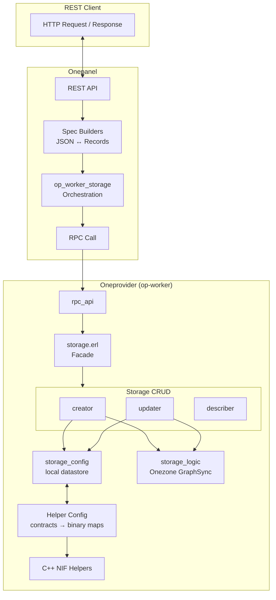

# Storage Configuration Architecture Overview

Storage configuration is the subsystem that governs how Onedata manages
storage backends — adding, modifying, describing, and removing them across
the distributed system. It is the interface between REST clients, the
Onepanel API, and the op-worker business logic that configures actual I/O
against S3, POSIX, Ceph, and other backends. Understanding this subsystem
is essential for anyone working on storage CRUD, helper configuration, or
adding new storage types.

## Key Concepts

- **Storage backend** — A configured backend (S3 bucket, POSIX mount, Ceph pool,
  etc.) that Onedata uses to store file data. Each storage has a unique
  ID, name, type, and configuration.

- **Helper** — A C++ object in op-worker that performs actual I/O
  operations on a specific storage backend via NIF calls. Each storage
  type has a corresponding helper (e.g. `s3`, `posix`, `ceph`).

- **Helper config** (`#helper_config{}`) — An Erlang record storing the
  helper's name, args (configuration), and admin_ctx (credentials), all
  as flat binary maps for the C++ NIF. The helper_config system
  translates typed contract records into this format.

- **Storage configuration contracts** — Typed Erlang records
  (`#storage_create_spec{}`, `#storage_update_spec{}`,
  `#storage_description{}`) that define the API between onepanel and
  op-worker. Defined in op-panel-contracts, they ensure consistent
  request/response shapes at compile time.

- **Storage path type** — `flat` (UUID-based paths on storage) vs
  `canonical` (mirrors logical file paths). Chosen at creation time and
  immutable thereafter.

- **LUMA** — Local User Mapping, a separate subsystem for mapping
  Onedata users to storage-native credentials (out of scope for this doc
  set).

## Architecture Diagram

## Component Roles

| Component              | Repository         | Role                                       |
|------------------------|--------------------|--------------------------------------------|
| op-panel-contracts     | op-panel-contracts | Shared typed contracts (records)            |
| Spec Builders          | onepanel           | REST JSON ↔ contract record translation   |
| op_worker_storage + RPC | onepanel           | Orchestration: build spec → single RPC     |
| storage.erl            | op-worker          | Central facade for all storage operations  |
| Storage CRUD           | op-worker          | Create, update, describe logic with validation and diagnostics  |
| Helper Config          | op-worker          | Translate contracts → flat binary maps for C++ helpers    |

## How It Works

A typical create flow starts when a REST client sends a POST request with
storage parameters. Onepanel parses the JSON, validates it against the
REST model, and passes it to `op_worker_storage:add/1`. The spec builder
translates the camelCase map into a typed `#storage_create_spec{}` record.
A single RPC call sends this record to op-worker.

In op-worker, `rpc_api` delegates to `storage:create/1`, which invokes
`storage_creator:create/1`. The creator builds a `#helper_config{}` from
the contract via `helper_config:build/1`, runs verification and
diagnostics, registers the storage in Onezone via `storage_logic`, and
persists the helper config locally via `storage_config`. If local
persistence fails after zone registration, the creator reverts the zone
entry to keep the system consistent.

## Motivation: Why This Architecture

The current design emerged from a refactor that addressed significant
architectural shortcomings.

**OLD**: Onepanel orchestrated many sequential RPC calls per storage
operation — `prepare_helper_args`, `prepare_user_ctx_params`, `new_helper`,
`new_luma_config`, `storage_create`, and various update RPCs. The panel
coordinated business logic it did not understand. JSON maps were passed
to op-worker, leading to runtime parsing failures and unclear contracts.

**NEW**: A single RPC call carries a typed contract record. Panel is a thin
REST translator. All business logic — validation, diagnostics,
persistence, zone coordination — lives in op-worker.

**WHY**: Better separation of concerns. Panel has no domain knowledge
about storage internals and should not orchestrate them. Typed records
catch errors at compile time instead of runtime. The single RPC
boundary simplifies debugging and evolution.

## Supported Storage Types

| Type      | Description                               |
|-----------|-------------------------------------------|
| posix     | Local POSIX filesystem mount              |
| s3        | Amazon S3 or S3-compatible object storage |
| ceph      | Ceph object storage                       |
| cephrados | Ceph RADOS (librados)                     |
| glusterfs | GlusterFS distributed filesystem          |
| http      | HTTP/HTTPS read-only storage              |
| nfs       | NFS network filesystem                    |
| nulldevice| Null device (test)                        |
| swift     | OpenStack Swift object storage            |
| webdav    | WebDAV protocol                           |
| xrootd    | XRootD protocol (HEP)                     |

## Next Steps

- [Storage Data Contracts](storage-contracts.md) — Record definitions,
  create vs update patterns
- [Storage CRUD Operations](storage-crud-operations.md) — End-to-end
  flows for create, update, describe, delete
- [Helper Configuration](helper-config.md) — Translation from contracts
  to C++ NIF parameters
- [Adding a New Storage Type](adding-new-storage-type.md) — Developer
  guide

## Related Documentation

- (Placeholder: link to parent architecture docs)
- (Placeholder: link to LUMA documentation when in scope)
- (Placeholder: link to Onezone / GraphSync overview)
