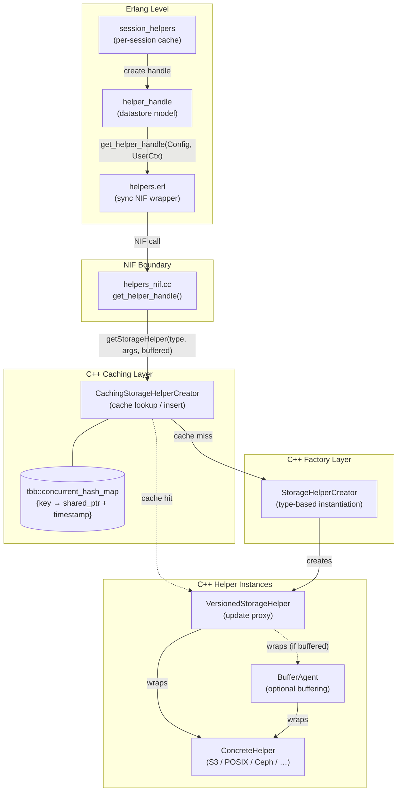
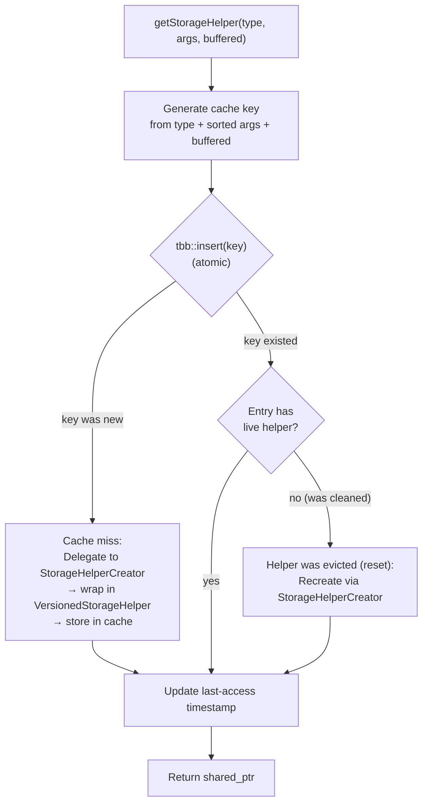
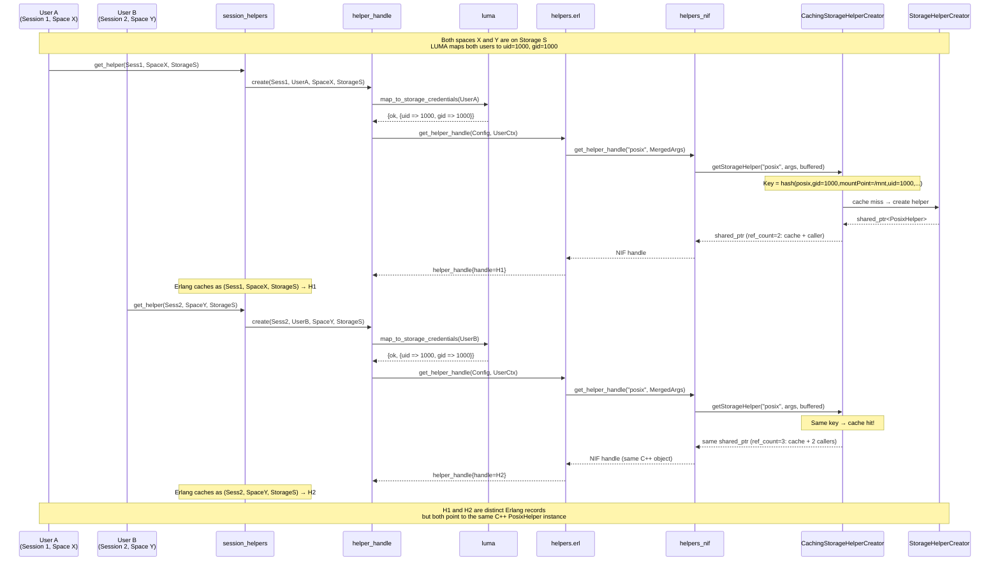
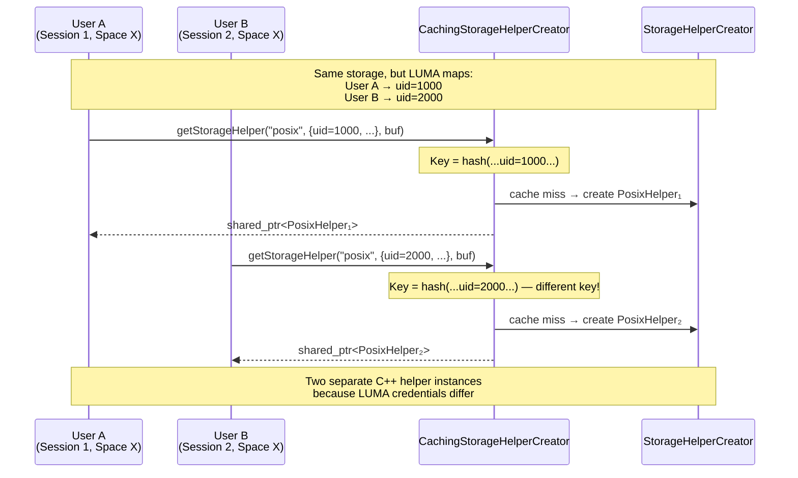
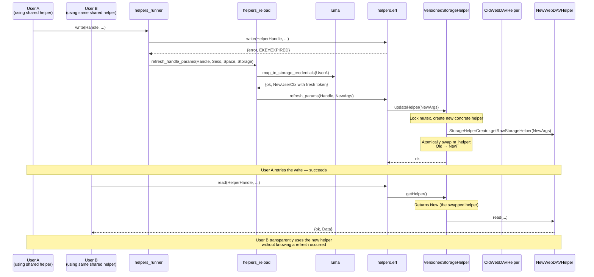
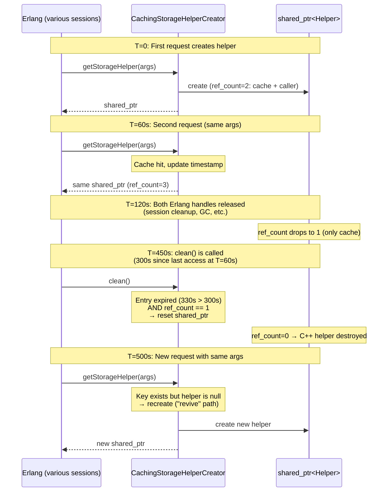

# C++ Helper Caching and Deduplication

The C++ helper caching layer (`CachingStorageHelperCreator`) deduplicates
storage helper instances at the NIF level. When multiple Erlang-level
helper handles request the same storage type with identical arguments
(including LUMA-resolved credentials), the C++ layer returns a single
shared `StorageHelper` instance instead of creating a new one. This
reduces memory consumption and connection overhead — particularly
important for backends like S3, Ceph, or WebDAV where each helper
instance may hold network connections or authentication state.

> **Complementary documentation**
>
> - [Helper Operations](helper-operations.md) — the Erlang-level handle
>   hierarchy (`sd_handle` → `helper_handle` → `file_handle`) and how
>   I/O operations flow to the NIF
> - [Helper Configuration](helper-config.md) — how `#helper_config{}`
>   and user context are built and merged into NIF arguments
> - [LUMA Credential Resolution](../luma/credential-resolution.md) —
>   how user credentials are mapped to storage-native credentials

---

## Key Concepts

- **Cache key** — A deterministic string derived from the helper type,
  all configuration arguments (sorted), the LUMA-resolved user
  credentials, and the `buffered` flag. Two requests with identical
  keys are guaranteed to describe functionally equivalent helpers.

- **Deduplication** — When a cache key matches an existing entry, the
  cached `shared_ptr<StorageHelper>` is returned. The Erlang caller
  receives a NIF reference to the same C++ object that another
  caller may already be using. Neither caller is aware of sharing.

- **`VersionedStorageHelper`** — A proxy wrapper around every
  concrete helper. It enables **in-place parameter updates** — when
  storage configuration changes (e.g., credential refresh), the
  proxy atomically swaps the underlying concrete helper. All sharers
  of the cached entry see the update transparently.

- **Expiry-based eviction** — Cached entries that have not been
  accessed for a configurable period *and* whose `shared_ptr`
  reference count is 1 (only the cache holds a reference) become
  eligible for eviction.

---

## Architecture

The caching layer sits between the Erlang NIF bridge and the original
`StorageHelperCreator` factory. Every `get_helper_handle` NIF call
passes through it.



### Component Roles

| Component | Role |
|-----------|------|
| `CachingStorageHelperCreator` | Decorator around `StorageHelperCreator`. Computes cache keys, performs lookup/insert on the concurrent hash map, manages expiry timestamps. |
| `tbb::concurrent_hash_map` | Thread-safe cache storage. Uses per-bucket locking via `accessor` objects — concurrent reads to different buckets do not block each other. |
| `StorageHelperCreator` | The original factory. Instantiates concrete helpers (S3, POSIX, Ceph, etc.) based on the `type` argument, optionally wrapping them in a `BufferAgent`. |
| `VersionedStorageHelper` | Proxy that delegates all `StorageHelper` operations to an internal concrete helper. Enables atomic replacement of the concrete helper via `updateHelper()` without invalidating the cache entry or any external `shared_ptr` references. |

---

## How It Works

### Cache Key Generation

The cache key is a hash derived from all inputs that define the
helper's identity:

```
key_string = type + ";" + sorted(arg₁=val₁;arg₂=val₂;…) + "buffered=" + 0|1
key  = format("{:016x}-{}", hash(key_string), type)
```

The arguments passed to the NIF are a **merge** of two maps
(`helper_config.erl`):

```erlang
build_helper_nif_args(HelperConfig, UserCtx) ->
    {ok, maps:merge(HelperConfig#helper_config.args, UserCtx)}.
```

- `HelperConfig#helper_config.args` — storage-level configuration
  (mount point, bucket name, endpoint URL, block size, timeout, etc.)
- `UserCtx` — LUMA-resolved credentials for the specific user
  (uid/gid for POSIX, access key for S3, OAuth2 token, etc.)

**Crucially, neither session ID nor space ID appear in the NIF
arguments.** The cache key is determined entirely by the storage
configuration and the resolved credentials. This means:

- Two users mapped to the **same** LUMA credentials share one
  C++ helper — even if they are in different sessions or spaces.
- Two users mapped to **different** credentials get separate
  C++ helpers — even if they access the same storage.

### Cache Lookup Flow



The `tbb::concurrent_hash_map::insert` method is atomic — it returns
whether the key was newly inserted or already existed. The `accessor`
object holds a per-bucket lock for the duration of the operation,
ensuring thread safety without a global lock.

### Cache Eviction

The `clean()` method iterates all cache entries and resets (nullifies)
those that meet **both** conditions:

1. **Expired** — time since last access exceeds the configured expiry
   (default: 300 seconds).
2. **Unreferenced** — `shared_ptr::use_count() == 1`, meaning only
   the cache itself holds a reference. No Erlang process is currently
   using this helper.

Evicted entries are not removed from the map — the key remains but
the `shared_ptr` is reset. If the same key is requested again later,
a new helper is created in-place (the "revive" path in the diagram
above).

> [!NOTE]
> The `clean()` function is exposed to Erlang as
> `helpers:clean_helper_cache/0` but is **not called
> automatically** by any periodic job. Cache eviction only occurs
> on explicit invocation — e.g., from a remote console or test.
> In practice, helpers stay cached for the lifetime of the
> application unless manually cleaned or the application restarts.

---

## Sharing Scenarios

The following scenarios illustrate when C++ helpers are shared or
separate, depending on how LUMA maps user credentials.

### Scenario 1 — Two Users, Same Credentials, Different Spaces

This is the most common deduplication case. Two users access
different spaces that are both supported by the same storage, and
LUMA maps both users to the same storage-native credentials (e.g.,
the same POSIX uid/gid or the same S3 access key).



**Why this happens:** The NIF args are `maps:merge(Config.args,
UserCtx)`. Since both users resolve to the same LUMA credentials
and the storage config is the same, the merged arg maps are
identical. The cache key is therefore identical, and the C++ layer
returns the same `shared_ptr`.

**Erlang is unaware of sharing.** `session_helpers` caches `H1`
and `H2` as separate `#helper_handle{}` records under different
keys (`(Sess1, SpaceX, StorageS)` and `(Sess2, SpaceY, StorageS)`).
The opaque NIF handle inside both records points to the same C++
object, but nothing in the Erlang code checks or depends on this.

### Scenario 2 — Two Users, Different Credentials

When LUMA maps users to different storage credentials, each gets
their own C++ helper instance — even on the same storage.



### Scenario 3 — Parameter Refresh on a Shared Helper

When an OAuth2 token expires (`EKEYEXPIRED`), the Erlang layer
regenerates credentials via LUMA and pushes them to the C++ helper
via `refresh_params`. Because the C++ helper is wrapped in a
`VersionedStorageHelper`, the update atomically replaces the
underlying concrete helper for **all** sharers.



**Key point:** The `VersionedStorageHelper` holds a `shared_ptr`
to the concrete helper behind a mutex. When `updateHelper()` is
called, it creates a new concrete helper and swaps the pointer.
Any in-flight operations on the old helper are safe — they hold
their own `shared_ptr` obtained before the swap via `getHelper()`.

> [!IMPORTANT]
> Because `VersionedStorageHelper::updateHelper()` uses the
> `StorageHelperCreator` directly (bypassing the cache), the
> refreshed helper is **not** subject to cache key matching. The
> cache entry still holds the same `VersionedStorageHelper` proxy,
> but its internal concrete helper has been replaced. This means
> the cache key (computed from the *original* args) may no longer
> match the *current* args of the helper inside.

### Scenario 4 — Cache Eviction Lifecycle



---

## Configuration

| Setting | Type | Default | Description |
|---------|------|---------|-------------|
| `helpers_cache_expiry_seconds` | `integer` | `300` | Minimum time (in seconds) since last access before a cached helper becomes eligible for eviction. Only takes effect when `clean()` is called. |
| `buffer_helpers` | `boolean` | — | Whether helpers should be wrapped in a `BufferAgent`. Affects the cache key (the `buffered` flag). |

Both settings are passed to the NIF during initialization via
`helpers_nif:prepare_args/0` and read from the op-worker application
environment.

---

## Implications for Erlang-Level Design

Understanding the C++ caching layer is important when reasoning
about the Erlang handle model and planning changes to it.

### What the Erlang layer sees vs. what actually happens

| Aspect | Erlang perspective | C++ reality |
|--------|-------------------|-------------|
| Helper identity | One `#helper_handle{}` per `(session, space, storage)` | Deduplicated by args — same credentials = same instance |
| `refresh_params` scope | "I'm refreshing my handle" | Affects all Erlang handles sharing the same C++ instance |
| Handle destruction | Dropping Erlang reference releases "my" helper | C++ helper lives on if other references exist; destroyed only when `use_count` reaches 0 |
| Cache cleanup | `clean_helper_cache/0` available but never called automatically | Entries accumulate indefinitely until explicit cleanup or application restart |

### Deduplication depends on LUMA mapping

The degree of deduplication is determined entirely by LUMA:

- **POSIX storages** — if all users map to the same uid/gid
  (common for storages with a single shared mount), all sessions
  share one C++ helper regardless of space.
- **S3 storages** — if all users share the same access key
  (common for single-account S3 buckets), deduplication occurs.
  If users have per-user IAM credentials, each gets a separate
  helper.
- **OAuth2 storages** (WebDAV, HTTP) — users typically have
  individual tokens, so deduplication is rare. However, the
  **admin context** (used for storage detection and rtransfer)
  is shared, so admin helpers are effectively singletons.

### Implications for planned refactoring

When considering changes to the Erlang helper handle model:

1. **Reducing Erlang-level handle proliferation is safe.** Because
   the C++ layer already deduplicates, removing redundant Erlang
   handles (e.g., collapsing per-space handles into per-storage
   handles when credentials are identical) would align the Erlang
   model with C++ reality without behavioral change.

2. **`refresh_params` has global effect.** Any refactoring must
   account for the fact that refreshing one handle's parameters
   affects all handles sharing the same C++ instance. This is
   correct for credential refresh (all sharers need the new token)
   but would be problematic if different sharers needed different
   parameter values.

3. **Cache key drift after `updateHelper`.** After a
   `refresh_params` call, the cached `VersionedStorageHelper` still
   lives under its original cache key, but the concrete helper
   inside may have different parameters. A subsequent
   `getStorageHelper` call with the *new* parameters would generate
   a *different* cache key and create a second helper — leading to
   two C++ helpers for what is logically the same connection.

---

## Related Documentation

- [Helpers Overview](_overview.md) — index for all helper-related
  documentation
- [Helper Operations](helper-operations.md) — the full Erlang-level
  I/O flow: `sd_handle` → `helper_handle` → `file_handle` → NIF
- [Helper Configuration](helper-config.md) — how `#helper_config{}`
  and user context are built and merged into NIF arguments
- [Storage Configuration Architecture Overview](../_overview.md) —
  high-level architecture and component roles
- [LUMA Credential Resolution](../luma/credential-resolution.md) —
  how user credentials (including OAuth2 tokens) are resolved
