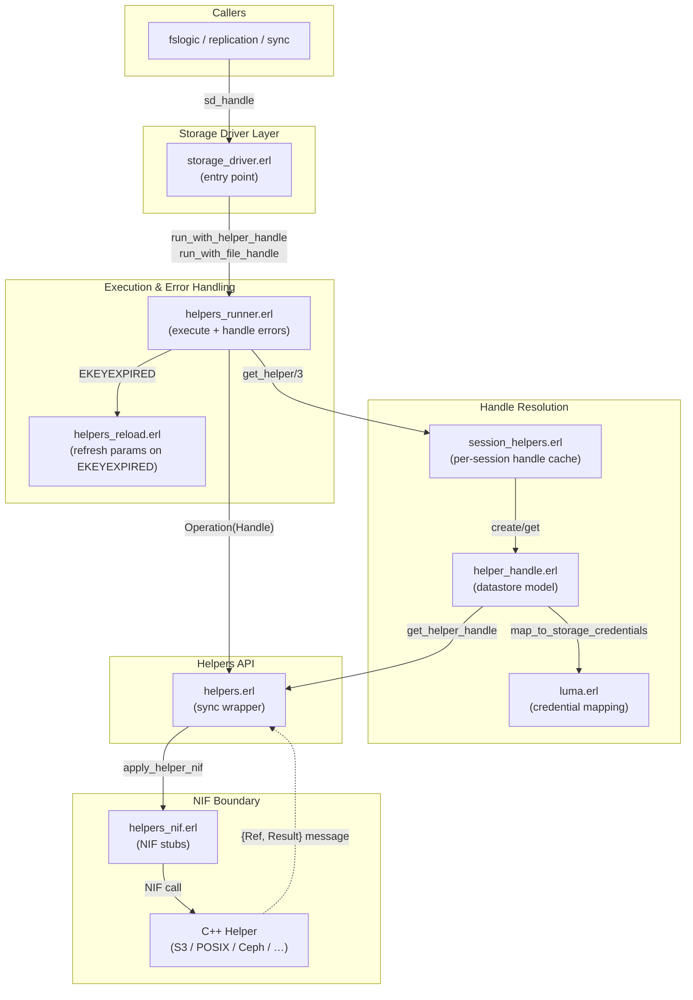
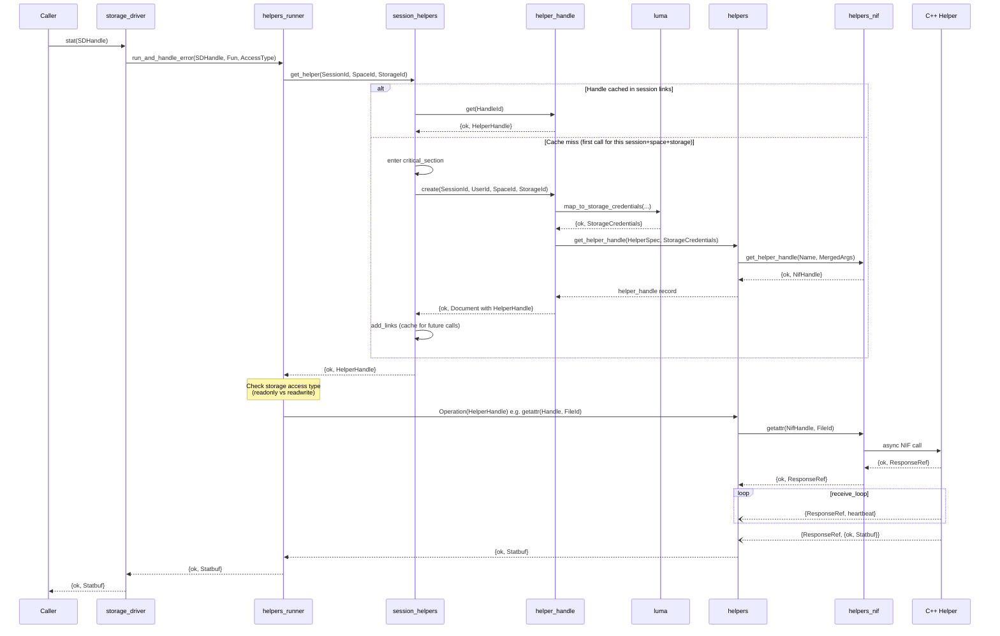
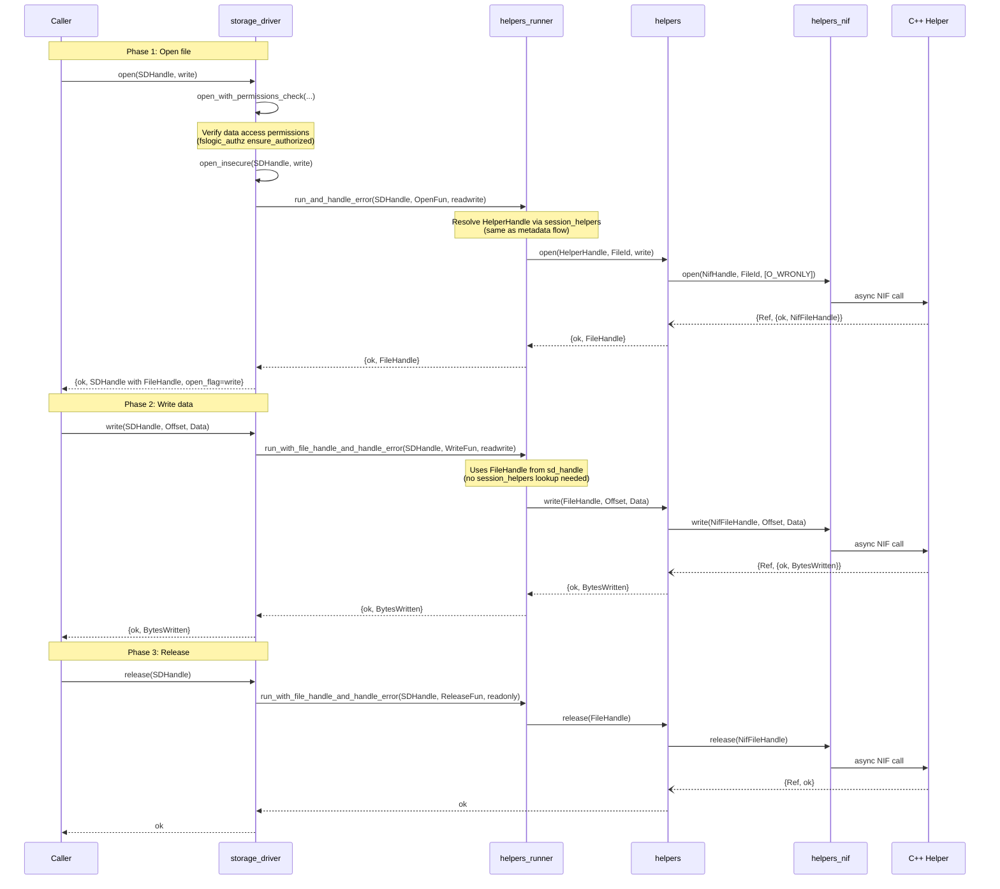
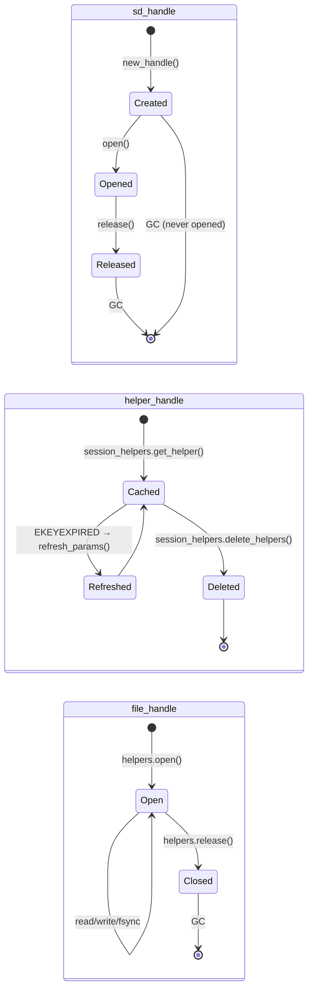
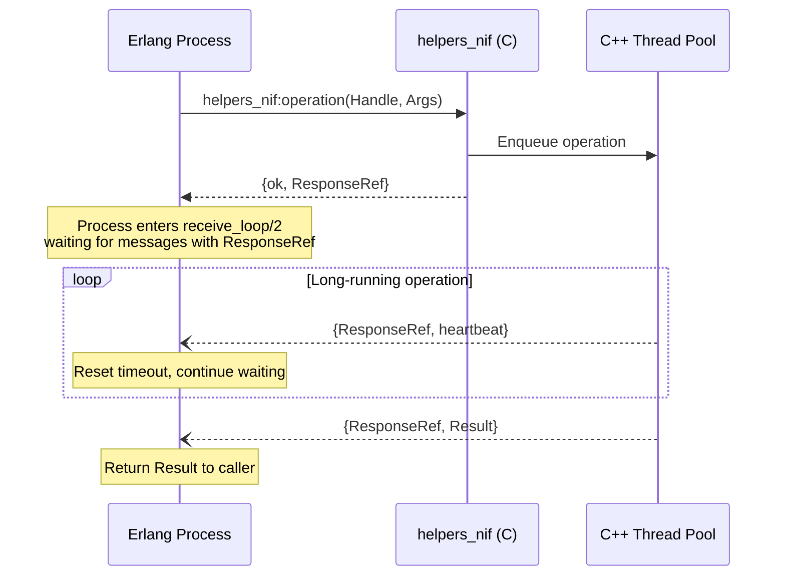
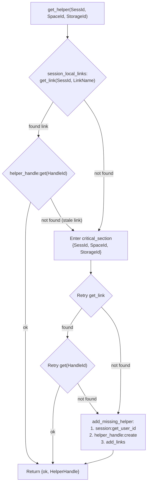

# Helper Operations — Executing I/O on Storage Backends

The helper operations subsystem is the runtime I/O engine of
op-worker. While [helper configuration](helper-spec.md) describes
how storage backends are configured, this document describes how actual
file operations — `read`, `write`, `mkdir`, `stat`, and dozens
more — flow from Erlang business logic through a layered handle
system, down to a C++ NIF that communicates with storage backends
(S3, POSIX, Ceph, etc.) asynchronously.

The design is driven by three forces: 
1. user-level POSIX semantics must be enforced on backends that 
may not natively support them;
2. the C++ helpers run asynchronously via NIF, so the Erlang side 
must manage async references and timeouts;
3. storage credentials are per-session and per-user, so handles 
must be cached and resolved at runtime.

The result is a multi-layer handle architecture with distinct roles at each level.

> **Complementary documentation**
>
> - [Storage Configuration Architecture Overview](../_overview.md) —
>   key concepts, component roles
> - [Helpers Overview](_overview.md) — index of helper-related
>   documentation
> - [Helper Spec](helper-spec.md) — how
>   `#helper_spec{}` is built from contracts and passed to
>   the NIF

---

## Key Concepts

- **`#sd_handle{}`** — The top-level **storage driver handle**.
  Created by `storage_driver:new_handle/2-6`, it bundles everything
  needed to operate on a specific file on a specific storage:
  session ID, space ID, storage ID, storage file path, and
  (after `open`) a file handle. This is what higher-level op-worker
  code (fslogic, replication, sync) works with.

- **`#helper_handle{}`** — A **C++ helper instance handle** that
  represents a configured connection to a storage backend for a
  specific user. It wraps a NIF-level opaque reference and a
  timeout value. Helper handles are used for metadata operations
  (mkdir, stat, chmod, rename, etc.) and for opening files.
  They are cached per session.

- **`#file_handle{}`** — An **open file descriptor** on the storage
  backend. Created by `helpers:open/3`, it wraps a NIF-level file
  handle and a timeout. Used for data I/O: `read`, `write`,
  `fsync`, `release`.

- **Async NIF pattern** — All NIF calls are asynchronous. The NIF
  function returns `{ok, ResponseRef}` immediately. The C++ side
  sends the result back as an Erlang message
  `{ResponseRef, Result}`. The Erlang process waits in a
  `receive` loop with a configurable timeout, handling heartbeat
  messages to avoid false timeouts on long-running operations.

- **Fallback strategy** — When a storage operation fails with
  `EACCES` or `EPERM`, `storage_driver` can retry the operation
  as root and optionally schedule a deferred `chown` to fix
  ownership. This handles edge cases where the file was created
  under different credentials than the current user.

---

## Architecture

The following diagram shows all modules involved in executing
a storage operation, from the entry point (`storage_driver`)
down to the C++ NIF.



### Module Roles

| Module | Role |
|--------|------|
| `storage_driver` | Public API for storage I/O. Creates `#sd_handle{}`, enforces permissions, implements fallback strategies. |
| `helpers_runner` | Executes operations against resolved handles. Checks access type (readonly/readwrite). Handles errors like `EKEYEXPIRED`. |
| `session_helpers` | Caches `#helper_handle{}` per session using session-local links. Creates new handles on cache miss. |
| `helper_handle` | Datastore model that persists helper handles locally (in-memory, no disc). Orchestrates handle creation: storage lookup → LUMA credential mapping → NIF handle allocation. |
| `luma` | Maps Onedata user identity to storage-native credentials (uid/gid, access tokens, etc.). |
| `helpers` | Synchronous wrapper around the NIF. Converts Erlang types to NIF format, calls NIF functions, and waits for async responses. |
| `helpers_nif` | NIF stubs — Erlang function heads that are replaced at load time by the C++ NIF library. |
| `helpers_reload` | Refreshes helper params when credentials expire (`EKEYEXPIRED`). Multicalls across cluster nodes. |

---

## How It Works

Storage operations split into two categories based on which handle
type they use. **Metadata operations** (mkdir, stat, chmod, rename,
unlink, etc.) use a `#helper_handle{}` resolved from the session
cache. **Data I/O operations** (read, write, fsync, release) use a
`#file_handle{}` obtained by opening a file.

### Metadata Operation Flow

The following sequence shows what happens when higher-level code
calls a metadata operation such as `storage_driver:stat/1`.



**Key points:**

1. `storage_driver` never interacts with helpers or NIF directly —
   it delegates to `helpers_runner` which resolves the handle.
2. `session_helpers` uses a link-based cache (session-local links)
   keyed by `StorageId:SpaceId`. The first fetch outside a
   critical section is an optimization; on miss, a critical section
   ensures only one handle is created.
3. `helper_handle:create/4` is the point where LUMA maps user
   credentials and `helpers:get_helper_handle/2` allocates the C++
   helper instance.
4. The NIF call is asynchronous — `helpers:apply_helper_nif/3`
   calls the NIF function, which returns a `ResponseRef`, then
   enters `receive_loop/2` to wait for the result message.

### Data I/O Operation Flow

Data operations require an open file. The `open` call itself is
a metadata operation that returns a `#file_handle{}`, which is then
stored in the `#sd_handle{}` for subsequent read/write calls.



**Key difference from metadata operations:** Data I/O uses
`run_with_file_handle` instead of `run_with_helper_handle`. The
file handle is already stored in `#sd_handle.file_handle` from
the `open` call, so no session lookup is needed — the handle
goes directly to the helpers function.

---

## Handle Lifecycle

The three handle types form a hierarchy with distinct lifecycles:



### `#sd_handle{}` — Ephemeral, per-operation

Created by `storage_driver:new_handle/2-6` for each file operation.
Contains metadata (session, space, storage, file path) and,
after `open`, a `#file_handle{}`. Goes out of scope when the
operation completes. If `release/1` is not called explicitly,
the C++ file handle is released when the Erlang term is garbage
collected.

```erlang
-record(sd_handle, {
    file_handle :: undefined | helpers:file_handle(),
    file :: undefined | helpers:file_id(),
    session_id :: undefined | session:id(),
    file_uuid :: undefined | file_meta:uuid(),
    space_id :: undefined | od_space:id(),
    storage_id :: undefined | storage:id(),
    open_flag :: undefined | helpers:open_flag(),
    file_size = 0 :: non_neg_integer(),
    share_id :: undefined | od_share:id()
}).
```

### `#helper_handle{}` — Cached, per-session

Created once per `(session, space, storage)` tuple and cached
via `session_helpers` using session-local links. 
These session-local links are in-memory pointers that refer 
to an in-memory `helper_handle` document, which itself holds 
a reference to the corresponding C++ NIF object. Because both 
the link and the `helper_handle` document live only in memory 
(not on disk), the C++ object is not deleted as long as these 
references exist.

```erlang
-record(helper_handle, {
    handle :: helpers_nif:helper_handle(),  %% opaque NIF reference
    timeout = infinity :: timeout()
}).
```

**Creation flow:**
`session_helpers:get_helper/3` → `helper_handle:create/4` →
`storage:get(StorageId)` → `luma:map_to_storage_credentials/4` →
`helpers:get_helper_handle/2` → `helpers_nif:get_helper_handle/2`

### `#file_handle{}` — Per open file

Created by `helpers:open/3` when a file is opened on the storage
backend. Wraps a NIF file handle that represents an open file
descriptor in C++. Closed by `helpers:release/1`.

```erlang
-record(file_handle, {
    handle :: helpers_nif:file_handle(),  %% opaque NIF reference
    timeout :: timeout()
}).
```

---

## The Async NIF Call Pattern

All interactions with C++ helpers are asynchronous. This is the
core mechanism that bridges Erlang's concurrency model with C++
threading.



The `helpers:apply_helper_nif/4` function implements this pattern:

1. Calls `apply(helpers_nif, Function, [Handle | Args])` which
   enqueues the operation on the C++ thread pool and returns
   `{ok, ResponseRef}`.
2. Enters `receive_loop/2` with the configured timeout (from the
   helper spec, default 120 seconds).
3. `heartbeat` messages reset the timeout — this prevents false
   timeouts on operations that are making progress but take a
   long time (e.g., large S3 uploads).
4. The final result message `{ResponseRef, Result}` terminates
   the loop. Errors from C++ arrive as
   `{error, Reason, Description}`.

**Why async?** A synchronous NIF call would block the Erlang
scheduler thread, degrading the entire VM. Asynchronous NIFs
allow the C++ work to happen on separate threads while the
Erlang process simply waits for a message — a natural fit for
Erlang's message-passing model.

---

## Error Handling

Error handling occurs at two layers, each with distinct concerns.

### `helpers_runner` — Operation-level errors

After executing an operation, `helpers_runner:run_and_handle_error/4`
inspects the result:

- **`{error, ?EKEYEXPIRED}`** — OAuth2 token expiration. The runner
  calls `helpers_reload:refresh_handle_params/4` to regenerate
  credentials (via LUMA) and push them to the C++ helper via
  `helpers:refresh_params/2`. The operation is then retried.
  This only applies to storages that support OAuth2 (WebDAV,
  HTTP with token).

- **`{error, ?EROFS}`** — Returned before executing the operation
  if the storage does not support the required access type
  (e.g., attempting a write on a readonly storage).

- **Other errors** — Passed through to the caller unchanged.

### `storage_driver` — Fallback strategies

`storage_driver` wraps `helpers_runner` calls with a fallback
mechanism for permission errors. Three strategies are available:

| Strategy | Behavior |
|----------|----------|
| `no_fallback` | Error is returned as-is. Used for operations that should never retry (e.g., `chown` — already requires root). |
| `retry_as_root` | On `EACCES`/`EPERM`, retry the operation with `?ROOT_SESS_ID`. Used for operations where root retry is safe (e.g., `chmod`, `stat`, `truncate`). |
| `retry_as_root_and_chown` | Same as above, plus schedule a deferred `chown` via `files_to_chown:chown_or_defer/1` to fix ownership for future operations. Used for operations that create or modify files (e.g., `mkdir`, `create`, `open`). |

The fallback only applies when:
- The current user is the **space owner**, and
- The target file is **not** a special space directory.

**Why fallback?** On POSIX-compatible storages, files may have been
created with root credentials (e.g., during lazy file creation or
replication) and the space owner's storage credentials may not have
write access. Retrying as root with a subsequent `chown` maintains
correct ownership while ensuring the operation succeeds.

---

## Operation Categories

All storage operations accessible through `storage_driver`:

### Metadata operations (use `#helper_handle{}`)

| Operation | `storage_driver` | `helpers` | Description |
|-----------|-------------------|-----------|-------------|
| mkdir | `mkdir/2,3` | `mkdir/3` | Create directory |
| create | `create/2,3` | `mknod/4` | Create file node |
| stat | `stat/1` | `getattr/2` | Get file attributes |
| chmod | `chmod/2` | `chmod/3` | Change permissions |
| chown | `chown/3` | `chown/4` | Change ownership |
| rename | `mv/2` | `rename/3` | Move/rename file |
| link | `link/2` | `link/3` | Create hard link |
| unlink | `unlink/2` | `unlink/3` | Remove file |
| rmdir | `rmdir/1` | `rmdir/2` | Remove directory |
| readdir | `readdir/3` | `readdir/4` | List directory |
| listobjects | `listobjects/4` | `listobjects/5` | List objects (object storage) |
| truncate | `truncate/3` | `truncate/4` | Truncate file |
| setxattr | `setxattr/5` | `setxattr/6` | Set extended attribute |
| getxattr | `getxattr/2` | `getxattr/3` | Get extended attribute |
| removexattr | `removexattr/2` | `removexattr/3` | Remove extended attribute |
| listxattr | `listxattr/1` | `listxattr/2` | List extended attributes |
| flushbuffer | `flushbuffer/2` | `flushbuffer/3` | Flush buffered helper |
| blocksize | `blocksize_for_path/1` | `blocksize_for_path/2` | Get optimal block size |

### Data I/O operations (use `#file_handle{}`)

| Operation | `storage_driver` | `helpers` | Description |
|-----------|-------------------|-----------|-------------|
| open | `open/2` | `open/3` | Open file (returns file handle) |
| read | `read/3` | `read/3` | Read data at offset |
| write | `write/3` | `write/3` | Write data at offset |
| release | `release/1` | `release/1` | Close file |
| fsync | `fsync/2` | `fsync/2` | Sync file to storage |

> [!NOTE]
> `open` is a hybrid — it uses a `#helper_handle{}` to execute
> the open operation on the storage, but its result is a
> `#file_handle{}` that is stored in the `#sd_handle{}` for
> subsequent data I/O.

---

## Read Operation — Special Handling

The `storage_driver:read/3` function has noteworthy logic beyond a
simple passthrough:

1. **Short read retry** — If the helper returns fewer bytes than
   requested (but more than zero), `storage_driver` issues a
   follow-up read for the remaining bytes and concatenates the
   results. This handles backends that may return partial results
   (common with object storages and network latency).

2. **Over-read protection** — If the helper returns *more* bytes
   than requested, this is treated as a helper malfunction. The
   error is throttle-logged and `EIO` is returned.

3. **Out-of-range tolerance** — Some object storages return `ENOENT`
   or `EIO` when reading beyond the end of a file. If the read
   offset is greater than zero and one of these errors occurs,
   `storage_driver` checks if the file exists via `stat`. If it
   does, an empty binary is returned instead of the error.

---

## Helper Handle Caching

Helper handles are cached per `(session, space, storage)` via
`session_helpers`. Understanding this caching is important for
debugging credential issues and performance.



**Why the double check?** The first link lookup outside the critical
section is an optimization — it avoids serialization for the common
case (handle already exists). The critical section is entered only
on cache miss, where the retry prevents two concurrent requests
from creating duplicate handles for the same key.

**Cache invalidation:**
- `session_helpers:delete_helpers/1` — Removes all helper handles
  for a session (called on session cleanup). Spawns deletion on
  all cluster nodes.
- `helpers_reload:refresh_helpers_by_storage/1` — Refreshes params
  on all existing handles for a storage when its configuration
  changes. Does not invalidate — updates in place.

---

## Related Documentation

- [Helpers Overview](_overview.md) — index for helper-related docs
- [Storage Configuration Architecture Overview](../_overview.md) —
  high-level architecture, component roles, supported storage types
- [Helper Spec](helper-spec.md) — how `#helper_spec{}`
  is built from contracts and passed to the NIF
- [Storage CRUD Operations](../storage-crud-operations.md) —
  create/update/describe/delete flows
- [Storage Data Contracts](../storage-contracts.md) — record
  definitions shared between onepanel and op-worker
- [LUMA Credential Resolution](../luma/credential-resolution.md) —
  how credentials (including OAuth2 tokens) are resolved at runtime
