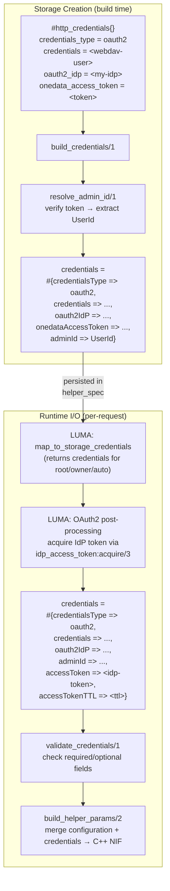

# Helper Spec

The helper configuration system bridges the gap between typed Erlang
storage contracts and the C++ NIF helpers that perform actual I/O.
Contract records (`#storage_create_spec{}`, `#storage_update_spec{}`)
use rich Erlang types (records, atoms, integers), but the C++ NIF
layer expects flat binary maps. The helper_spec subsystem translates
between these two worlds: it builds, updates, and describes storage
configurations as NIF-compatible key-value maps while preserving
type-safety on the Erlang side.

> **Complementary documentation**
>
> - [Storage Configuration Architecture Overview](../_overview.md) — key
>   concepts, component roles, architecture diagram
> - [Storage Data Contracts](../storage-contracts.md) — `#storage_create_spec{}`,
>   `#storage_update_spec{}`, `#storage_description{}` definitions
> - [Helpers Overview](_overview.md) — index of helper-related documentation

---

## What Is a Helper Spec

A **helper spec** is an Erlang record that holds all configuration
and credentials required by a C++ helper in a format the NIF can
consume. It is defined as:

```erlang
-record(helper_spec, {
    name :: binary(),
    configuration = #{} :: #{binary() => binary()},
    credentials = #{} :: #{binary() => binary()}
}).
```

- **`name`** — Identifies the C++ helper implementation. Examples:
  `<<"s3">>`, `<<"posix">>`, `<<"ceph">>`. The dispatcher uses this
  to route calls to the correct per-storage module.

- **`configuration`** — Storage-specific settings: hostname, bucket name, mount
  point, block size, timeout, storage path type, etc. All values are
  binary strings.

- **`credentials`** — Storage-level credentials set during configuration:
  access keys, secret keys, passwords, uid/gid. These are stored
  persistently with the storage. All values are binary strings.

**All values must be binary strings.** The C++ NIF interface cannot
work with Erlang records or complex types (atoms, integers, tuples).
Everything must be serialized to string key-value pairs. Integers and
atoms are converted via `integer_to_binary/1`, `atom_to_binary/1`, and
similar helpers.

**Keys use camelCase.** Examples: `<<"bucketName">>`, `<<"accessKey">>`,
`<<"storagePathType">>`. This convention matches the C++ helper
expectations and keeps JSON-like semantics for the NIF layer.

**Why flat binary maps?** The C++ NIF layer is a separate compiled
component. It receives a single map of strings and does not understand
Erlang records or type descriptors. A flat `#{binary() => binary()}`
map is the lowest common denominator: easy to serialize, pass across
the NIF boundary, and parse in C++.

---

## Architecture

The helper_spec system uses a **strategy / dispatcher pattern**. Each
storage type has different configuration fields, credentials, and
capabilities. The behaviour ensures a consistent interface while
allowing per-type customization.

```
helper_spec.erl (dispatcher)
        |
        +-- get_module(Type) → routes by storage type
        |
        +-- helper_spec_behaviour.erl (callback interface)
        |
        +-- helper_spec_utils.erl (shared utilities)
        |
        +-- 11 per-storage modules:
                s3_helper_spec
                posix_helper_spec
                ceph_helper_spec
                cephrados_helper_spec
                swift_helper_spec
                glusterfs_helper_spec
                http_helper_spec
                webdav_helper_spec
                xrootd_helper_spec
                nfs_helper_spec
                nulldevice_helper_spec
```

- **`helper_spec.erl`** — Central dispatcher. Exposes `build/1`,
  `update/2`, `describe/1`, `build_helper_params/2`, and capability
  queries. Routes each call to the appropriate per-storage module via
  `get_module/1` based on `name` or storage type.

- **`helper_spec_behaviour.erl`** — Defines the callback interface:
  `build/1`, `validate_credentials/1`, `build_configuration_diff/2`,
  `build_credentials_diff/2`, `describe/1`, plus capability and
  redaction callbacks.

- **`helper_spec_utils.erl`** — Shared utilities: optional-arg
  handling, diff building, storage path type conversion, per-user credentials
  validation.

- **Per-storage modules** — One module per storage type. Each
  implements the behaviour and knows how to map its contract records
  to and from flat binary maps.

**Why this pattern?** Each storage type has different configuration
fields (S3 has bucket and region; POSIX has mount point; HTTP has
URL). Credentials differ (S3 uses access/secret keys; POSIX uses
uid/gid; Swift uses password). Capabilities differ (HTTP is read-only;
S3 does not support rename). A single monolithic module would become
unmaintainable. The behaviour ensures a uniform API while isolating
type-specific logic in dedicated modules.

---

## Building from Contracts

The **create** flow converts a typed create spec into a helper spec:

```
#storage_create_spec{} → helper_spec:build/1 → Module:build/1 → #helper_spec{}
```

1. `helper_spec:build/1` receives `#storage_create_spec{}` with
   `type`, `configuration`, `credentials`, and `timeout`.

2. The dispatcher calls `get_module(Type)` to select the per-storage
   module (e.g. `s3_helper_spec` for `<<"s3">>`).

3. The module's `build/1` callback:
   - Maps configuration record fields → `configuration` (with type conversions)
   - Maps credentials record fields → `credentials`
   - Adds `timeout` from the create spec to `configuration` as `<<"timeout">>`
   - Omits optional fields that are `undefined` via
     `add_optional_entries_if_defined/2`

4. Returns `#helper_spec{name, configuration, credentials}`.

**Type conversions:** Integers (e.g. `block_size`, `timeout`) use
`integer_to_binary/1`. Atoms (e.g. `verify_server_certificate`) use
`atom_to_binary/1`. Storage path type (`flat` | `canonical`) is
converted via `storage_path_type_to_binary/1` to `<<"flat">>` |
`<<"canonical">>`.

### S3 Mapping Example

| Contract field                         | NIF key              | Conversion                  |
|----------------------------------------|----------------------|-----------------------------|
| `s3_configuration.hostname`             | `<<"hostname">>`     | as-is                       |
| `s3_configuration.bucket_name`          | `<<"bucketName">>`   | as-is                       |
| `s3_configuration.block_size`           | `<<"blockSize">>`    | `integer_to_binary`         |
| `s3_configuration.storage_path_type`    | `<<"storagePathType">>` | `storage_path_type_to_binary` |
| `s3_configuration.scheme`               | `<<"scheme">>`       | as-is                       |
| `s3_configuration.signature_version`    | `<<"signatureVersion">>` | `integer_to_binary`      |
| `s3_configuration.verify_server_certificate` | `<<"verifyServerCertificate">>` | `atom_to_binary` |
| `s3_configuration.region`              | `<<"region">>`       | as-is (optional)           |
| `s3_credentials.access_key`            | `<<"accessKey">>`    | as-is                      |
| `s3_credentials.secret_key`             | `<<"secretKey">>`    | as-is                      |
| `timeout` (from create spec)            | `<<"timeout">>`      | `integer_to_binary`        |

---

## Updating Helper Spec

The **update** flow applies diffs from an update spec to an existing
helper spec:

```
#helper_spec{} + #storage_update_spec{} → helper_spec:update/2 → {ok, NewHelperSpec} | {error, no_change}
```

1. `helper_spec:update/2` receives the current `#helper_spec{}`
   and `#storage_update_spec{}`.

2. The dispatcher routes to the per-storage module.

3. `Module:build_configuration_diff/2` compares the update spec's
   `*_configuration_diff` fields to the current `configuration`. Only changed
   or new values are included; unchanged values are filtered out.

4. `Module:build_credentials_diff/2` does the same for credentials
   (`*_credentials_diff` → `credentials`).

5. If both diffs are empty, the function returns `{error, no_change}`.
   The caller can use this to avoid emitting unnecessary events or
   persisting no-op updates.

6. Otherwise, the diffs are merged: `maps:merge(CurrentArgs, ArgsDiff)`
   and `maps:merge(CurrentCredentials, CredentialsDiff)`. Returns
   `{ok, NewHelperSpec}`.

**Why return `no_change`?** The updater and orchestration layer can
short-circuit: no need to persist, emit events, or reload helpers when
nothing actually changed. This avoids unnecessary churn and keeps
logs clean.

---

## Describing Helper Spec

The **describe** flow is the inverse of build: it reconstructs typed
records from flat binary maps.

```
#helper_spec{} → helper_spec:describe/1 → Module:describe/1 → #helper_spec_description{}
```

`helper_spec:describe/1` returns `#helper_spec_description{}`
with `type`, `configuration`, `credentials`, and `timeout`. Each
per-storage module implements `describe/1` to map `configuration` and
`credentials` back to Erlang records (`#s3_configuration{}`,
`#s3_credentials{}`, etc.).

**Use case:** `storage_describer` calls `helper_spec:describe/1` when
handling a GET request. The result is embedded in
`#storage_description{}` and returned to the REST client. The client
expects typed configuration and credentials; the flat maps are
internal and never exposed.

---

## Admin Credentials vs Per-User Credentials

**Admin credentials** — Storage-level credentials set during storage
configuration. Stored as part of `#helper_spec{}` in `credentials`.
Examples: S3 access key and secret key, POSIX root uid/gid, Swift
password. These credentials apply to the storage as a whole and are
persisted with the storage configuration.

**Per-user credentials** — Per-session credentials provided at runtime when
performing I/O. Examples: user-specific access tokens, delegated
credentials. Not stored in `helper_spec` — they are passed separately when e.g.
opening a file.

**At NIF call time:** `helper_spec:build_helper_params/2` merges
`configuration` and `credentials` into a single map. The per-user credentials are validated
first via `validate_credentials/2`; if validation fails, the function
returns `{error, Reason}`. If validation succeeds, the result is
`maps:merge(HelperSpec#helper_spec.configuration, CredentialsParams)`. The merged
map is what the C++ helper receives.

**Why separate?** Admin credentials are storage-wide and typically
static until an admin updates the storage. User credentials are
per-session and may change with each request (e.g. different users
accessing the same storage). Storing user credentials in helper_spec
would pollute the persisted configuration and complicate multi-user
scenarios. Merging at call time keeps the separation clean.

---

## OAuth2-Supporting Storages (HTTP, WebDAV)

HTTP and WebDAV storages differ significantly from all other storage
types in how their credentials are structured, built, and later used
at runtime. Most storages have a **1:1 mapping** between the contract
record fields and the `credentials` map — S3 maps `access_key` →
`<<"accessKey">>` and `secret_key` → `<<"secretKey">>`, and that is
the entire admin credentials. OAuth2-supporting storages are fundamentally
different: their credentials undergo a **transformation** during
`build_credentials`, and the resulting admin credentials contains fields that
do not exist in the original contract record.

> **Key takeaway:** Understanding how credentials is constructed for
> HTTP and WebDAV is essential, because these same fields are later
> used during [LUMA credential resolution](../luma/credential-resolution.md#oauth2-credential-lifecycle)
> to acquire IdP access tokens and validate the per-user credentials before
> passing it to the C++ helper.

### Credential Types

HTTP and WebDAV support four credential types (`credentials_type`):

| Type | `credentials` field contains | OAuth2 flow | Description |
|------|------------------------------|-------------|-------------|
| `none` | (ignored) | No | No authentication; `credentials` is removed from credentials |
| `basic` | `username:password` | No | HTTP Basic authentication |
| `token` | Bearer token | No | Static token-based authentication |
| `oauth2` | WebDAV/HTTP username | Yes | Token obtained dynamically from an Identity Provider |

### Contract Records vs Credentials Map

Unlike simple storages where the contract maps 1:1, OAuth2 storages
undergo a transformation during `build_credentials`. The contract
records (`#http_credentials{}`, `#webdav_credentials{}`) contain:

```erlang
-record(http_credentials, {
    credentials_type :: none | basic | token | oauth2,
    credentials      :: undefined | binary(),
    oauth2_idp       :: undefined | binary(),
    onedata_access_token :: undefined | binary()
}).
```

The resulting `credentials` map contains **additional fields** not
present in the contract:

| Contract field | Admin ctx key | Notes |
|----------------|---------------|-------|
| `credentials_type` | `<<"credentialsType">>` | Converted via `credentials_type_to_binary/1` |
| `credentials` | `<<"credentials">>` | Removed when `credentials_type = none` |
| `oauth2_idp` | `<<"oauth2IdP">>` | Optional; identifies the Identity Provider |
| `onedata_access_token` | `<<"onedataAccessToken">>` | The Onedata access token used to acquire IdP tokens |
| *(not in contract)* | `<<"adminId">>` | **Injected by `resolve_admin_id/1`** — see below |

### The `resolve_admin_id` Mechanism

When the admin credentials contains an `<<"onedataAccessToken">>`,
`helper_spec_utils:resolve_admin_id/1` verifies the token against
Onezone and extracts the owning user's ID.

This adds `<<"adminId">>` to the admin credentials — a field that **does
not exist in the contract record**. It is injected at build time and
persisted with the helper spec. This admin ID is critical later in
the OAuth2 credential resolution flow in LUMA: when the system needs
to acquire an IdP access token on behalf of the admin (for root user,
space owner, or auto feed scenarios), it uses `<<"adminId">>` and
`<<"onedataAccessToken">>` from the admin credentials.

When there is no `<<"onedataAccessToken">>` (e.g. `credentials_type`
is `none` or `basic`), `resolve_admin_id/1` returns the credentials
unchanged — no `<<"adminId">>` is added.

### Credentials Shapes by Credential Type

The shape of the credentials map varies depending on the credential
type:

**`none`:**
```erlang
#{<<"credentialsType">> => <<"none">>}
```

**`basic`:**
```erlang
#{<<"credentialsType">> => <<"basic">>,
  <<"credentials">> => <<"user:password">>}
```

**`token`:**
```erlang
#{<<"credentialsType">> => <<"token">>,
  <<"credentials">> => <<"bearer-token-value">>}
```

**`oauth2`:**
```erlang
#{<<"credentialsType">> => <<"oauth2">>,
  <<"credentials">> => <<"webdav-username">>,
  <<"oauth2IdP">> => <<"my-idp">>,                     %% optional
  <<"onedataAccessToken">> => <<"MDAxN...">>,
  <<"adminId">> => <<"user-id-from-token-verification">>}  %% injected
```

### Credentials Validation

When a C++ helper handle is created at runtime, the per-user credentials
(resolved by [LUMA](../luma/credential-resolution.md)) is validated
by `validate_credentials/1` before being passed to the NIF. For
OAuth2-supporting storages, the validation is more complex than for
simple storages because the per-user credentials map may contain fields from
multiple stages of the credential lifecycle.

**Allowed fields in per-user credentials for HTTP/WebDAV:**

| Field | Required? | Source                                                                        |
|-------|-----------|-------------------------------------------------------------------------------|
| `<<"credentialsType">>` | Always required | From credentials or LUMA record                                                 |
| `<<"credentials">>` | Required when `credentialsType /= <<"none">>` | From credentials or LUMA record                                                 |
| `<<"oauth2IdP">>` | Optional | From credentials or LUMA record; identifies the Identity Provider                                              |
| `<<"onedataAccessToken">>` | Optional | From credentials or LUMA record; **removed after token acquisition** by LUMA OAuth2 post-processing |
| `<<"adminId">>` | Optional | From credentials; **injected at build time** by `resolve_admin_id`     |
| `<<"accessToken">>` | Optional | **Injected at runtime** by LUMA OAuth2 post-processing                        |
| `<<"accessTokenTTL">>` | Optional | **Injected at runtime** by LUMA OAuth2 post-processing                        |

Note that `<<"accessToken">>` and `<<"accessTokenTTL">>` are listed
as optional fields — they do not exist in the persisted credentials and
are not present in the contract records. They are **injected at
runtime** by the
[LUMA OAuth2 post-processing](../luma/credential-resolution.md#oauth2-credential-lifecycle)
step, which acquires an IdP access token and adds these fields to the
credential map before the map reaches validation.

### End-to-End OAuth2 Credential Flow

The following diagram shows how credentials flow from storage
creation through to runtime I/O for an OAuth2-configured storage:



Notice how `<<"onedataAccessToken">>` from the admin credentials is 
**consumed and removed** during OAuth2 post-processing. 
It is replaced with `<<"accessToken">>` (the actual IdP token) 
and `<<"accessTokenTTL">>` (its time-to-live).
The C++ helper never sees `<<"onedataAccessToken">>` — it only
receives the resolved `<<"accessToken">>`.

For the complete LUMA-side OAuth2 resolution flow including token
acquisition, IdP selection, and caching, see
[Credential Resolution — OAuth2 Credential Lifecycle](../luma/credential-resolution.md#oauth2-credential-lifecycle).

---

## Capability Queries

Each per-storage module declares its capabilities via behaviour
callbacks. The dispatcher exposes these as `helper_spec:is_*`
functions. CRUD verification uses them to validate configuration
constraints (e.g. rejecting readwrite for HTTP storage).

| Capability                    | What it means                     | Example                         |
|------------------------------|-----------------------------------|---------------------------------|
| `is_posix_compatible`        | Supports POSIX filesystem semantics | POSIX, GlusterFS, NFS          |
| `is_object_storage`          | Object-based; no rename, no POSIX semantics | S3, Swift, Ceph               |
| `is_storage_access_type_supported` | Supports readonly or readwrite | HTTP: readonly only            |
| `is_auto_import_supported`   | Can auto-import existing data     | POSIX, S3 (with canonical + block_size 0) |
| `is_file_registration_supported` | Can register existing files   | S3 (with canonical + block_size 0) |
| `is_import_supported`        | Either auto-import or file registration | Logical OR of the above   |
| `is_rename_supported`        | Supports atomic rename            | POSIX: yes; S3: no              |
| `is_nfs4_acl_supported`      | Supports NFSv4 ACLs                | NFS, POSIX on some backends    |
| `is_oauth2_supported`        | Supports OAuth2 credentials       | WebDAV, HTTP (with token)      |
| `is_getting_size_supported`  | Can report storage size           | S3 (block_size 0), POSIX       |

`is_import_supported/1` is defined as `is_auto_import_supported(HelperSpec)
orelse is_file_registration_supported(HelperSpec)` — it answers
whether the storage can import existing data in any form.

---

## Credential Redaction

Before logging or returning credentials to clients, confidential
fields are replaced with `<<"*****">>`. This prevents secrets from
appearing in logs or API responses.

**Functions:**
- `redact_confidential_credentials/2` — masks secrets in a full
  credentials record
- `redact_confidential_credentials_diff/2` — masks secrets in a
  credentials diff

Each per-storage module declares which fields to redact via
`helper_spec_utils:redact_record_fields_if_defined/2`. The redacted
value is `?CONFIDENTIAL_MASK` (`<<"*****">>`).

**Per-type redacted fields:**

| Storage   | Redacted fields                          |
|-----------|------------------------------------------|
| S3        | `secret_key`                             |
| Ceph      | `key`                                    |
| CephRados | `key`                                    |
| Swift     | `password`                               |
| HTTP      | `credentials`, `onedata_access_token`    |
| WebDAV    | `credentials`, `onedata_access_token`   |
| XRootD    | `credentials`                            |

POSIX, GlusterFS, NFS, and nulldevice have no confidential credential
fields (uid/gid are not considered secrets in the same way).

---

## Related Documentation

- [Helpers Overview](_overview.md) — index for helper-related docs
- [Helper Operations](helper-operations.md) — runtime I/O, handle
  lifecycle, async NIF pattern
- [Storage Configuration Architecture Overview](../_overview.md)
- [Storage Data Contracts](../storage-contracts.md)
- [Storage CRUD Operations](../storage-crud-operations.md)
- [LUMA Credential Resolution](../luma/credential-resolution.md) —
  how credentials (including OAuth2 tokens) are resolved at runtime
