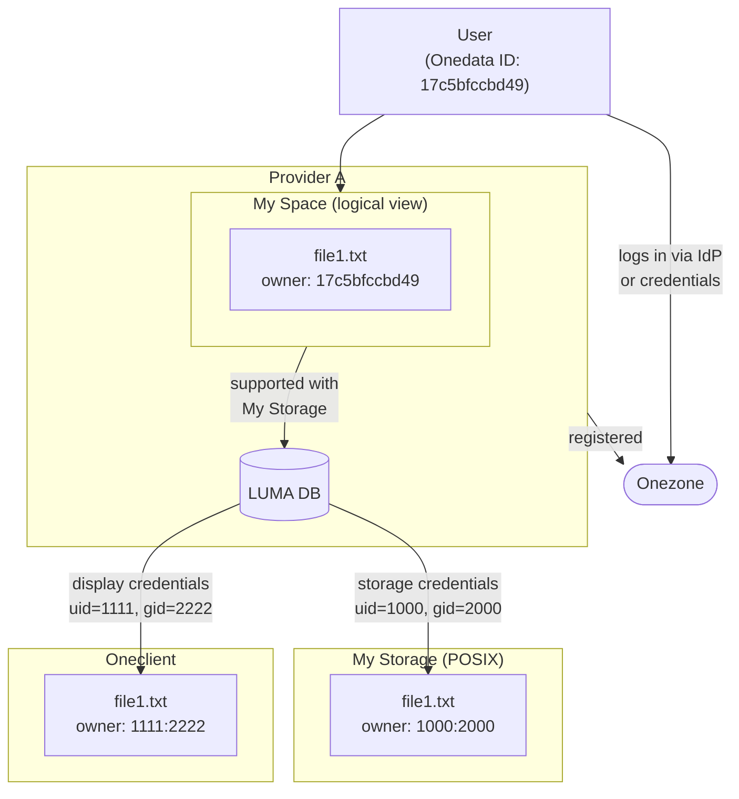

# LUMA — Local User Mapping

LUMA (Local User MApping) is the subsystem responsible for mapping
Onedata user identities to storage-native credentials. Every file
operation on a storage backend requires credentials that the backend
understands — POSIX UID/GID for filesystem-based storages, access
key/secret pairs for S3, tokens for OAuth2-based backends, and so on.
LUMA bridges the gap between Onedata's logical user model and these
heterogeneous credential schemes, providing both **storage credentials**
(for performing I/O) and **display credentials** (for presenting file
ownership in Oneclient).

## Key Concepts

- **Storage credentials** — Credentials passed to a
  [helper](../helpers/helper-operations.md) to perform I/O operations on behalf
  of a specific user. On POSIX-compatible storages, this is a UID + GID
  pair. On object storages, it may be an access key/secret, an OAuth2
  token, or an admin context.

- **Display credentials** — A UID/GID pair returned in `getattr`
  responses and displayed in Oneclient (e.g. the owner shown by `ls -l`).
  Display credentials are always POSIX-style, even on non-POSIX storages,
  because Oneclient presents a POSIX filesystem interface to users.

- **LUMA feed** — The source from which credential mappings are
  obtained. Three feed types exist: `auto`, `local`, and `external`.
  See [Feed Types](#feed-types) below.

- **LUMA DB** — A per-storage database of cached credential mappings,
  organized into five logical tables. Each table is scoped by
  storage ID **and** the current [LUMA generation](#luma-generation),
  which ensures that config changes atomically isolate old data. See
  [Data Model & Persistence](data-model.md) for the storage layout.

- **LUMA generation** — A monotonically increasing counter stored in
  `storage_config` alongside the LUMA configuration. It is
  incremented every time the LUMA config changes, causing all
  subsequent DB operations to target a new key namespace. This
  provides atomic isolation between old and new configurations
  without requiring synchronous deletion of stale entries. See
  [LUMA Generation](#luma-generation) below.

- **POSIX-compatible storage** — A storage backend that uses UID/GID
  for access control (POSIX, GlusterFS, NullDevice). On these storages,
  all space members share a common GID (the "space group"), and storage
  credentials include both a per-user UID and the shared GID.

- **Imported storage** — A storage with pre-existing data that
  Onedata synchronizes into its namespace via storage import. Reverse
  LUMA mappings (storage user → Onedata user) are relevant only for
  imported storages.

## Credential Types — The Big Picture

A single file exists at three identity levels. LUMA translates between
them:



| Level | Identity | Example | Purpose |
|-------|----------|---------|---------|
| **Logical** | Onedata user ID | `17c5bfccbd49` | Internal file ownership in Onedata |
| **Storage** | Storage credentials | `uid=1000, gid=2000` | Passed to the [helper](../helpers/helper-operations.md) for actual I/O on the storage backend |
| **Display** | Display credentials | `uid=1111, gid=2222` | Shown to the user in Oneclient (`ls -l`); purely presentational — does not affect access control |

LUMA maps from the logical level to the other two. How this mapping
is obtained depends on the configured [feed type](#feed-types); how
the mappings are stored and managed is described in
[Data Model & Persistence](data-model.md); the detailed resolution
flows are in [Credential Resolution](credential-resolution.md).

For the internal module architecture (tables, records, link system),
see the [Data Model](data-model.md) document.

## Feed Types

LUMA supports three feed types, configured per storage. The feed type
determines how credential mappings are obtained when they are not
already present in the LUMA DB. For the detailed population mechanisms
per feed type, see
[Database Population](data-model.md#database-population).

- **Auto feed (`auto`)** — The default mode. Mappings are generated
  deterministically by the system:
  - On POSIX-compatible storages, UIDs and GIDs are generated by
    hashing the Onedata user/space ID into a configured numeric range.
  - On non-POSIX storages, all users share the storage's admin context
    (the credentials configured at storage creation time).
  - Auto-generated mappings that are computationally expensive or must
    remain stable (e.g. POSIX storage defaults derived from `stat` of
    the mountpoint) are cached in the DB. Others are computed on the
    fly and not cached.

- **Local feed (`local`)** — Custom mappings are pre-configured by
  the administrator using the
  [Onepanel REST API](https://onedata.org/#/home/api/stable/onepanel?anchor=tag/LUMA-DB-Local-Feed).
  The admin must set up all required mappings before the storage is
  used to support a space. If a mapping is missing at resolution time,
  the operation fails — the system does not fall back to auto
  generation.

- **External feed (`external`)** — An external HTTP server implements
  the [LUMA API](https://onedata.org/#/home/documentation/25/admin-guide/oneprovider/configuration/luma[external-feed].html).
  When a mapping is needed and not present in the DB, the system sends
  an HTTP POST to the external server with user/storage context. The
  response is validated, cached in the DB, and used for subsequent
  lookups.

> [!NOTE]
> The feed type is stored in `luma_config` alongside optional URL and
> API key fields (used only with the external feed). It is part of
> the storage configuration and can be changed via the storage update
> API.

## The Five Logical Tables

LUMA DB is organized into five logical tables. Each table is scoped
per storage and [LUMA generation](#luma-generation) — keys within a
table are implicitly namespaced by `(storage:id(), luma_generation)`.
For record types, document structure, and persistence details, see
[Data Model & Persistence](data-model.md).

| Table | Key                                       | Record | Purpose |
|-------|-------------------------------------------|--------|---------|
| `luma_storage_users` | `od_user:id()`            | `#luma_storage_user{}` | Maps Onedata user → storage credentials + display UID |
| `luma_spaces_posix_storage_defaults` | `od_space:id()`           | `#luma_posix_credentials{}` | Default UID/GID for POSIX storage access in a space |
| `luma_spaces_display_defaults` | `od_space:id()`           | `#luma_posix_credentials{}` | Default UID/GID for display in a space |
| `luma_onedata_users` | `UID<uid>` or `ACL<name>` | `#luma_onedata_user{}` | Reverse: storage user → Onedata user (import) |
| `luma_onedata_groups` | `acl_who`                 | `#luma_onedata_group{}` | Reverse: storage group → Onedata group (import) |

The first three tables serve the **forward LUMA** flow (Onedata user →
storage credentials). The last two serve the **reverse LUMA** flow
(storage identity → Onedata identity), used exclusively by storage
import.

## How Credential Resolution Works

When a file operation requires credentials, the system calls
`luma:map_to_storage_credentials/3` or
`luma:map_to_display_credentials/3`. These functions:

1. Check for special cases (root user, space owner).
2. Look up the relevant table(s) using
   [`get_or_acquire`](data-model.md#the-get_or_acquire-pattern) —
   which first checks the DB, then calls the configured feed if the
   entry is missing.
3. Compose the final credential value, potentially combining data from
   multiple tables (e.g. per-user UID from `luma_storage_users` +
   shared GID from `luma_spaces_posix_storage_defaults`).
4. Apply post-processing if needed (e.g. OAuth2 token acquisition).

For complete flow descriptions with sequence diagrams, see
[Credential Resolution](credential-resolution.md).

## Reverse LUMA

Reverse LUMA maps storage-native identities back to Onedata entities.
This is used exclusively by the storage import mechanism, which
discovers files on an existing storage and must determine which
Onedata user should own each file.

Three reverse operations exist:

- **UID → Onedata user** — Maps a POSIX UID to an `od_user:id()`.
- **ACL user → Onedata user** — Maps an NFSv4 ACL username to an
  `od_user:id()`.
- **ACL group → Onedata group** — Maps an NFSv4 ACL group name to an
  `od_group:id()`.

Reverse mappings are only relevant on POSIX-compatible, imported
storages (enforced via
[constraint validation](data-model.md#constraint-validation)). With
auto feed, UID mapping falls back to a synthetic
`?SPACE_OWNER_ID(SpaceId)` — there is
[no auto generation](data-model.md#population-via-auto-feed) for
reverse tables; ACL mappings require local or external feed to
function.

For details, see [Reverse LUMA](reverse-luma.md).

## LUMA Generation

When the LUMA configuration of a storage changes (e.g. the feed type
is switched, or the external server URL is updated), all previously
cached mappings become stale and must not be used with the new
configuration. Deleting entries one by one across five tables is both
slow and fragile — a failure mid-way would leave the database in an
inconsistent state where some mappings reflect the old config and
others are missing.

**LUMA generation** solves this by making the config change and the
invalidation of old data a single atomic step:

1. The `luma_generation` counter in `storage_config` is incremented
   together with the new LUMA config in the same datastore write
   (as part of the [storage update saga](../storage-crud-operations.md#4-the-update-saga)).
2. The generation value is embedded in LUMA DB
   [document IDs](data-model.md#document-id-generation) and
   [link forest keys](data-model.md#the-link-system). All subsequent
   reads and writes automatically target the new generation's
   namespace.
3. Old-generation entries become unreachable — no read path will
   ever construct the old key again. They are cleaned up
   asynchronously on a best-effort basis; a failure in cleanup does
   not affect correctness.

```
Before update:       After update (gen 0 → 1):

gen=0                gen=0  (orphaned, scheduled for cleanup)
  ├─ user1 → creds    ├─ user1 → creds
  ├─ user2 → creds    └─ user2 → creds
  └─ space1 → defs
                     gen=1  (active — all new ops land here)
                       └─ (empty, populated on demand)
```

### Backward Compatibility

Storages created before the introduction of LUMA generation start
with `luma_generation = 0`. When the generation is `0`, it is
**omitted** from document IDs and link forest keys, preserving the
original key format. The first LUMA config change bumps the
generation to `1`, at which point it becomes part of the key. This
means no migration is required for existing storages.

## Next Steps

- **[Credential Resolution](credential-resolution.md)** — Detailed
  flows for storage and display credential resolution, including
  POSIX vs non-POSIX differences, OAuth2 handling, and sequence
  diagrams
- **[Reverse LUMA](reverse-luma.md)** — Storage import: mapping
  storage users and groups back to Onedata identities
- **[Data Model & Persistence](data-model.md)** — Database structure,
  record serialization, population mechanisms, caching, and the link
  system

## Related Documentation

- **[Storage Overview](../_overview.md)** — Parent documentation for
  the storage configuration subsystem
- **[Helper Operations](../helpers/helper-operations.md)** — How I/O
  operations use storage credentials via the helper handle system
- **[Helper Configuration](../helpers/helper-config.md)** — How
  `#helper_config{}` is built, including OAuth2-specific admin context
- **[Onepanel LUMA DB API](https://onedata.org/#/home/api/stable/onepanel?anchor=tag/LUMA-DB)**
  — REST API for querying and clearing LUMA DB entries
- **[Onepanel LUMA Local Feed API](https://onedata.org/#/home/api/stable/onepanel?anchor=tag/LUMA-DB-Local-Feed)**
  — REST API for managing local feed mappings
