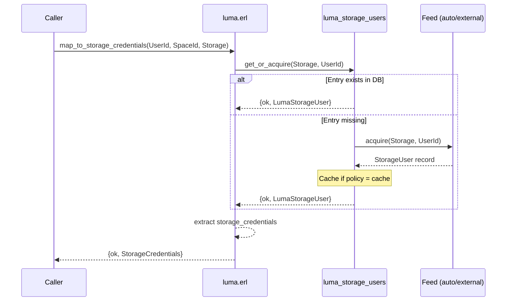
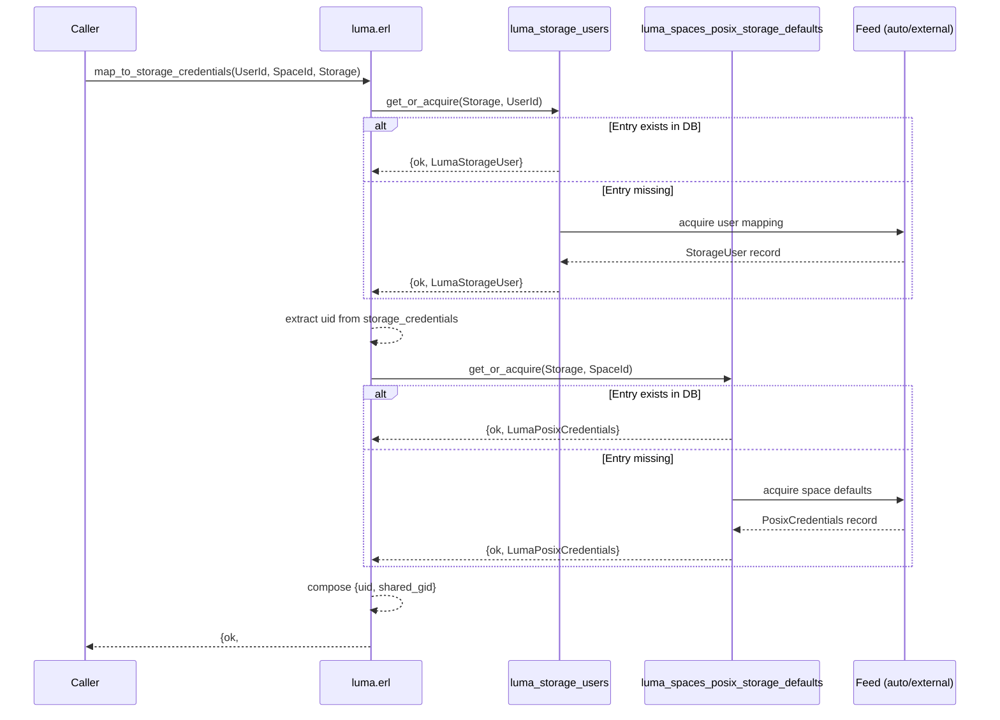
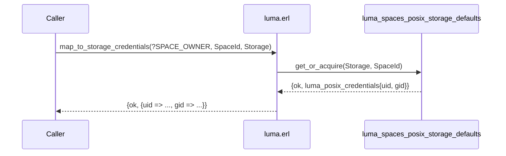
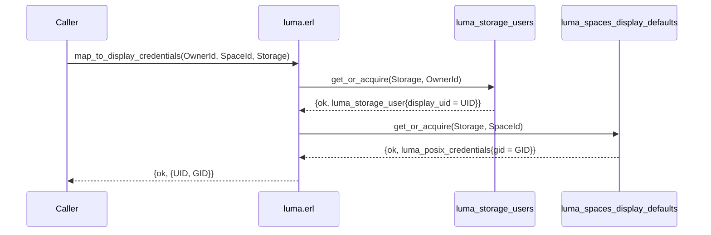
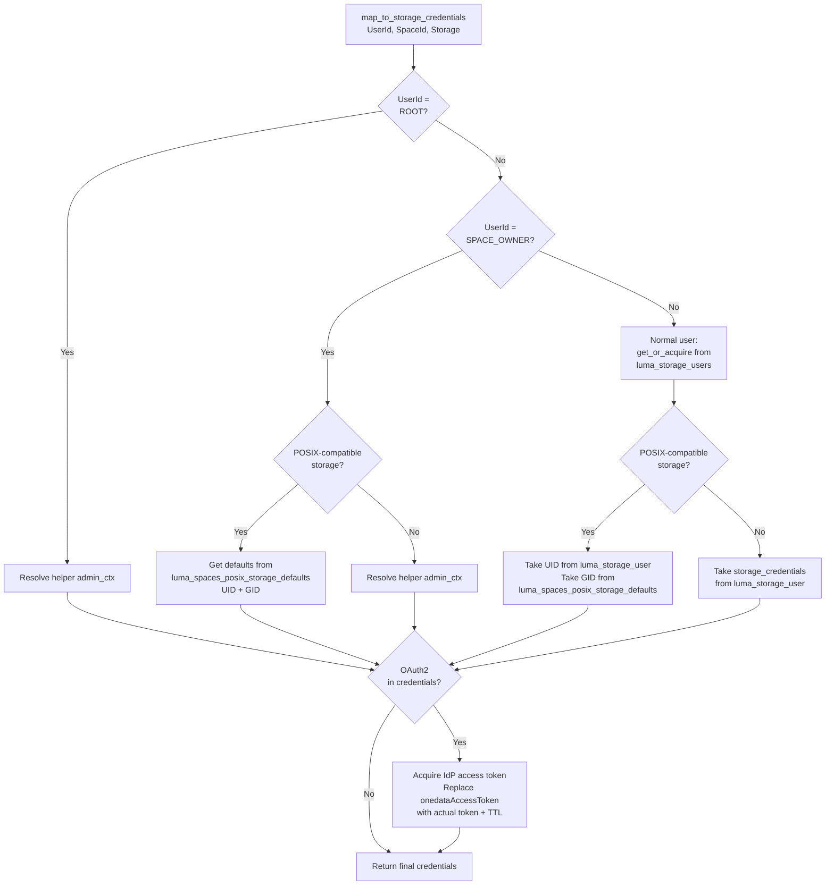

# Credential Resolution

> This document complements the [LUMA Overview](_overview.md), which
> introduces the key concepts and architecture. For the database
> internals, see [Data Model & Persistence](data-model.md).

Credential resolution is the core function of LUMA — translating a
Onedata user identity into credentials that a storage backend
understands. The system resolves two types of credentials:
**storage credentials** (used by helpers to perform I/O) and
**display credentials** (UID/GID shown to users in Oneclient). The
resolution logic differs significantly depending on whether the storage
is POSIX-compatible, what feed type is configured, and whether the user
is a regular user or a space owner.

## Storage Credentials

Storage credentials are passed to the C++ helper when performing file
operations on behalf of a specific user. The entry point is
`luma:map_to_storage_credentials/3,4`.

### Resolution by User Type

The system first classifies the requesting user:

- **Root user** (`?ROOT_USER_ID`) — Always receives the helper's
  **admin context** directly from `helper_config`. No LUMA lookup
  occurs. This is the fast path for internal system operations.

- **Space owner** (`?SPACE_OWNER_ID(SpaceId)`) — A synthetic identity
  representing the space itself. Resolution depends on storage type:
  - On POSIX-compatible storages: uses default UID and GID from the
    `luma_spaces_posix_storage_defaults` table.
  - On non-POSIX storages: falls back to the helper's admin context.

- **Normal user** — The full LUMA resolution flow applies. See below.

### Normal User — Full Resolution Flow

For a normal user, the system looks up the `luma_storage_users` table
using [`get_or_acquire`](data-model.md#the-get_or_acquire-pattern). If
the entry is missing, it is acquired from the configured feed (auto,
local, or external) — see
[Database Population](data-model.md#database-population) for how
records enter the DB. The resulting `#luma_storage_user{}` record
contains both `storage_credentials` (the helper user context) and
`display_uid`.

What happens next depends on the storage type:

#### Non-POSIX Storages (S3, Ceph, Swift, WebDAV, …)

The `storage_credentials` from the `#luma_storage_user{}` record are
returned directly. These are typically access key/secret pairs, admin
contexts, or OAuth2 placeholders.

#### POSIX-Compatible Storages (POSIX, GlusterFS, NullDevice)

On POSIX storages, only the `uid` is taken from the per-user
`#luma_storage_user{}` record. The `gid` comes from the
`luma_spaces_posix_storage_defaults` table, which provides a shared
GID for the entire space.

This design reflects a key invariant: **all files in a space must share
the same GID**, because Onedata treats all space members as a single
POSIX group. Without a shared GID, storage-level group permission checks
would be inconsistent across users.

### Space Owner — POSIX Storage

When the requesting user is a space owner (`?SPACE_OWNER_ID(SpaceId)`)
on a POSIX-compatible storage, both UID and GID come from the
`luma_spaces_posix_storage_defaults` table:

### OAuth2 Post-Processing

OAuth2 post-processing applies **to every user type** — root, space
owner, and normal user. After resolving the base storage credentials
(admin context, space defaults, or per-user LUMA record), the system
checks whether the helper supports OAuth2. If the credentials contain
`<<"credentialsType">> := <<"oauth2">>`, an additional step acquires
a fresh IdP access token:

1. Determine the OAuth2 Identity Provider (IdP):
   - If `<<"oauth2IdP">>` is set in credentials — use it explicitly.
   - Otherwise — query Onezone for the list of offline-access IdPs.
     If exactly one exists, use it. If zero or more than one, fail
     with an error.

2. Acquire the access token:
   - For **root user**, **space owner** (admin context), or **auto feed**
     — use the admin's Onedata access token (`<<"onedataAccessToken">>`
     from credentials) to obtain an IdP token via `idp_access_token:acquire/3`.
   - For **normal users** — use the user's session to obtain an IdP
     token via `idp_access_token:acquire/3`.

3. Replace the `<<"onedataAccessToken">>` field with the actual
   `<<"accessToken">>` and `<<"accessTokenTTL">>`.

This mechanism allows OAuth2-based storages (WebDAV, HTTP) to work
with user-specific or admin-delegated tokens, depending on the
configured feed and user type.

## Display Credentials

Display credentials are a `{UID, GID}` pair returned in `getattr`
responses and shown by Oneclient. They are purely for presentation —
they do not affect access control. The entry point is
`luma:map_to_display_credentials/3`.

### Resolution Rules

Display credentials are always a POSIX-style `{UID, GID}` tuple,
regardless of the storage type. The resolution combines data from two
sources:

| Component | Source |
|-----------|--------|
| **Display UID** | `display_uid` field from `#luma_storage_user{}` in `luma_storage_users` table |
| **Display GID** | `gid` field from `#luma_posix_credentials{}` in `luma_spaces_display_defaults` table |

### By User Type

- **Root user** — Returns `{0, 0}` immediately.

- **Space owner** — Both UID and GID come from the
  `luma_spaces_display_defaults` table.

- **Normal user** — UID comes from `luma_storage_users` (the
  `display_uid` field), GID comes from `luma_spaces_display_defaults`.

### Unsupported Space

When the storage is `undefined` (unsupported space), display
credentials are generated on the fly using `luma_auto_feed`:
`{generate_uid(OwnerId), generate_gid(SpaceId)}`.

### Normal User — Display Credentials Flow

## Comprehensive Decision Tree

The following flowchart shows the complete decision tree for storage
credential resolution:

## Related Documentation

- **[LUMA Overview](_overview.md)** — Key concepts and architecture
- **[Reverse LUMA](reverse-luma.md)** — Mapping storage identities
  back to Onedata users/groups
- **[Data Model & Persistence](data-model.md)** — How mappings are
  stored, serialized, populated, and cached
- **[Helper Operations](../helper-operations.md)** — How credentials
  are used by the helper handle system
