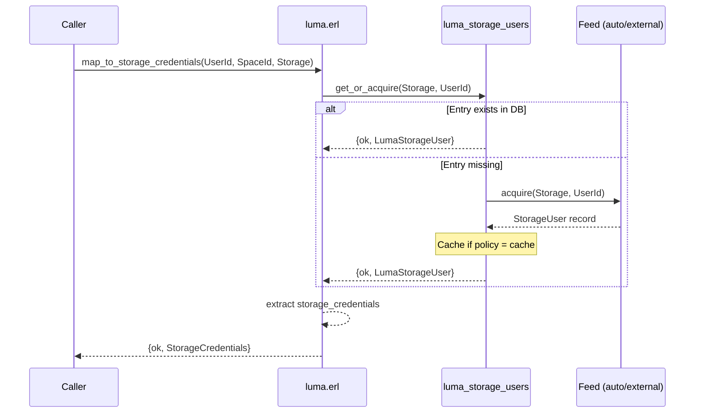
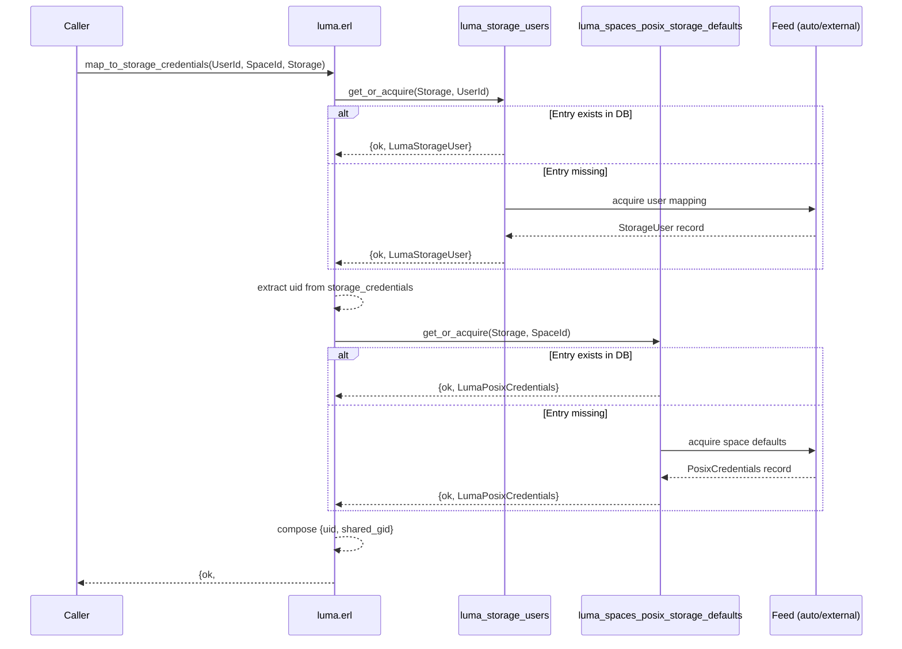
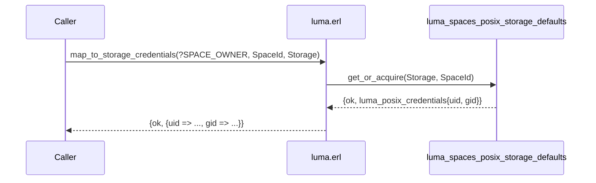
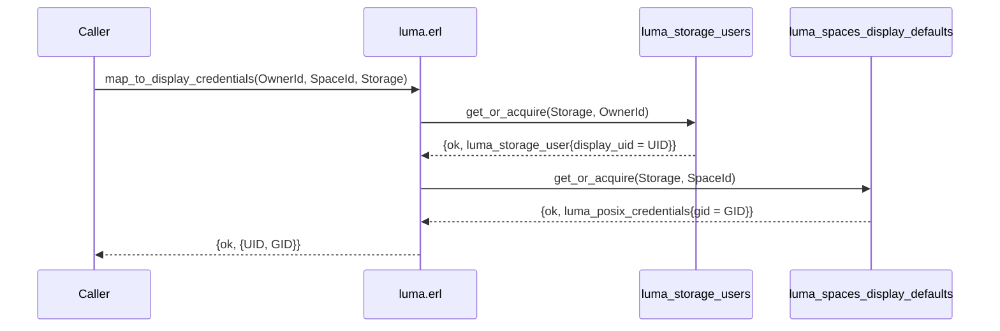
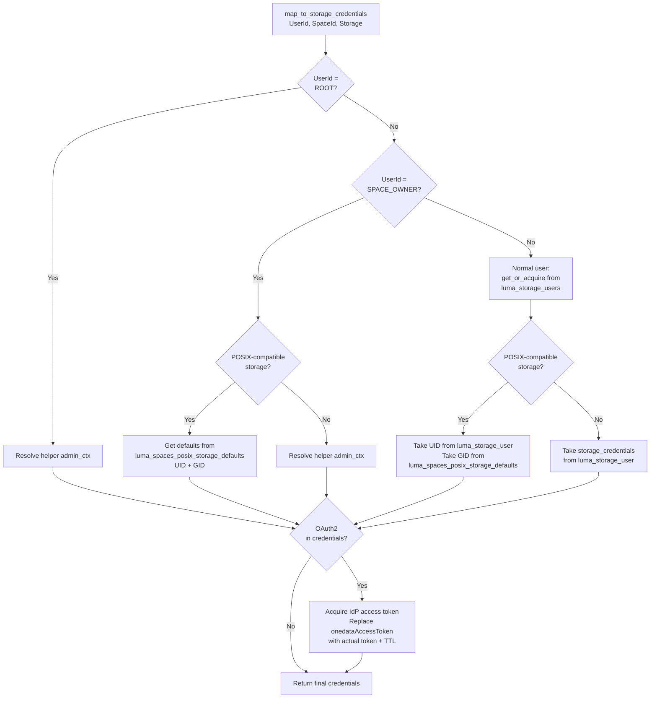
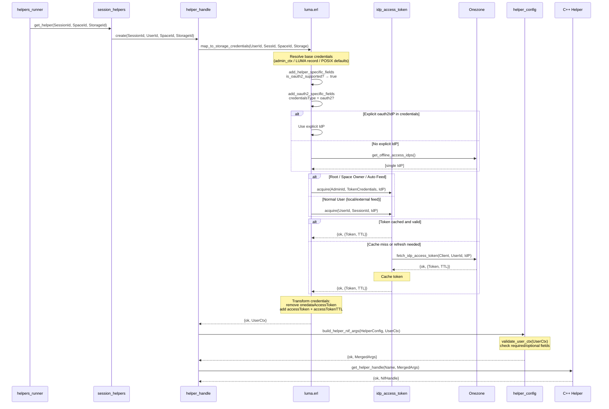

# Credential Resolution

> This document complements the [LUMA Overview](_overview.md), which
> introduces the key concepts and architecture. For the database
> internals, see [Data Model & Persistence](data-model.md).

Credential resolution is the core function of LUMA — translating a
Onedata user identity into credentials that a storage backend
understands. The system resolves two types of credentials:
**storage credentials** (used by helpers to perform I/O) and
**display credentials** (UID/GID shown to users in Oneclient). The
resolution logic differs significantly depending on whether the storage
is POSIX-compatible, what feed type is configured, and whether the user
is a regular user or a space owner.

## Storage Credentials

Storage credentials are passed to the C++ helper when performing file
operations on behalf of a specific user. The entry point is
`luma:map_to_storage_credentials/3,4`.

### Resolution by User Type

The system first classifies the requesting user:

- **Root user** (`?ROOT_USER_ID`) — Always receives the helper's
  **admin context** directly from `helper_config`. No LUMA lookup
  occurs. This is the fast path for internal system operations.

- **Space owner** (`?SPACE_OWNER_ID(SpaceId)`) — A synthetic identity
  representing the space itself. Resolution depends on storage type:
  - On POSIX-compatible storages: uses default UID and GID from the
    `luma_spaces_posix_storage_defaults` table.
  - On non-POSIX storages: falls back to the helper's admin context.

- **Normal user** — The full LUMA resolution flow applies. See below.

### Normal User — Full Resolution Flow

For a normal user, the system looks up the `luma_storage_users` table
using [`get_or_acquire`](data-model.md#the-get_or_acquire-pattern). If
the entry is missing, it is acquired from the configured feed (auto,
local, or external) — see
[Database Population](data-model.md#database-population) for how
records enter the DB. The resulting `#luma_storage_user{}` record
contains both `storage_credentials` (the helper user context) and
`display_uid`.

What happens next depends on the storage type:

#### Non-POSIX Storages (S3, Ceph, Swift, WebDAV, …)

The `storage_credentials` from the `#luma_storage_user{}` record are
returned directly. These are typically access key/secret pairs, admin
contexts, or OAuth2 placeholders.

#### POSIX-Compatible Storages (POSIX, GlusterFS, NullDevice)

On POSIX storages, only the `uid` is taken from the per-user
`#luma_storage_user{}` record. The `gid` comes from the
`luma_spaces_posix_storage_defaults` table, which provides a shared
GID for the entire space.

This design reflects a key invariant: **all files in a space must share
the same GID**, because Onedata treats all space members as a single
POSIX group. Without a shared GID, storage-level group permission checks
would be inconsistent across users.

### Space Owner — POSIX Storage

When the requesting user is a space owner (`?SPACE_OWNER_ID(SpaceId)`)
on a POSIX-compatible storage, both UID and GID come from the
`luma_spaces_posix_storage_defaults` table:

### OAuth2 Post-Processing (Summary)

OAuth2 post-processing applies **to every user type** — root, space
owner, and normal user. After resolving the base storage credentials
(admin context, space defaults, or per-user LUMA record), the system
checks whether the helper supports OAuth2. If the credentials contain
`<<"credentialsType">> := <<"oauth2">>`, an additional step acquires
a fresh IdP access token. This mechanism allows OAuth2-based storages
(WebDAV, HTTP) to work with user-specific or admin-delegated tokens,
depending on the configured feed and user type.

The full details of this flow — including IdP selection, token
acquisition, caching, and how the resulting credential map is
validated by the helper config — are described in the dedicated
section below:
[OAuth2 Credential Lifecycle](#oauth2-credential-lifecycle).

## Display Credentials

Display credentials are a `{UID, GID}` pair returned in `getattr`
responses and shown by Oneclient. They are purely for presentation —
they do not affect access control. The entry point is
`luma:map_to_display_credentials/3`.

### Resolution Rules

Display credentials are always a POSIX-style `{UID, GID}` tuple,
regardless of the storage type. The resolution combines data from two
sources:

| Component | Source |
|-----------|--------|
| **Display UID** | `display_uid` field from `#luma_storage_user{}` in `luma_storage_users` table |
| **Display GID** | `gid` field from `#luma_posix_credentials{}` in `luma_spaces_display_defaults` table |

### By User Type

- **Root user** — Returns `{0, 0}` immediately.

- **Space owner** — Both UID and GID come from the
  `luma_spaces_display_defaults` table.

- **Normal user** — UID comes from `luma_storage_users` (the
  `display_uid` field), GID comes from `luma_spaces_display_defaults`.

### Unsupported Space

When the storage is `undefined` (unsupported space), display
credentials are generated on the fly using `luma_auto_feed`:
`{generate_uid(OwnerId), generate_gid(SpaceId)}`.

### Normal User — Display Credentials Flow

## Comprehensive Decision Tree

The following flowchart shows the complete decision tree for storage
credential resolution:

## OAuth2 Credential Lifecycle

This section describes the complete OAuth2 credential lifecycle for
HTTP and WebDAV storages — from admin context construction at storage
creation time, through LUMA credential resolution, IdP token
acquisition, and finally user context validation before the
credentials reach the C++ helper.

> **Prerequisite reading:** The admin context for OAuth2-supporting
> storages is constructed differently from simple storages. See
> [Helper Configuration — OAuth2-Supporting Storages](../helpers/helper-config.md#oauth2-supporting-storages-http-webdav)
> for how `build_admin_ctx` works, how `resolve_admin_id` injects the
> `<<"adminId">>` field, and what the admin_ctx map looks like for each
> credential type.

### Overview

The OAuth2 credential lifecycle has three phases:

1. **Build time** (storage creation/update) — The admin context is
   constructed from the contract record. If `onedataAccessToken` is
   present, `resolve_admin_id` verifies it and injects `adminId`.
   The resulting admin_ctx is persisted with the helper config.

2. **Credential resolution** (LUMA, at I/O time) — LUMA resolves base
   credentials (admin context for root/owner/auto, per-user record for
   normal users). If the helper supports OAuth2 and the credentials
   contain `<<"credentialsType">> := <<"oauth2">>`, the OAuth2
   post-processing step acquires a fresh IdP access token.

3. **Validation** (helper config, just before NIF call) — The
   resulting user context map is validated by `validate_user_ctx/1`
   from the per-storage helper config module. The fields injected
   during OAuth2 post-processing (`<<"accessToken">>`,
   `<<"accessTokenTTL">>`) must pass validation.

### Phase 1: Admin Context Construction

Described in detail in
[Helper Configuration](../helpers/helper-config.md#oauth2-supporting-storages-http-webdav).
Key points:

- `build_admin_ctx/1` converts the contract record to a flat binary
  map with `<<"credentialsType">>` and optional credential fields.
- When `credentials_type = none`, the `<<"credentials">>` field is
  removed from the map.
- `helper_config_utils:resolve_admin_id/1` is called on the result:
  if `<<"onedataAccessToken">>` is present, it verifies the token
  against Onezone and adds `<<"adminId">> => UserId` to the map.
- The admin context is persisted as part of `#helper_config{}` in
  `storage_config`.

### Phase 2: LUMA Credential Resolution with OAuth2

After resolving base credentials (see
[Resolution by User Type](#resolution-by-user-type) above), the
function `add_helper_specific_fields/5` checks whether OAuth2
post-processing is needed.

If the helper does not support OAuth2 (e.g. S3, POSIX), credentials
are returned as-is. For HTTP and WebDAV, the system proceeds to 
checks the credential type.

If `credentialsType` is not `<<"oauth2">>` (e.g. `basic`, `token`,
`none`), no token acquisition occurs and the credentials are returned
unchanged. Space owners are treated as the root user for token
acquisition purposes.

#### Step 1: IdP Selection

The system determines which Identity Provider (IdP) to use for
token acquisition.

| Scenario | IdP source | Result |
|----------|-----------|--------|
| `<<"oauth2IdP">>` is in credentials | Use explicitly | Proceed |
| No explicit IdP, exactly one offline-access IdP in Onezone | Use that one | Proceed |
| No explicit IdP, zero offline-access IdPs | — | `{error, no_offline_access_idps}` |
| No explicit IdP, multiple offline-access IdPs | — | `{error, ambiguous_offline_access_idps}` |

#### Step 2: Token Acquisition

Once the IdP is determined, `fill_in_oauth2_token/5` acquires the
actual IdP access token. The acquisition logic differs by user
type and LUMA feed.

**Root user / Admin context**

This clause handles root user, space owner (mapped to root),
and any scenario where the admin context is used directly. It uses
the `<<"adminId">>` and `<<"onedataAccessToken">>` that were injected
by `resolve_admin_id` during
[admin context construction](../helpers/helper-config.md#the-resolve_admin_id-mechanism).

**Auto feed (any user)**

With auto feed, **all users** share the admin's OAuth2 token. This
is because auto feed maps all users to the admin context — there are
no per-user credential mappings, so the admin's Onedata access token
is the only available source for IdP token acquisition.

**Normal user (local or external feed)**

With local or external feed, each user has their own IdP token
acquired via their session.

#### Step 3: Credential Map Transformation

In all cases, the token acquisition step transforms the credential
map:

| Before | After |
|--------|-------|
| `<<"onedataAccessToken">> => <<"MDAxN...">>` | *(removed)* |
| *(not present)* | `<<"accessToken">> => <<"eyJhbG...">>` |
| *(not present)* | `<<"accessTokenTTL">> => <<"3600">>` |

The `<<"onedataAccessToken">>` is removed because it is a Onedata
internal token used only to acquire the IdP token — it should never
be passed to the C++ helper. The `<<"accessToken">>` and
`<<"accessTokenTTL">>` are the IdP-issued credentials that the C++
helper actually uses to authenticate against the storage backend.

#### Token Acquisition Summary by User Type

| User type | LUMA feed | Base credentials | Token acquired via |
|-----------|-----------|------------------|--------------------|
| Root | any | admin_ctx | admin's `onedataAccessToken` + `adminId` |
| Space owner | any | admin_ctx (non-POSIX) / POSIX defaults | admin's `onedataAccessToken` + `adminId` |
| Normal user | auto | admin_ctx | admin's `onedataAccessToken` + `adminId` |
| Normal user | local/external | per-user LUMA record | user's session |

### Phase 3: Validation Before NIF

After LUMA resolves credentials (including OAuth2 post-processing),
the resulting user context map is passed to
`helper_config:build_helper_nif_args/2`, which calls
`validate_user_ctx/1` from the per-storage helper config module.

For HTTP and WebDAV, the validation accepts both the original admin
context fields **and** the fields injected by OAuth2 post-processing.
See
[Helper Configuration — User Context Validation](../helpers/helper-config.md#user-context-validation)
for the full field list and validation logic.

After successful validation, `build_helper_nif_args/2` merges the
helper config `args` with the user context into a single flat binary
map that is passed to the C++ NIF.

### Token Caching and Refresh

IdP access tokens are cached in the `idp_access_token` datastore
model to avoid redundant calls to Onezone:

- **Cache key:** `{UserId, IdP}` — one cached token per user per IdP.
- **Cache hit:** If the cached token exists and is not due for
  refresh, it is returned immediately with its remaining TTL.
- **Refresh:** If the token is near expiration (`should_refresh/1`
  returns `true`), a fresh token is fetched from Onezone via
  `user_logic:fetch_idp_access_token/3` and the cache is updated.
- **Cache miss:** A new token is fetched and cached.

When a cached token expires and the C++ helper receives an expired
token, the helper returns `EKEYEXPIRED`. The
[error handling in `helpers_runner`](../helpers/helper-operations.md#helpers_runner--operation-level-errors)
catches this, triggers `helpers_reload:refresh_handle_params/4`
(which re-runs LUMA credential resolution, acquiring a fresh IdP
token), and retries the operation.

### Complete OAuth2 Flow — Sequence Diagram

## Related Documentation

- **[LUMA Overview](_overview.md)** — Key concepts and architecture
- **[Reverse LUMA](reverse-luma.md)** — Mapping storage identities
  back to Onedata users/groups
- **[Data Model & Persistence](data-model.md)** — How mappings are
  stored, serialized, populated, and cached
- **[Helper Configuration](../helpers/helper-config.md)** — How
  `#helper_config{}` is built from contracts, including
  [OAuth2-specific admin context construction](../helpers/helper-config.md#oauth2-supporting-storages-http-webdav)
- **[Helper Operations](../helpers/helper-operations.md)** — How
  credentials are used by the helper handle system, including
  `EKEYEXPIRED` handling for expired OAuth2 tokens
