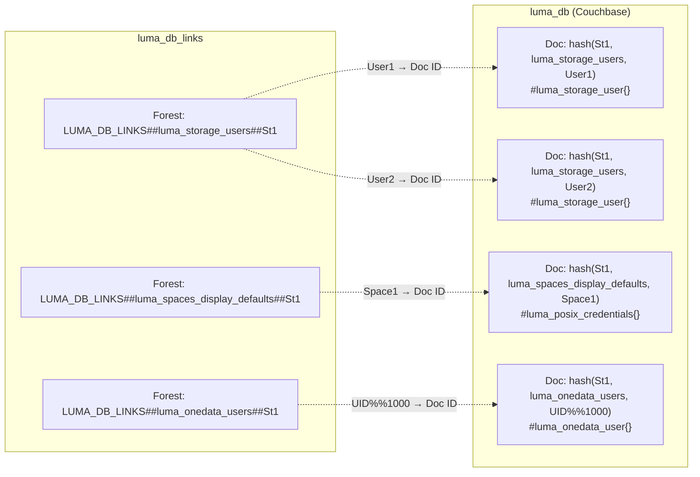
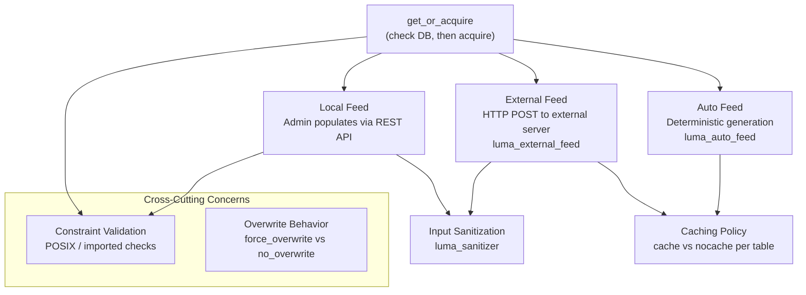

# Data Model & Persistence

> This document complements the [LUMA Overview](_overview.md) which
> introduces the architecture, and
> [Credential Resolution](credential-resolution.md) which describes
> how credentials are resolved. This document focuses on *how* the
> data is stored, serialized, and managed.

LUMA DB uses a single generic datastore model (`luma_db`) that stores
all five logical tables in one document space. Each mapping entry is a
**separate Couchbase document** identified by a deterministic hash.
Documents are complemented by **[link forests](#the-link-system)** for
enumeration and use **in-memory replication** across cluster nodes for
fast reads.

## Document Structure

Every entry in the LUMA DB is stored as a single Couchbase document
with the following structure:

```erlang
#document{
    key = DocId,            %% deterministic hash
    value = #luma_db{
        table = TableName,  %% atom: luma_storage_users, etc.
        record = Record,    %% custom record (see below)
        storage_id = StorageId,
        feed = Feed         %% auto | local | external
    }
}
```

### Document ID Generation

The document ID is a **deterministic hash** of three components:

```
DocId = datastore_key:new_from_digest([StorageId, TableName, Key])
```

Where:
- `StorageId` — The storage the mapping belongs to.
- `TableName` — The table module name as a binary
  (e.g. `<<"luma_storage_users">>`).
- `Key` — The table-specific key (e.g. `od_user:id()`,
  `od_space:id()`, or a composite key like `<<"UID%%1000">>`).

This means that the same logical key in different tables or on
different storages produces different document IDs.

### Record Serialization

The `record` field stores a custom Erlang record (`#luma_storage_user{}`,
`#luma_posix_credentials{}`, `#luma_onedata_user{}`, or
`#luma_onedata_group{}`). These are serialized using a **tagged JSON
encoding**:

```json
{
    "recordType": "luma_storage_user",
    "storageCredentials": {"uid": "1000"},
    "displayUid": 1000
}
```

The serialization is handled by `luma_db_record`:

- **`encode/1`** — Calls `Module:to_json(Record)` to get the JSON
  map, adds a `<<"recordType">>` field with the module name, then
  encodes to a binary via `json_utils:encode/1`.
- **`decode/1`** — Decodes the binary, extracts `<<"recordType">>` to
  determine the module, then calls `Module:from_json(Map)` to
  reconstruct the Erlang record.

The datastore record struct declares this field as:

```erlang
{record, {custom, json, {luma_db_record, encode, decode}}}
```

This means the datastore framework delegates serialization entirely to
the `luma_db_record` module rather than using its standard record
encoding.

### The `feed` Field

Each stored document remembers which feed produced it. This metadata
is used by [`delete_if_auto_feed/3`](#selective-auto-feed-deletion) to
selectively delete only auto-generated entries while preserving
admin-configured or externally-fetched ones. For example, when POSIX storage defaults are
updated via local feed, the system deletes the auto-feed display
defaults for the same space but keeps any that were explicitly set.

## Persistence Model

| Layer | Technology | Purpose |
|-------|-----------|---------|
| Memory | ETS (`ets_driver`) | In-memory cache for fast reads |
| Disc | Couchbase (`couchbase_driver`) | Durable persistence |
| Replication | `memory_copies => all` | Replicate to ETS on all cluster nodes |

The `luma_db` model is configured with `memory_copies => all`, which
means that on every write, the document is replicated to the in-memory
ETS cache on **all cluster nodes** in the provider. This ensures that
credential lookups can be served from local memory without network hops.

Couchbase provides durability — if a node restarts, the ETS cache is
repopulated from Couchbase on demand.

### The Four Record Types

#### `#luma_storage_user{}`

Represents a Onedata user's credentials on a specific storage.

| Field | Type | Description |
|-------|------|-------------|
| `storage_credentials` | `map()` | Credentials passed to the helper. Content depends on storage type. |
| `display_uid` | `non_neg_integer()` | UID shown in file attributes for this user. |

**JSON representation:**

```json
{
    "storageCredentials": {"accessKey": "...", "secretKey": "..."},
    "displayUid": 42000
}
```

On POSIX storages, `storage_credentials` contains only `{"uid": "1000"}`.
The GID is not stored per-user — it comes from the space defaults table.

On non-POSIX storages, `storage_credentials` contains whatever the
helper expects — access keys, tokens, etc.

#### `#luma_posix_credentials{}`

Represents a UID/GID pair. Used by both
`luma_spaces_posix_storage_defaults` and `luma_spaces_display_defaults`.

| Field | Type | Description |
|-------|------|-------------|
| `uid` | `non_neg_integer()` | POSIX user ID |
| `gid` | `non_neg_integer()` | POSIX group ID |

**JSON representation:**

```json
{
    "uid": 1000,
    "gid": 1000
}
```

#### `#luma_onedata_user{}`

Identifies a Onedata user. Used in reverse LUMA mappings.

| Field | Type | Description |
|-------|------|-------------|
| `onedata_user_id` | `od_user:id()` | The resolved Onedata user ID. |
| `idp` | `binary() \| undefined` | Identity Provider ID (for IdP scheme). |
| `subject_id` | `binary() \| undefined` | Subject ID at the IdP (for IdP scheme). |
| `mapping_scheme` | `binary()` | `<<"onedataUser">>` or `<<"idpUser">>`. |

**JSON representation (Onedata scheme):**

```json
{
    "mappingScheme": "onedataUser",
    "onedataUserId": "a1b2c3d4...",
    "idp": null,
    "subjectId": null
}
```

**JSON representation (IdP scheme):**

```json
{
    "mappingScheme": "idpUser",
    "onedataUserId": "a1b2c3d4...",
    "idp": "github",
    "subjectId": "12345"
}
```

When created with the IdP scheme, the `onedata_user_id` is resolved
during construction by calling
`provider_logic:map_idp_user_to_onedata/2`.

#### `#luma_onedata_group{}`

Identifies a Onedata group. Used in reverse LUMA for ACL group mapping.

| Field | Type | Description |
|-------|------|-------------|
| `onedata_group_id` | `od_group:id()` | The resolved Onedata group ID. |
| `idp` | `binary() \| undefined` | Identity Provider ID (for entitlement scheme). |
| `idp_entitlement` | `binary() \| undefined` | Entitlement string at the IdP. |
| `mapping_scheme` | `binary()` | `<<"onedataGroup">>` or `<<"idpEntitlement">>`. |

**JSON representation (Onedata scheme):**

```json
{
    "mappingScheme": "onedataGroup",
    "onedataGroupId": "x1y2z3...",
    "idp": null,
    "idpEntitlement": null
}
```

### The Five Logical Tables

All five tables share the same underlying `luma_db` datastore model.
They are distinguished by the `table` field in the `#luma_db{}` record
and by the `TableName` component in the document ID hash.



#### Table Summary

| Table Module | Key | Record Type | Per-Storage Scope | Constraints |
|-------------|-----|-------------|-------------------|-------------|
| `luma_storage_users` | `od_user:id()` | `#luma_storage_user{}` | `(StorageId, UserId)` | None |
| `luma_spaces_posix_storage_defaults` | `od_space:id()` | `#luma_posix_credentials{}` | `(StorageId, SpaceId)` | Store: POSIX + non-imported |
| `luma_spaces_display_defaults` | `od_space:id()` | `#luma_posix_credentials{}` | `(StorageId, SpaceId)` | None |
| `luma_onedata_users` | [composite](#composite-keys-in-luma_onedata_users) | `#luma_onedata_user{}` | `(StorageId, UID\|AclUser)` | POSIX + imported |
| `luma_onedata_groups` | `acl_who` | `#luma_onedata_group{}` | `(StorageId, AclGroup)` | POSIX + imported |

#### Composite Keys in `luma_onedata_users`

The `luma_onedata_users` table stores two types of mappings using a
single key space with type-prefixed keys:

```
UID%%<numeric_uid>     — for UID-based reverse mapping
ACL%%<acl_username>    — for ACL-based reverse mapping
```

The prefix and separator (`%%`) prevent collisions between numeric UIDs
and ACL usernames.

### The Link System

Datastore documents are stored by their hash ID, which makes
enumeration impossible without an index. The **link forest** system
provides this index:

- For each `(Table, StorageId)` pair, a link forest exists with key
  `LUMA_DB_LINKS##<TableName>##<StorageId>`.
- Each link maps the table-level key (e.g. `od_user:id()`) to the
  document ID.
- Links are stored in the local provider's tree (`TreeId = oneprovider:get_id()`) — 
  they are **not synchronized** across providers.

#### Link Operations

- **`add_link/4`** — Called whenever a document is stored. Adds a
  `(Key → DocId)` link to the appropriate forest. Idempotent — ignores
  `already_exists` errors.
- **`delete_link/3`** — Called when a document is deleted. Removes the
  link. Idempotent.
- **`list/4`** — Enumerates all entries in a `(Table, StorageId)`
  forest with pagination support via tokens. Used by `clear_all/2` to
  iterate and delete all entries.

#### `clear_all` — Bulk Deletion

The `luma_db:clear_all/2` function deletes all entries in a table for
a given storage. It works by iterating through the
[link forest](#the-link-system) in batches of 1000, deleting each
document and its corresponding link. For higher-level clearing
operations that invoke this function, see
[Database Clearing](#database-clearing).

```
clear_all(StorageId, Table)
  │
  ├─ list links(Table, StorageId, batch=1000)
  │   └─ for each (Key, DocId):
  │       ├─ delete document DocId
  │       └─ delete link Key
  │
  └─ if more links: repeat with next token
```

## Database Population

The LUMA DB is populated in two fundamentally different ways,
depending on the configured feed type:

- **Local feed** — The administrator manually inserts mappings via the
  Onepanel REST API **before** the storage is used. The database is
  the sole source of truth; if a mapping is absent, the lookup fails.
- **Auto and external feeds** — The database is populated
  **on demand**: when a mapping is first needed and not yet present,
  the system generates it (auto) or fetches it from an external server
  (external), optionally caches the result, and returns it.



**Subsections:**

- [The `get_or_acquire` Pattern](#the-get_or_acquire-pattern) — core DB access mechanism
- [Population via Local Feed](#population-via-local-feed) — admin REST API path
- [Population via Auto Feed](#population-via-auto-feed) — deterministic generation
- [Population via External Feed](#population-via-external-feed) — HTTP fetch from external server
- [Caching Policy](#caching-policy) — which records are persisted, which are ephemeral
- [Input Sanitization](#input-sanitization) — when and where validation occurs
- [Constraint Validation](#constraint-validation) — storage type preconditions
- [Overwrite Behavior](#overwrite-behavior) — `force_overwrite` vs `no_overwrite`

### The `get_or_acquire` Pattern

The central data access pattern in LUMA is **get-or-acquire**: check
the database first, and if the entry is missing, call the configured
feed to obtain it. This pattern is implemented in
`luma_db:get_or_acquire/5`:

```
get_or_acquire(Storage, Key, Table, AcquireFun, Constraints)
  │
  ├─ Validate constraints (POSIX? imported?)
  │   └─ Fail early if storage type doesn't match
  │
  ├─ get(Storage, Key, Table)
  │   ├─ Found → return record
  │   └─ Not found ↓
  │
  └─ acquire_and_maybe_store(AcquireFun)
      │
      └─ AcquireFun()  ← provided by the table module's acquire/2
          ├─ {cache, Record, Feed}    → store in DB via luma_db:store, return Record
          ├─ {nocache, Record, Feed}  → return Record without storing
          └─ {error, _}               → return error
```

Each table module provides its own `acquire/2` function that
dispatches to the appropriate feed based on the storage's LUMA
configuration (`storage:get_luma_feed/1`). The behavior differs per
feed type: [local](#population-via-local-feed),
[auto](#population-via-auto-feed), and
[external](#population-via-external-feed).

### Population via Local Feed

With the local feed, the administrator is responsible for inserting
all required mappings before the storage begins serving requests. The
population path is:

```
Onepanel REST API
  → rpc_api:<table_function>(StorageId, Key, Data)
    → <table_module>:store(Storage, Key, Data)
      ├─ luma_sanitizer:sanitize_*(Data)     ← input validation
      ├─ (table-specific preprocessing)
      └─ luma_db:store(Storage, Key, Table, Record, ?LOCAL_FEED, OverwriteFlag, Constraints)
          ├─ Validate constraints
          ├─ Create document with feed = local
          ├─ Save to Couchbase + replicate to ETS
          └─ Add link to link forest
```

For example, storing a storage user mapping:

1. Onepanel calls `rpc_api:luma_storage_users_store(StorageId, OnedataUserMap, StorageUserMap)`.
2. This calls `luma_storage_users:store/3`, which:
   - Sanitizes the `OnedataUserMap` via `luma_sanitizer:sanitize_onedata_user/1`.
   - Sanitizes the `StorageUserMap` via `luma_sanitizer:sanitize_storage_user/2`.
   - Constructs the `#luma_storage_user{}` record.
   - Stores it via `luma_db:store/7` with `feed = ?LOCAL_FEED` and
     [`?NO_OVERWRITE`](#overwrite-behavior) (to prevent accidental
     overwrites).
   - If the storage is POSIX-compatible and imported, also creates a
     reverse mapping in `luma_onedata_users`.

When the `get_or_acquire` function is called on a storage with local
feed and the record is not in the DB, the table's `acquire/2` returns
`{error, not_found}` — **there is no fallback**. The admin must have
populated the mapping beforehand.

### Population via Auto Feed

With the auto feed, mappings are **generated deterministically** by
`luma_auto_feed` whenever a `get_or_acquire` call finds no existing
record. No external I/O or admin action is required.

The generation logic depends on the table and the storage type:

| Table | Generation Strategy |
|-------|-------------------|
| `luma_storage_users` | **POSIX:** generate UID by hashing `UserId` into the configured `uid_range`. **Non-POSIX:** return the storage's admin context (the credentials configured at storage creation). |
| `luma_spaces_posix_storage_defaults` | Perform `stat` on the storage mountpoint directory and use the resulting UID/GID. |
| `luma_spaces_display_defaults` | **POSIX:** delegate to `luma_spaces_posix_storage_defaults:get_or_acquire` (which may itself trigger auto generation). **Non-POSIX:** generate UID/GID by hashing `SpaceId` into the configured ranges. |
| `luma_onedata_users` | **No auto generation.** Returns `{error, not_found}`. Reverse mappings require local or external feed. |
| `luma_onedata_groups` | **No auto generation.** Returns `{error, not_found}`. |

**Key characteristics of auto feed population:**

- **No sanitization** — Auto-generated values are produced
  programmatically and are inherently valid, so `luma_sanitizer` is
  not called during acquisition.
- **Caching varies by table** — Some auto-generated values are cached
  in the DB; others are re-generated on every access (see
  [Caching Policy](#caching-policy) below).

### Population via External Feed

With the external feed, mappings are **fetched from an HTTP server**
when `get_or_acquire` finds no existing record. The system sends an
HTTP POST request with context about the entity being mapped and
expects a JSON response.

The acquisition flow is:

```
<table_module>:acquire(Storage, Key)
  → luma_external_feed:<endpoint_function>(Key, Storage)
    ├─ Build JSON request body with context
    ├─ HTTP POST to external LUMA server
    ├─ On 200: luma_sanitizer:sanitize_*(ResponseBody)   ← input validation
    │          return {ok, SanitizedData}
    ├─ On 404: return {error, not_found}
    └─ Other:  log error, return {error, luma_external_feed_error}
  → (table wraps result as {cache, Record, ?EXTERNAL_FEED})
  → luma_db stores record in DB
```

**Key characteristics of external feed population:**

- **Always sanitized** — Every response from the external server is
  validated via `luma_sanitizer` before being stored. Invalid responses
  cause the acquisition to fail with an error.
- **Always cached** — External feed results are returned with the
  `cache` [policy](#caching-policy) so that subsequent lookups avoid
  repeated HTTP calls.
- **Special behavior for optional endpoints** — For
  `luma_spaces_posix_storage_defaults` and
  `luma_spaces_display_defaults`, the external feed endpoint is
  optional. If the external server returns an empty map or 404, the
  missing fields are filled in from auto feed (stat of mountpoint
  or hash-based generation). In this case the record is tagged with
  `feed = ?AUTO_FEED` if all fields came from auto, or
  `feed = ?EXTERNAL_FEED` if at least some came from the external
  server.
- **Special behavior for `luma_spaces_posix_storage_defaults` on imported
  storages** — On imported storages this table is *always* populated
  from the auto feed (stat of mountpoint), regardless of the
  storage-level feed setting. This is because on imported storages the
  on-disk UID/GID must be used directly.

### Caching Policy

When auto or external feed generates a record, it decides whether the
result should be stored in the DB or returned without caching. This is
signaled by the first element of the acquire result tuple:

- `{cache, Record, Feed}` — Store in the DB for future lookups.
- `{nocache, Record, Feed}` — Return the record but do not persist it;
  the next `get_or_acquire` call will re-generate it.

The policy varies per table and feed:

| Table | Auto Feed | External Feed | Rationale |
|-------|-----------|---------------|-----------|
| `luma_storage_users` | `nocache` | `cache` | Auto: cheap hash computation, repeated identically. External: avoid repeated HTTP calls. |
| `luma_spaces_posix_storage_defaults` | `cache` | `cache` | Auto: `stat()` on mountpoint is expensive I/O; result must remain stable. |
| `luma_spaces_display_defaults` | `nocache` | `cache` | Auto: derived from other tables (posix defaults or hash), not worth duplicating. External: avoid repeated HTTP calls. |
| `luma_onedata_users` | *(no auto)* | `cache` | Only populated via external or local feed. |
| `luma_onedata_groups` | *(no auto)* | `cache` | Only populated via external or local feed. |

Note that `nocache` entries are never persisted, so they leave no
trace in the DB. On auto-feed storages, `luma_storage_users` and
`luma_spaces_display_defaults` are effectively computed on the fly
for every request. This means [`clear_db`](#database-clearing) has no
effect on these particular mappings — they will simply be
re-generated.

### Input Sanitization

Data entering the LUMA DB is validated by `luma_sanitizer`, which uses
`middleware_sanitizer` to enforce type and range constraints:

| Data Type | Validation Rules |
|-----------|-----------------|
| Storage user | `storageCredentials` required (validated per helper type); `displayUid` optional, integer in `[0, UID_MAX]` |
| POSIX credentials | `uid` and `gid` optional, integers in `[0, UID_MAX]` / `[0, GID_MAX]` |
| Onedata user | `mappingScheme` required (`onedataUser` or `idpUser`); scheme-specific fields required |
| Onedata group | `mappingScheme` required (`onedataGroup` or `idpEntitlement`); scheme-specific fields required |

For POSIX-compatible storages, storage credentials are additionally
validated to ensure `uid` is a non-negative integer. All integer values
in storage credentials are converted to binaries before storage,
because credentials are passed directly to the C++ helper which
expects string values.

**When sanitization is applied depends on the feed type:**

- **Local feed** — Sanitization happens in each table's `store/3`
  function, before the record is passed to `luma_db:store`. This is
  the point where user-supplied JSON from the REST API is validated.
- **External feed** — Sanitization happens in `luma_external_feed`,
  immediately after decoding the HTTP response body. Each endpoint
  function calls the appropriate `luma_sanitizer:sanitize_*` function
  before returning the data to the table's `acquire` function.
- **Auto feed** — **No sanitization is performed.** Auto-generated
  values are produced by deterministic code within the system
  (hash-based UID/GID generation, `stat` calls, or admin context
  retrieval), so they are inherently valid.

### Constraint Validation

Certain table operations are only valid on specific storage types.
Before executing a DB operation, `luma_db` validates a list of
constraints passed by the table module:

| Constraint | Validated Against | Error on Failure |
|-----------|-------------------|-----------------|
| `posix_storage` | `storage:is_posix_compatible/1` | `?ERR_REQUIRES_POSIX_COMPATIBLE_STORAGE` |
| `imported_storage` | `storage:is_imported/1` | `?ERR_REQUIRES_IMPORTED_STORAGE` |
| `non_imported_storage` | `not storage:is_imported/1` | `?ERR_REQUIRES_NON_IMPORTED_STORAGE` |

For example, storing entries in `luma_spaces_posix_storage_defaults`
via the local feed requires `[posix_storage, non_imported_storage]` — the
storage must be POSIX-compatible and not imported (because on imported
storages, these defaults always come from auto feed, even if the
overall LUMA feed is set to external).

Constraints are checked both when storing records (local feed `store`)
and when looking them up (`get_or_acquire`). For instance,
`luma_onedata_users:map_uid_to_onedata_user/2` passes
`[posix_storage, imported_storage]` to `get_or_acquire`, because
reverse UID mapping is only meaningful on POSIX-compatible imported
storages.

### Overwrite Behavior

When storing a record, two modes are available:

- **`force_overwrite`** — Uses `datastore_model:save/2`. If a document
  with the same ID exists, it is overwritten. Used by most tables and
  by all auto/external feed acquisitions.
- **`no_overwrite`** — Uses `datastore_model:create/2`. If a document
  already exists, the operation fails with `{error, already_exists}`.
  Used by `luma_storage_users:store/3` (local feed) to prevent
  accidental overwrites of existing user mappings.

## Database Clearing

The LUMA DB supports several levels of clearing:

### Full Storage Clear

`luma:clear_db(StorageId)` deletes **all entries** across all five
tables for the given storage. Internally, it calls `clear_all/1` on
each table module, which in turn uses
[`luma_db:clear_all/2`](#clear_all--bulk-deletion) to iterate through
the [link forest](#the-link-system) in batches and delete each
document and link.

This function is called in several situations:

- **Via Onepanel REST API** — `rpc_api:luma_clear_db/1`, allowing the
  administrator to wipe the LUMA DB for a storage.
- **On storage deletion** — `storage:delete_insecure/1` clears the
  LUMA DB before removing the storage.
- **On LUMA config change** — When the storage's LUMA configuration is
  updated (e.g. changing the feed type or the external server URL),
  `storage_updater` clears the entire DB to ensure stale mappings are
  not used with the new configuration.

### Per-Space Clear

`luma:clear_db(StorageId, SpaceId)` deletes only the
`luma_spaces_display_defaults` and
`luma_spaces_posix_storage_defaults` entries for a specific space on
a storage. This is used during space unsupport
(`space_unsupport:cleanup/1`).

### Selective Auto-Feed Deletion

`luma_db:delete_if_auto_feed(StorageId, Key, Table)` deletes a record
only if its `feed` field is `?AUTO_FEED`. This is used by
`luma_spaces_posix_storage_defaults:store/3` and
`luma_spaces_posix_storage_defaults:delete/2`: when an administrator
stores or deletes POSIX storage defaults via local feed, the system
also deletes the corresponding auto-generated display defaults
(if any), because they were derived from the old POSIX defaults and
are now stale. Admin-configured or externally-fetched display defaults
are preserved.

## Related Documentation

- **[LUMA Overview](_overview.md)** — Key concepts and architecture
- **[Credential Resolution](credential-resolution.md)** — How
  credentials are resolved using the data model described here
- **[Reverse LUMA](reverse-luma.md)** — How reverse mappings work
- **[Onepanel LUMA DB API](https://onedata.org/#/home/api/stable/onepanel?anchor=tag/LUMA-DB)**
  — REST API for querying and clearing LUMA DB entries
- **[Onepanel LUMA Local Feed API](https://onedata.org/#/home/api/stable/onepanel?anchor=tag/LUMA-DB-Local-Feed)**
  — REST API for managing local feed mappings
