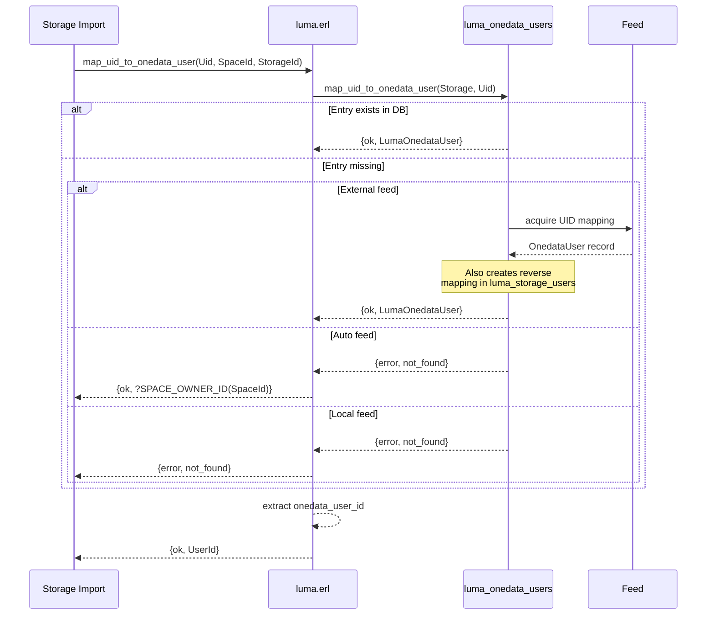

# Reverse LUMA — Storage Import Mappings

> This document complements the
> [Credential Resolution](credential-resolution.md) doc which covers
> the forward direction (Onedata user → storage credentials). For the
> database internals, see [Data Model & Persistence](data-model.md).

Reverse LUMA maps storage-native identities back to Onedata entities.
It exists exclusively for the **storage import** mechanism — the
process that discovers pre-existing files on a storage backend and
integrates them into Onedata's namespace. During import, the system
encounters POSIX UIDs and NFSv4 ACL names that must be mapped to
Onedata users and groups so that file ownership and permissions can
be represented in the logical model.

## When Reverse LUMA Is Needed

Reverse LUMA applies only when **all three conditions** are met:

1. The storage is **POSIX-compatible** (POSIX, GlusterFS, NullDevice).
2. The storage is **imported** — it has pre-existing data that Onedata
   synchronizes.
3. The LUMA feed is **local** or **external** — auto feed provides
   only limited reverse mapping (UID falls back to space owner; ACL
   mappings are unavailable).

## Three Reverse Operations

### UID → Onedata User

Maps a POSIX UID (the numeric owner of a file on storage) to an
`od_user:id()`. This determines who becomes the logical owner of
a synchronized file in Onedata.

**Behavior by feed type:**

| Feed | Behavior                                                                                                               |
|------|------------------------------------------------------------------------------------------------------------------------|
| Auto | Returns `?SPACE_OWNER_ID(SpaceId)` as the file owner. All imported files are owned by the space.                       |
| Local | Looks up the `luma_onedata_users` table with key `UID<uid>`. If missing, returns `{error, not_found}`.                 |
| External | Queries the external server. Caches the result. |

### ACL User → Onedata User

Maps an NFSv4 ACL username (a string identifier in an Access Control
Entry) to an `od_user:id()`. This is required to synchronize
storage-level NFSv4 ACLs into Onedata's permission model.

**Behavior by feed type:**

| Feed | Behavior |
|------|----------|
| Auto | Returns `{error, not_found}`. ACL synchronization requires explicit mappings. |
| Local | Looks up the `luma_onedata_users` table with key `ACL%%<aclUser>`. |
| External | Queries the external server. Caches the result. |

> [!IMPORTANT]
> Enabling LUMA (local or external feed) is **required** for
> synchronizing NFSv4 ACLs. With auto feed, ACL user and group
> mappings always fail.

### ACL Group → Onedata Group

Maps an NFSv4 ACL group name to an `od_group:id()`. Like ACL user
mapping, this is only available with local or external feed.

**Behavior by feed type:**

| Feed | Behavior |
|------|----------|
| Auto | Returns `{error, not_found}`. |
| Local | Looks up the `luma_onedata_groups` table. |
| External | Queries the external server. Caches the result. |

## Constraints

All reverse LUMA operations validate **two constraints** before
proceeding:

1. **POSIX storage** — The storage must be POSIX-compatible.
   Non-POSIX storages do not have UIDs or ACL names.
2. **Imported storage** — The storage must be imported. Non-imported
   storages have no pre-existing files to map.

If either constraint fails, the operation returns an appropriate error
(e.g. `?ERR_REQUIRES_POSIX_COMPATIBLE_STORAGE` or
`?ERR_REQUIRES_IMPORTED_STORAGE`).

## Bidirectional Mapping Maintenance

Forward and reverse mappings are kept in sync through automatic
**reverse mapping propagation**. When a forward mapping is created or
updated, the system may also create or update the corresponding
reverse mapping, and vice versa.

### Forward → Reverse

When a `luma_storage_users` entry is stored for a user on a
POSIX-compatible, imported storage, the system automatically creates a
corresponding `luma_onedata_users` UID entry. This ensures that if a
user's storage UID is known, the reverse mapping (UID → Onedata user)
is also available for storage import.

The flow:
1. `luma_storage_users:store_internal/4` stores the forward mapping.
2. Calls `maybe_add_reverse_mapping/4`.
3. If the storage is POSIX-compatible and imported, calls
   `luma_onedata_users:update_or_store_uid_mapping/4` with the user's
   UID and Onedata identity.

### Reverse → Forward

When a `luma_onedata_users` UID entry is stored (via local feed API
or external feed), the system automatically creates a corresponding
`luma_storage_users` entry — a POSIX-compatible mapping with only the
UID as storage credentials.

The flow:
1. `luma_onedata_users:store_by_uid/3` stores the reverse mapping.
2. Calls `luma_storage_users:store_posix_compatible_mapping/4` with
   the user's ID and UID.

### Update Handling

When a `luma_storage_users` entry is updated on a POSIX storage:

1. The previous storage credentials (old UID) are retrieved.
2. After the update, if the UID has changed, the old reverse mapping
   is deleted and a new one is created for the new UID.

## GID Handling on Imported Storages

> [!NOTE]
> Imported files may have different GIDs on storage, but Onedata does
> not map these GIDs to its group model. The POSIX group model
> (one GID per file) is not compatible with Onedata's group model
> (multiple groups per user with hierarchical permissions).

The administrator is encouraged to ensure that the storage file
structure is compliant with the Onedata model — all files in a space
should have the same group owner. If files have heterogeneous GIDs:

- Access may be denied by the storage even if Onedata's logical
  permissions would allow it.

## Onedata User/Group Identity Schemes

Reverse LUMA records use **mapping schemes** to identify Onedata
entities. Two schemes exist for each entity type:

### User Mapping Schemes

| Scheme | Fields | Resolution |
|--------|--------|------------|
| `onedataUser` | `onedataUserId` | Direct — the Onedata user ID is known. |
| `idpUser` | `idp`, `subjectId` | Indirect — the user is identified by their external IdP identity. Resolved to `od_user:id()` via `provider_logic:map_idp_user_to_onedata/2`. |

### Group Mapping Schemes

| Scheme | Fields | Resolution |
|--------|--------|------------|
| `onedataGroup` | `onedataGroupId` | Direct — the Onedata group ID is known. |
| `idpEntitlement` | `idp`, `idpEntitlement` | Indirect — the group is identified by its IdP entitlement. Resolved to `od_group:id()` via `provider_logic:map_idp_group_to_onedata/2`. |

The IdP-based schemes are useful when the admin knows users/groups by
their external identity (e.g. LDAP DN, SAML entitlement) but not by
their internal Onedata ID.

## Related Documentation

- **[LUMA Overview](_overview.md)** — Key concepts and architecture
- **[Credential Resolution](credential-resolution.md)** — Forward
  LUMA: Onedata user → storage credentials
- **[Data Model & Persistence](data-model.md)** — Database structure,
  record serialization, document layout
