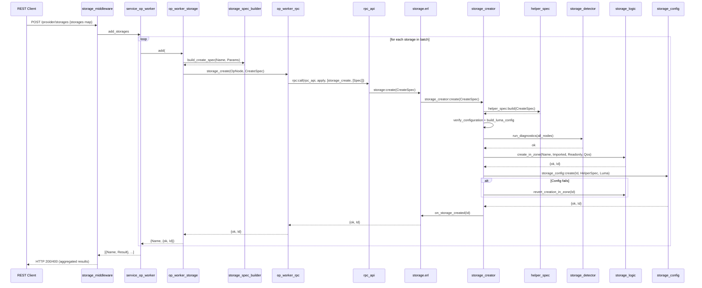
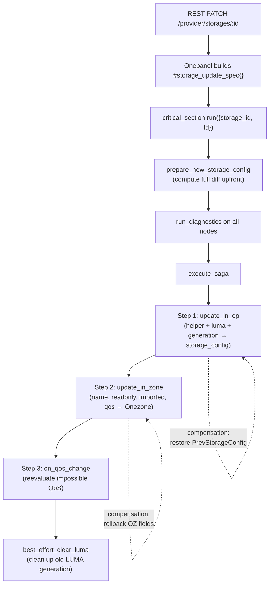

# Storage CRUD Operations

Storage CRUD operations manage the lifecycle of storage backends in
Onedata — from initial registration through configuration updates to
removal. This document describes the end-to-end flows for Create,
Update, Describe, and Delete operations, from REST request through
onepanel orchestration to op-worker business logic.

> **Complementary documentation**
>
> - [Storage Configuration Architecture Overview](_overview.md) — key concepts,
>   component roles, architecture diagram
> - [Storage Data Contracts](storage-contracts.md) — `#storage_create_spec{}`,
>   `#storage_update_spec{}`, `#storage_description{}` definitions

---

## Entry Points

### REST Endpoints

| HTTP Method | Path | Operation |
|-------------|------|-----------|
| POST | `/provider/storages` | Create storage |
| PATCH | `/provider/storages/:id` | Update storage |
| GET | `/provider/storages` | List storages |
| GET | `/provider/storages/:id` | Describe storage |
| DELETE | `/provider/storages/:id` | Delete storage |

### Onepanel Layer

| Component | Role |
|-----------|------|
| **storage_middleware** | Parses REST requests, validates against `rest_model`, delegates to services |
| **service_op_worker** | Maps service actions to `op_worker_storage` functions |
| **op_worker_storage** | Builds typed specs via `storage_spec_builder`, calls RPC |
| **op_worker_rpc** | `rpc:call(Node, rpc_api, apply, [FunctionName, Args])` |

### RPC Layer

| Op-worker module | Behaviour |
|------------------|-----------|
| **rpc_api** | Pure delegation: `storage_create/1` → `storage:create/1`; no business logic |

### Op-worker Facade

| Module | Role |
|--------|------|
| **storage.erl** | Single entry point for all storage operations; delegates to CRUD modules |

`storage.erl` overlays **storage_config** (local datastore) and **storage_logic**
(Onezone GraphSync). These modules must not be called directly; all access must
go through `storage`.

---

## Create Storage

**Create** is the most complex operation. It illustrates all patterns: spec
building, verification, diagnostics, zone persistence, local persistence, and
revert on failure.

### Batch API

The REST API supports a **batch create** — a single POST request can
contain multiple storages. The body is a map of storage name → params:

```json
{
  "my-s3":   {"type": "s3", "hostname": "...", ...},
  "my-posix": {"type": "posix", "mountPoint": "...", ...}
}
```

`service_op_worker` splits this into one step per storage and processes
each independently via `op_worker_storage:add/1`. If any storage fails,
the others still succeed; the response aggregates per-storage results.

### Sequence Diagram

The diagram shows the flow for a single storage within a batch. In a
batch request, the loop (service → op_worker_storage → RPC) repeats
for each storage in the request.



### Step-by-Step Narrative

1. **REST POST → batch dispatch**

   The client sends a JSON body with one or more storages (name → params
   map). Onepanel parses it against
   `rest_model:storage_create_request_model()` (polymorphic by type).
   `service_op_worker` produces one step per storage. Each step calls
   `op_worker_storage:add/1`.

2. **Spec building → single RPC call**

   `op_worker_storage:add/1` calls
   `storage_spec_builder:build_create_spec(Name, Params)` to translate
   the camelCase REST map into a typed `#storage_create_spec{}` record.
   Then `op_worker_rpc:storage_create(OpNode, CreateSpec)` issues a
   single RPC call. Onepanel performs no storage logic; it only sends
   the contract.

### REST to Contract Translation

The spec builders in Onepanel (`storage_spec/`) convert camelCase JSON
maps into snake_case Erlang contract records. The translation is
mechanical — no business logic, only key mapping and type conversion.

REST keys use camelCase; record fields use snake_case:

```
#{accessKey => <<"...">>} → #s3_credentials{access_key = <<"...">>}
#{bucketName => <<"...">>} → #s3_configuration{bucket_name = <<"...">>}
```

Each type has a dedicated builder (e.g. `s3_storage_spec_builder`)
implementing six functions:

| Function | Purpose |
|----------|---------|
| `build_credentials/1` | `map()` → `#type_credentials{}` |
| `build_configuration/1` | `map()` → `#type_configuration{}` |
| `build_credentials_diff/1` | `map()` → `#type_credentials_diff{}` |
| `build_configuration_diff/1` | `map()` → `#type_configuration_diff{}` |
| `credentials_to_map/1` | `#type_credentials{}` → `map()` |
| `configuration_to_map/1` | `#type_configuration{}` → `map()` |

The main `storage_spec_builder` dispatches to the type-specific builder
based on the `type` field. S3 has special handling: the REST `hostname`
URL (e.g. `https://s3.amazonaws.com:443`) is parsed into `scheme` and
`hostname` (host:port) for the contract.

3. **storage_creator:create/1**

   a. **Build helper_spec** — `helper_spec:build(StorageCreateSpec)` translates
      the contract into `#helper_spec{}` with configuration and credentials (flat binary
      maps for the C++ NIF).

   b. **Verify configuration** — `storage_crud_utils:verify_configuration/4`:
      - Readonly requires imported (`?ERR_REQUIRES_IMPORTED_STORAGE` if
        readonly=true and imported=false)
      - Readonly-only helpers (e.g. HTTP) reject readwrite
        (`?ERR_REQUIRES_READONLY_STORAGE`)
      - Import support check (`?ERR_STORAGE_IMPORT_NOT_SUPPORTED` if imported
        but helper does not support import)

   c. **Build LUMA config** — `build_luma_config(LumaSpec)` produces `luma_config`
      (feed: auto | local | external).

   d. **Run diagnostics** — `storage_crud_utils:run_diagnostics/3` invokes
      `storage_detector:run_diagnostics(all_nodes, HelperSpec, LumaFeed, Opts)`.
      Diagnostics run on **all cluster nodes**; optionally performs read-write
      test (skipped for readonly). Must pass before any persistence.

   e. **Create storage in Onezone** — `storage_logic:create_in_zone/4` registers
      the storage in Onezone via GraphSync. Returns `{ok, Id}`.

   f. **Create local storage_config** — `storage_config:create(Id, HelperSpec,
      LumaConfig)` persists the local datastore entry.

   g. **Initialize rtransfer** — `storage:on_storage_created(Id)` calls
      `rtransfer_config:add_storage/1`.

4. **Revert on failure**

   If `storage_config:create/2` fails after Onezone creation, the creator calls
   `revert_creation_in_zone(Id)` to delete the storage from Onezone. This keeps
   zone and local state consistent.

### Design Rationale: Diagnostics Before Persistence

Diagnostics run **before** any persistence (zone or local). This design ensures
**fail fast** — the system does not persist a broken configuration. If
credentials are wrong, the mount is unreachable, or the read-write test fails on
any node, the operation fails before any state is written.

### Design Rationale: Zone Before Local

Onezone is created **before** local `storage_config`. Onezone is the source of
truth for storage identity; the provider must register the storage there first.
The local storage_config is provider-specific; it relies on the zone having
already created the storage ID.

---

## Update Storage

**Update** applies partial changes to an existing storage's
configuration. The operation uses a **saga pattern** — a sequence of
steps with compensations (rollbacks) that are executed in reverse
order if any step fails. This ensures the system either fully applies
the update or restores the previous state.

### Key Constraint

- **Storage type cannot change** — `storage_updater:assert_valid_type/2`
  throws `?ERR_BAD_VALUE_NOT_ALLOWED` if `UpdateSpec#storage_update_spec.type`
  does not match the current helper spec.

### High-Level Flow



### Step-by-Step

#### 1. REST PATCH → spec building

Onepanel builds `#storage_update_spec{}` via
`storage_spec_builder:build_update_spec/2`. The spec uses
`credentials_diff` and `configuration_diff`; `undefined` means no
change.

#### 2. RPC call wrapped in critical_section

`storage:update/2` runs `critical_section:run({storage_id, Id}, Fun)`
before calling `storage_updater:update/2`. This serializes concurrent
updates.

#### 3. Preparation phase (`prepare_new_storage_config`)

Before any persistence, the updater computes the **complete new state**
upfront and determines what has changed:

a. **Assert type matches**

b. **Compute helper spec diff**

c. **Compute LUMA config diff**

d. **Increment LUMA generation** — If the LUMA config changed, the
   `luma_generation` counter is incremented. This is a critical part
   of the [LUMA generation](luma/_overview.md#luma-generation)
   mechanism: the new generation value will be persisted atomically
   with the new config, causing all subsequent LUMA DB operations to
   target a new key namespace.

e. **Verify new configuration** —
   `storage_crud_utils:verify_configuration/4` with the new
   readonly/imported values and helper spec.

f. **Run diagnostics** — `storage_crud_utils:run_diagnostics/3`
   on all nodes. Read-write test is skipped if readonly is `true`,
   or if the storage is imported and already supports a space.

The preparation phase produces three values:
- `HelperSpecChanged :: boolean()`
- `LumaChanged :: boolean()`
- `NewStorageConfig :: #storage_config{}` (the complete new record)

#### 4. The Update Saga

The saga consists of three steps executed in order. Each step has a
compensation function. If a step fails, all previously succeeded
steps are rolled back via their compensations (in reverse order).

| Step | Runs when | Action | Compensation |
|------|-----------|--------|-------------|
| 1 | Helper or LUMA changed | `update_in_op(StorageId, NewStorageConfig)` — atomically writes the new `storage_config` (helper + luma + generation) | Restore `PrevStorageConfig` via the same `update_in_op` |
| 2 | Always | `storage_logic:update_in_zone(StorageId, UpdateSpec)` — updates name, readonly, imported, qos in Onezone | `update_in_zone` with `build_rollback_oz_spec` (original values for any fields that were changed) |
| 3 | QoS parameters changed | `on_qos_change(StorageId)` — reevaluates all impossible QoS in affected spaces | No-op (best effort) |

**Step 1 details (`update_in_op`):** Persists the new
`#storage_config{}` record (which contains `helper_spec`,
`luma_config`, and `luma_generation`) in a single datastore write.
If the helper spec changed, also triggers side effects (see
[Side Effects of Helper Spec Change](#side-effects-of-helper-config-change)).

**Step 2 rollback (`build_rollback_oz_spec`):** Constructs a
`#storage_update_spec{}` with the **previous** Onezone values for
every field that the original update would have changed. Fields not
present in the original update are left as `undefined` (no-op).

#### 5. Post-Saga: LUMA Cleanup

After the saga completes (regardless of success or failure), if the
LUMA config changed, the updater runs a best-effort cleanup of the
now-orphaned LUMA generation:

- **On success:** Cleans up the **previous** generation's entries
  (`PrevStorageConfig`). These entries are unreachable because all
  new reads use the incremented generation.
- **On failure (rollback):** Cleans up the **new** generation's
  entries (`NewStorageConfig`). The rollback restored the old config,
  so any entries written to the new generation during the brief
  window before rollback are orphaned.

The cleanup is best-effort — failures are logged but do not affect
the update result. For the full rationale, see
[LUMA Generation](luma/_overview.md#luma-generation) and
[Generation-Based Isolation](luma/data-model.md#generation-based-isolation-on-config-change).

### Side Effects of Helper Spec Change

When `update_in_op` detects that the helper spec changed, it
triggers:

- notifies connected clients
- re-registers storage in rtransfer
- recreation of all cached helper handles for this storage

---

## Describe Storage

**Describe** is simple: read storage data and translate it back to the contract
format.

### Flow

1. **storage_describer:describe/1`** — Receives storage ID.

2. **Read storage data** — `storage:get(StorageId)` → `storage_config:get/1`.

3. **Reverse translation** — `helper_spec:describe(HelperSpec)` produces
   `#helper_spec_description{}` (type, configuration, credentials).

4. **Build description** — Assemble `#storage_description{}` from:
   - `storage:fetch_name_of_local_storage/1`, `storage:is_local_storage_readonly/1`,
     `storage:is_imported/1` (Onezone)
   - `storage:fetch_qos_parameters_of_local_storage/1` (Onezone)
   - `helper_spec:describe/1` (local helper spec)
   - `storage:get_luma_config/1` (local)

5. **Onepanel conversion** — `storage_spec_builder:description_to_map/1` converts
   the record to a JSON-friendly map for the REST response.

---

## Delete Storage

**Delete** lives in `storage.erl`; no separate CRUD module.

### Flow

1. **Wrapped in critical_section** — `lock_on_storage_by_id(StorageId, Fun)`.

2. **Check supports_any_space** — If `storage:supports_any_space(StorageId)` is
   true, fail with `?ERR_STORAGE_IN_USE`. Do not delete storages that support
   spaces.

3. **Delete sequence** — `delete_insecure/1`:
   - `storage_logic:delete_in_zone(StorageId)` — remove from Onezone
   - `storage_config:delete(StorageId)` — remove local config
   - `luma_crud_api:clear_db(StorageData)` — clear LUMA DB for the
     current generation (uses the full storage document to derive the
     generation-scoped keys)

4. **Onepanel validation** — `op_worker_storage:can_be_removed/1` checks
   `storage_supports_any_space` before calling delete. If validation fails, the
   middleware never invokes delete.

---

## Verification and Diagnostics

### verify_configuration/4

`storage_crud_utils:verify_configuration/4` performs three checks:

| Check | Condition | Error |
|-------|-----------|-------|
| Readonly requires imported | `readonly=true` and `imported=false` | `?ERR_REQUIRES_IMPORTED_STORAGE` |
| Readonly-only helpers | `readonly=false` and helper does not support readwrite | `?ERR_REQUIRES_READONLY_STORAGE` |
| Import support | `imported=true` and helper does not support import | `?ERR_STORAGE_IMPORT_NOT_SUPPORTED` |

### run_diagnostics/3

`storage_crud_utils:run_diagnostics/3` invokes
`storage_detector:run_diagnostics(all_nodes, HelperSpec, LumaFeed, Opts)`:

- Runs **storage_detector** on **all cluster nodes** via `consistent_hashing:get_all_nodes()`
- Performs access check on each node
- Optionally performs read-write test (create, write, read, remove) when
  `PerformReadWriteTest` is true
- Skips diagnostics for `nulldevice` and `http` helpers
- Must pass before any persistence; diagnostics failure is logged and thrown

### Verification Errors Table

| Error | Meaning |
|-------|---------|
| `?ERR_REQUIRES_IMPORTED_STORAGE` | Readonly storage must be imported |
| `?ERR_REQUIRES_READONLY_STORAGE` | Helper is readonly-only (e.g. HTTP) cannot be used for readwrite |
| `?ERR_STORAGE_IMPORT_NOT_SUPPORTED` | Helper does not support import |

---

## Concurrency

| Operation | Locking |
|-----------|---------|
| Create | None (new storage; no concurrent access possible) |
| Update | `critical_section:run({storage_id, Id}, Fun)` |
| Delete | `critical_section:run({storage_id, Id}, Fun)` |

`lock_on_storage_by_id/2` serializes concurrent updates and deletes on the same
storage ID across the cluster.

---

## Error Handling

| Layer | Error | Handling |
|-------|-------|----------|
| RPC | `{badrpc, nodedown}` | `?ERR_SERVICE_UNAVAILABLE` |
| RPC | `{badrpc, {'EXIT', {Error, Stacktrace}}}` | Thrown (from op-worker) |
| Create | Zone created, local fails | Revert zone creation |
| Update | Saga step fails | Prior steps rolled back via compensations |
| Delete | Storage in use | `?ERR_STORAGE_IN_USE` |
| Diagnostics | Failure | Logged and thrown |
| Onepanel add | Any error | Returns `{error, Reason}`; REST 400 |

Onepanel maps `{badrpc, nodedown}` to `?ERR_SERVICE_UNAVAILABLE`. Other errors
propagate from op-worker to the REST response. For add operations, each storage
in a batch returns `{ok, Id}` or `{error, Reason}`; the middleware aggregates
results and returns HTTP 400 with error details when any storage fails.

---

## Related Documentation

- [Storage Configuration Architecture Overview](_overview.md)
- [Storage Data Contracts](storage-contracts.md) — Record definitions,
  create vs update patterns
- [Helper Spec](helpers/helper-spec.md) — Translation from
  contracts to C++ NIF parameters
- [Helper Operations](helpers/helper-operations.md) — Runtime I/O,
  handle lifecycle, async NIF pattern
- [LUMA Overview](luma/_overview.md) — Credential mapping subsystem,
  including [LUMA generation](luma/_overview.md#luma-generation)
- [LUMA Data Model](luma/data-model.md) — Database structure,
  [generation-based isolation](luma/data-model.md#generation-based-isolation-on-config-change)
- [Adding a New Storage Type](adding-new-storage-type.md) — Developer
  guide
