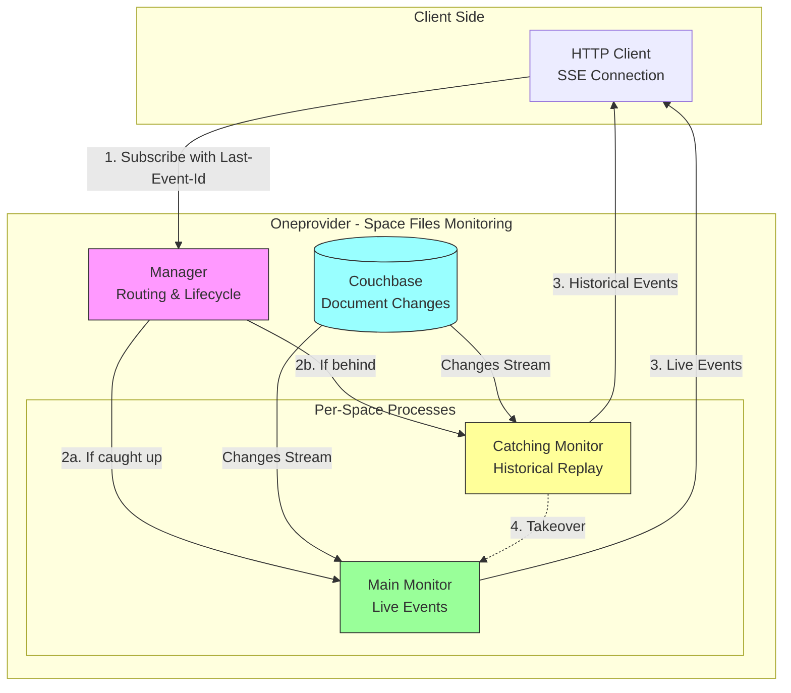

# Space Files Monitoring

Real-time file change notifications for Onedata spaces via **Server-Sent Events (SSE)**.

---

## What is Space Files Monitoring?

Space Files Monitoring is a system that streams real-time notifications when files 
change within specified directories of a space. Think of it as "file system watch" 
for Onedata, delivered over HTTP using Server-Sent Events.

When a file is created, modified, or deleted in a directory you're watching, you 
receive an immediate notification with the file's ID and requested attributes. 
This enables building responsive user interfaces and external integrations that 
stay synchronized with file system state.

## Why Use It?

**Live User Interfaces**: Update file lists in web applications immediately when 
files change, without polling or manual refreshes.

**External Integrations**: Trigger workflows in external systems (data pipelines, 
analysis tools, notification services) the moment files appear or change.

**Collaborative Workflows**: Multiple users or systems can observe the same directories 
and react to changes in real-time, enabling coordinated data processing.

**Efficient Updates**: Receive only the file attributes you need, reducing bandwidth 
and processing overhead compared to polling entire directory listings.

## Key Concepts

Understanding a few core concepts will help you work effectively with the system:

**[Main Monitor](glossary.md#main-monitor)** - The primary monitor process for a space 
that streams live events from the current database sequence. One per actively monitored 
space.

**[Catching Monitor](glossary.md#catching-monitor)** - A temporary monitor that replays 
historical events when you reconnect after a disconnect. Ensures you don't miss any 
changes.

**[Observers](glossary.md#observer)** - Clients subscribed to monitors. Each observer 
specifies which directories to watch and which file attributes to receive.

**[Last-Event-Id](glossary.md#last-event-id)** - SSE standard header containing the 
sequence number of the last event you received. Used for seamless reconnection without 
missing events.

**[Takeover](glossary.md#takeover)** - The seamless transfer from catching monitor 
to main monitor when you've caught up after reconnection.

**[Heartbeat Events](glossary.md#heartbeat-event)** - Periodic updates keeping your 
sequence number current during inactivity, preventing unnecessary replay on reconnect.

## Quick Architecture



### How It Works

1. **Subscribe**: Client connects via HTTP SSE, specifying directories to observe 
   and file attributes to receive.

2. **Route**: Manager routes the client to either:
   - **Main Monitor** (if caught up or first connection)
   - **Catching Monitor** (if behind after disconnect)

3. **Stream Events**: Client receives file change notifications as SSE events, 
   each with a unique sequence ID.

4. **Reconnect** (optional): On disconnect, client reconnects with `Last-Event-Id` 
   header. System replays missed events, then seamlessly transfers to live stream.

## System Guarantees

The monitoring system provides strong consistency and reliability guarantees:

**No Gaps**: When you reconnect with `Last-Event-Id`, you receive every event from 
that point forward. No changes are lost.

**No Duplicates**: Event sequence numbers are strictly increasing. You never receive 
the same event twice during normal operation.

**Authorization**: Every event is checked against your current permissions. If you 
lose access to a directory during monitoring, you stop receiving its events (but 
connection stays alive).

**Eventual Consistency**: Events reflect the state of the underlying database at 
the time of the change. Due to distributed nature of Onedata, there may be brief 
propagation delays across providers.

## Quick Start

### Basic Connection

Connect to receive events from a directory:

```http
GET /api/v3/oneprovider/spaces/{spaceId}/events/files HTTP/1.1
Host: oneprovider.example.com
Authorization: Bearer {access_token}
Accept: text/event-stream
Content-Type: application/json

{
  "observedDirectories": ["{dirObjectId}"],
  "observedAttributes": ["name", "size", "mtime"]
}
```

### Reconnection

After disconnect, reconnect with the last event ID you received:

```http
GET /api/v3/oneprovider/spaces/{spaceId}/events/files HTTP/1.1
Host: oneprovider.example.com
Authorization: Bearer {access_token}
Last-Event-Id: 12345
Accept: text/event-stream
Content-Type: application/json

{
  "observedDirectories": ["{dirObjectId}"],
  "observedAttributes": ["name", "size", "mtime"]
}
```

The system will replay events from sequence 12346 onwards, ensuring you don't 
miss any changes that occurred while disconnected.

### Event Examples

**File Created/Changed:**
```
id: 12346
event: changedOrCreated
data: {
  "fileId": "abc123",
  "parentFileId": "parent456",
  "attributes": {
    "name": "data.csv",
    "size": 1024,
    "mtime": 1704067200
  }
}
```

**File Deleted:**
```
id: 12347
event: deleted
data: {
  "fileId": "abc123",
  "parentFileId": "parent456"
}
```

**Heartbeat:**
```
id: 12450
event: heartbeat
data: null
```

## Important Limitations

Before integrating, understand these key limitations:

**Non-Recursive**: Only direct children of specified directories are monitored. 
Changes in subdirectories are not reported unless you explicitly observe them.

**Document-Level Granularity**: Events indicate a document changed, not which specific 
field. You may receive events even when your observed attributes didn't change.

**Ordering Caveats**: Events for related documents (e.g., file_meta, times, file_location) 
may arrive out of order. Always verify file existence before processing change events.

**Duplicate Deletions**: You may receive multiple deletion events for the same file 
as its metadata is cleaned up.

See [Implementation Notes](implementation_notes.md) for complete details and client 
implementation guidelines.

## Next Steps

**For Client Developers:**
- **[Client Implementation Guide](../../../guides/file_monitoring/client.md)** ⭐ - 
  Complete guide with working examples (Python, curl) and troubleshooting

**For System Understanding:**
- **[Architecture](architecture.md)** - Understand the supervisor hierarchy and 
  process relationships
- **[Monitors](monitors.md)** - Learn how main and catching monitors work
- **[Event Streaming](event_streaming.md)** - Explore event generation, filtering, 
  and authorization
- **[Reconnection](reconnection.md)** - Master the takeover protocol and heartbeat 
  mechanism
- **[Implementation Notes](implementation_notes.md)** - Critical caveats and edge cases

**Reference:**
- **[Glossary](glossary.md)** - Quick reference for all terms
- Test Suite: `test_distributed/suites/space_events/space_events_files_rest_test_SUITE.erl` - 
  Comprehensive test scenarios
