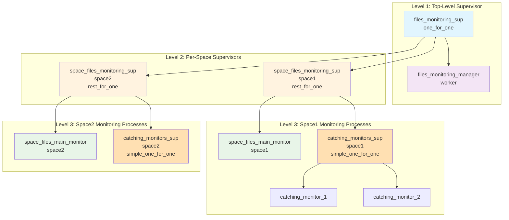
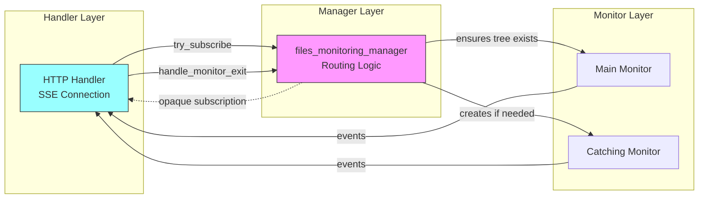
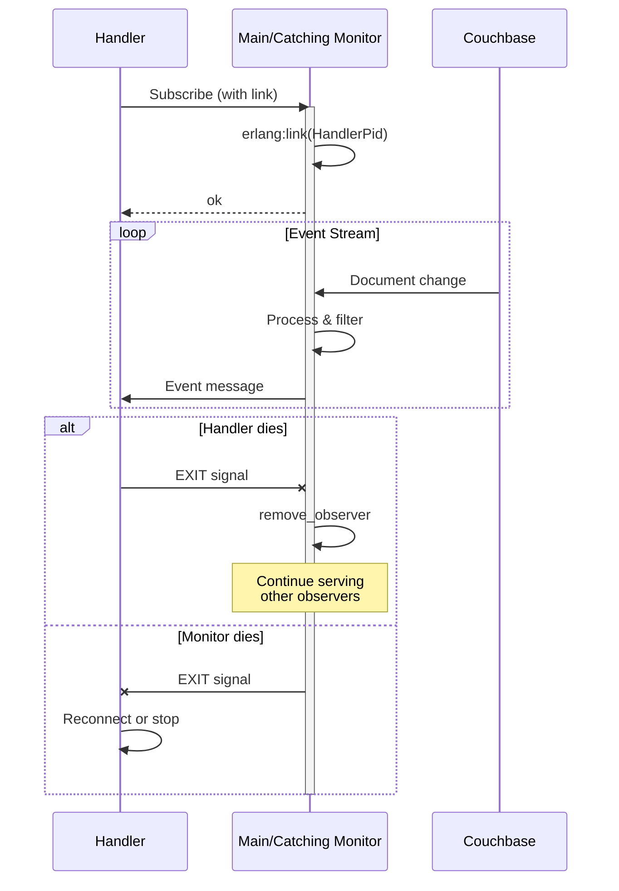
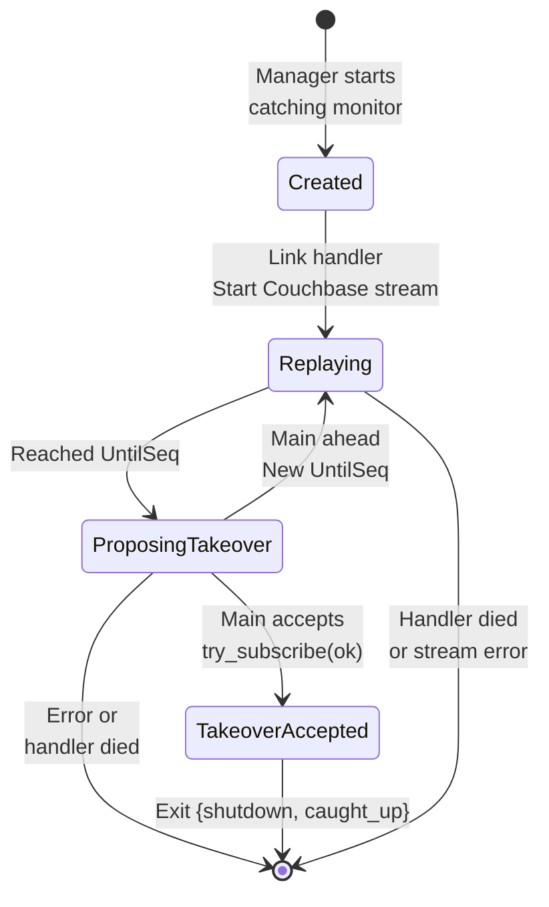

# Space Files Monitoring Architecture

Deep dive into the supervision tree, process relationships, and lifecycle management 
of the space files monitoring system.

---

## Overview

The space files monitoring architecture is built around a 3-level supervisor hierarchy 
that cleanly models the domain: a top-level supervisor manages per-space monitoring 
trees, each space tree consists of a main monitor and a catching monitors supervisor, 
and the catching supervisor dynamically manages temporary replay monitors.

This design ensures proper fault isolation (one space's failure doesn't affect others), 
automatic dependency management (main monitor death terminates catching monitors), 
and efficient resource cleanup (trees terminate on inactivity).

## 3-Level Supervisor Hierarchy



### Level 1: Top-Level Supervisor

**Module**: `files_monitoring_sup`  
**Strategy**: `one_for_one`  
**Responsibility**: Manages per-space supervisor trees and the monitoring manager

The top-level supervisor uses `one_for_one` strategy because each space's monitoring 
is independent - if one space's supervisor fails, others continue unaffected.

**Children**:
1. `files_monitoring_manager` - Coordinates lifecycle and routing (started first)
2. Per-space supervisors - Created dynamically when clients connect

**Key Functions**:
- `ensure_monitoring_tree_for_space/1` - Atomically creates or returns existing 
  space supervisor
- `find_sup_for_space/1` - Looks up existing space supervisor (returns `undefined` if not found)

### Level 2: Per-Space Supervisors

**Module**: `space_files_monitoring_sup`  
**Strategy**: `rest_for_one`  
**Responsibility**: Manages main monitor and catching monitors supervisor for one space

The `rest_for_one` strategy is critical here - it models the dependency relationship 
where catching monitors depend on the main monitor. When the main monitor terminates, 
the catching monitors supervisor (and all its children) must also terminate.

**Children (in order)**:
1. `space_files_main_monitor` - Primary event stream (first child)
2. `space_files_catching_monitors_sup` - Dynamic catching monitors (second child)

**Why rest_for_one?**

The order matters:
- **Main terminates → Catching dies**: Correct! Catching monitors replay to the main's 
  sequence. If main is gone, catching has nowhere to hand off clients.
- **Catching terminates → Main unaffected**: Correct! Individual catching monitor 
  failures don't impact the main stream.

**Restart Strategy**: `temporary` - Space supervisor doesn't restart automatically. 
Reconnecting clients trigger recreation through the manager.

### Level 3: Monitor Processes

#### Main Monitor (Worker)

**Module**: `space_files_main_monitor`  
**Strategy**: N/A (worker, not supervisor)  
**Restart**: `permanent`  
**Responsibility**: Stream live events, accept/reject subscriptions, accept takeovers

One main monitor per space. Streams from current Couchbase sequence. Accepts 
subscriptions if clients are caught up, rejects if behind (triggering catching 
monitor creation).

#### Catching Monitors Supervisor

**Module**: `space_files_catching_monitors_sup`  
**Strategy**: `simple_one_for_one`  
**Responsibility**: Dynamically manage temporary catching monitors

Creates one catching monitor per reconnecting client that is behind. All children 
are the same type (`space_files_catching_monitor`), added and removed dynamically.

#### Catching Monitors (Workers)

**Module**: `space_files_catching_monitor`  
**Strategy**: N/A (worker, not supervisor)  
**Restart**: `temporary`  
**Responsibility**: Replay historical events, propose takeover, terminate

Each catching monitor:
- Replays events from `SinceSeq` to `UntilSeq`
- Proposes takeover when reaching target sequence
- Dies with `{shutdown, caught_up}` after successful takeover

Restart is `temporary` because catching monitors are one-time use - once they 
complete their job (takeover or failure), they shouldn't restart.

## Manager Abstraction

The `files_monitoring_manager` provides a clean abstraction layer between HTTP 
handlers and the monitoring system.



### Manager Responsibilities

**Atomic Tree Creation**:
```erlang
try_subscribe(SpaceId, SubscribeReq) ->
    SpaceSupPid = files_monitoring_sup:ensure_monitoring_tree_for_space(SpaceId),
    do_try_subscribe(SpaceSupPid, SubscribeReq).
```

The manager ensures the space monitoring tree exists before attempting subscription, 
handling races between concurrent first subscribers.

**Routing Decision**:
```erlang
do_try_subscribe(SpaceSupPid, SubscribeReq) ->
    MainMonitorPid = get_main_monitor_pid(SpaceSupPid),
    case space_files_main_monitor:try_subscribe(MainMonitorPid, SubscribeReq) of
        ok ->
            {ok, #subscription{monitor_type = main, ...}};
        {error, {main_ahead, UntilSeq}} ->
            start_catching_monitor(SpaceSupPid, MainMonitorPid, ...)
    end.
```

Based on main monitor's response, routes client to appropriate monitor type.

**EXIT Interpretation**:
```erlang
handle_monitor_exit(Pid, Reason, Subscription) ->
    case {Pid, Reason} of
        {MainPid, _} when MainPid == Subscription#subscription.main_pid ->
            stop;  % Main died - fatal
        {CatchingPid, {shutdown, caught_up}} ->
            {ok, Subscription#subscription{monitor_type = main}};  % Takeover success
        {CatchingPid, _} ->
            stop  % Catching died before takeover - fatal
    end.
```

Interprets EXIT signals from monitors, distinguishing between normal takeover 
and failure cases.

**Opaque Subscription**:

The manager returns an opaque `#subscription{}` record to handlers:
```erlang
-record(subscription, {
    monitor_type :: main | catching,
    main_pid :: pid(),
    catching_pid :: pid() | undefined
}).
```

Handlers don't need to know about supervisor structure or routing logic - they 
just receive events and call `handle_monitor_exit/3` when receiving EXIT signals.

## Process Relationships

### Handler-Monitor Linking



**Bidirectional Links**: Handlers and monitors are linked bidirectionally:
- Handler dies → Monitor receives EXIT, removes observer, continues
- Monitor dies → Handler receives EXIT, reconnects or terminates

**Why linking?**
- Automatic cleanup when handler dies (no orphaned subscriptions)
- Immediate notification when monitor dies (enables reconnection)
- No manual cleanup code needed

### Catching Monitor Lifecycle



**Creation**: Manager creates catching monitor when main rejects subscription
```erlang
{error, {main_ahead, UntilSeq}} = space_files_main_monitor:try_subscribe(...),
{ok, CatchingPid} = space_files_catching_monitors_sup:start_catching_monitor(...)
```

**Replay Phase**: Catching monitor processes documents from `SinceSeq` to `UntilSeq`

**Takeover Proposal**: When reaching target, proposes takeover to main
```erlang
has_reached_target_seq(State) -> CurrentSeq >= UntilSeq
propose_takeover(State) -> space_files_main_monitor:try_subscribe(MainPid, ...)
```

**Termination**: Dies with `{shutdown, caught_up}` after successful takeover, 
triggering handler to update subscription

## Lifecycle Management

### Tree Creation

**Trigger**: First client connects to a space

**Flow**:
1. Handler calls `files_monitoring_manager:try_subscribe(SpaceId, ...)`
2. Manager ensures tree exists: `files_monitoring_sup:ensure_monitoring_tree_for_space(SpaceId)`
3. Supervisor starts per-space tree: main monitor + catching supervisor
4. Main monitor initializes Couchbase stream from current sequence

**Idempotency**: Multiple concurrent first subscribers race-safely - 
`ensure_monitoring_tree_for_space/1` handles `{already_started, Pid}` return.

### Inactivity Timeout

**Trigger**: Main monitor has no observers AND catching supervisor has no children

**Main Monitor Timeout Logic**:
```erlang
is_inactive(State) -> not has_observers(State#state.monitoring).

check_inactivity_timer(State) ->
    case is_inactive(State) of
        true -> schedule_inactivity_shutdown(State);
        false -> cancel_inactivity_shutdown(State)
    end.
```

After `?INACTIVITY_PERIOD_MS` (default: 30 seconds) of inactivity:
1. Main monitor sends `notify_inactive(SpaceId)` to manager
2. Manager double-checks: no observers AND no catching monitors
3. Manager terminates space supervisor tree
4. Supervisor cleanup removes child spec

**Why double-check?**

Race condition: Between main timeout firing and manager checking, a new subscriber 
might have connected. The double-check prevents premature termination.

### Catching Monitor Prevents Timeout

Even if main has no direct observers, it doesn't timeout while catching monitors exist:

```erlang
should_terminate_monitoring_tree(SpaceMonitoringSup) ->
    CatchingCount = get_active_children_count(CatchingSup),
    case CatchingCount of
        0 -> verify_main_inactive();
        _ -> false  % Active catching monitors - don't terminate
    end.
```

**Rationale**: Catching monitors will soon transfer their observers to main via 
takeover. Terminating main would break that handoff.

### Tree Termination

**Cascading Shutdown**: When manager terminates space tree, `rest_for_one` ensures 
proper cleanup:
1. Manager calls `supervisor:terminate_child(files_monitoring_sup, SpaceSupChildId)`
2. Space supervisor terminates catching supervisor (rest_for_one)
3. Catching supervisor terminates all catching monitors
4. Space supervisor terminates main monitor
5. All Couchbase streams are canceled
6. Manager deletes child spec: `supervisor:delete_child(...)`

**Cleanup**: 
```erlang
terminate(Reason, State) ->
    couchbase_changes:cancel_stream(ChangesStreamPid),
    ok.
```

Each monitor cancels its Couchbase stream in terminate callback.

## Design Rationale

### Why 3 Levels?

**Domain Modeling**: The hierarchy directly reflects the domain:
- System has multiple spaces (level 1)
- Each space has one main monitor and many catching monitors (level 2)
- Catching monitors are dynamically created/destroyed (level 3)

**Fault Isolation**: Space failures don't affect other spaces (one_for_one at top level)

**Dependency Management**: Main-catching dependency is automatic (rest_for_one at level 2)

### Why rest_for_one for Per-Space?

**Alternative Considered**: `one_for_all`

If main dies, restart both main and catching supervisor → All catching monitors 
lose their clients anyway (handlers are linked to catching monitors).

**Why rest_for_one is better**:
- More precise: Only dependent children restart
- Catching monitors dying doesn't affect main (correct isolation)
- Matches the actual dependency: catching depends on main, not vice versa

### Why simple_one_for_one for Catching?

**Dynamic Creation**: Catching monitors are created on-demand per reconnecting client

**Uniform Type**: All children are `space_files_catching_monitor` with same spec

**Temporary Restart**: Catching monitors are one-time use, shouldn't restart on failure

**Clean Removal**: Catching monitors self-terminate after takeover, automatic cleanup

### Why Manager as Separate Process?

**Alternative Considered**: Handlers talk directly to supervisors and monitors

**Why manager is better**:
- **Atomic operations**: Tree creation and subscription are a single operation
- **Abstraction**: Handlers don't need to understand supervisor structure
- **Race handling**: Manager centralizes inactivity vs. new subscription races
- **Clean API**: Single entry point for all monitoring operations
- **EXIT interpretation**: Manager encodes knowledge of shutdown semantics

## Related Documentation

- **[Monitors](monitors.md)** - Main and catching monitor implementations
- **[Reconnection](reconnection.md)** - Takeover protocol and lifecycle
- **[Glossary](glossary.md)** - Term definitions
