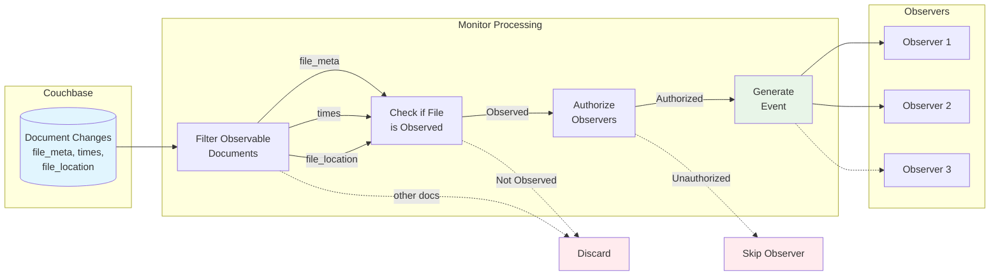
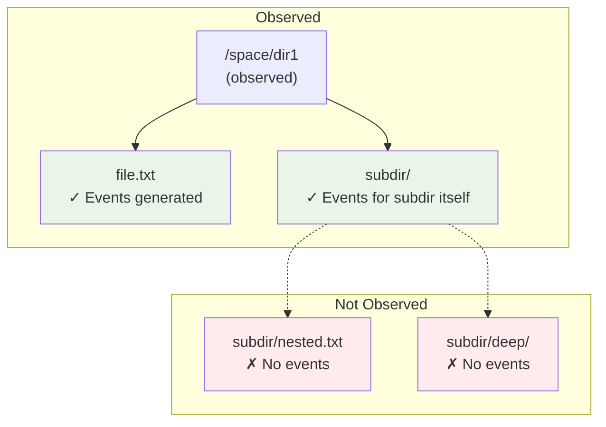
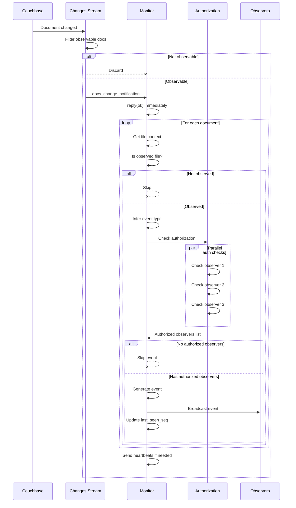

# Space Files Monitoring - Event Streaming

How events are generated, filtered, and delivered to authorized subscribers.

---

## Overview

The event streaming system transforms Couchbase document changes into typed events 
that are delivered only to authorized observers who have specified interest in 
the affected files and attributes.



## Event types

The system generates three types of events, each with a unique sequence ID 
(Couchbase sequence number) and specific structure.

### File Changed/Created Event

**Trigger**: A file in an observed directory is created or modified

**Structure**:
```erlang
-record(file_changed_or_created_event, {
    id :: binary(),                      % Sequence number as binary
    file_guid :: file_id:file_guid(),    % GUID of the affected file
    parent_file_guid :: file_id:file_guid(),  % Parent directory GUID
    doc_type :: file_meta | times | file_location,  % Which doc changed
    file_attr :: file_attr:record()      % Requested attributes
}).
```

**SSE Format**:
```
id: 12346
event: changedOrCreated
data: {
  "fileId": "abc123",
  "parentFileId": "parent456",
  "attributes": {
    "name": "data.csv",
    "size": 1024,
    "mtime": 1704067200,
    "posixPermissions": "664"
  }
}
```

**Generation Sources**:
- `file_meta` document change (not deleted) → attributes like name, mode, type
- `times` document change → attributes like mtime, ctime, atime
- `file_location` document change → attributes like size, replication rate

**Attribute Inclusion**: Only attributes that:
1. The observer requested in their subscription
2. The observer has permission to read
3. Are available for the changed document type

**Important**: You may receive a `changedOrCreated` event even if your requested 
attributes didn't actually change. See [Implementation Notes](implementation_notes.md#document-field-granularity) 
for details.

### File Deleted Event

**Trigger**: A file in an observed directory is deleted

**Structure**:
```erlang
-record(file_deleted_event, {
    id :: binary(),                      % Sequence number as binary
    file_guid :: file_id:file_guid(),    % GUID of the deleted file
    parent_file_guid :: file_id:file_guid()   % Parent directory GUID
}).
```

**SSE Format**:
```
id: 12347
event: deleted
data: {
  "fileId": "abc123",
  "parentFileId": "parent456"
}
```

**Generation Source**: Only `file_meta` document marked as deleted

**No Attributes**: Deleted events contain no file attributes - you only get the 
file and parent GUIDs. This is by design since the file no longer exists.

**Multiple Deletions**: You may receive multiple deletion events for the same file. 
See [Implementation Notes](implementation_notes.md#duplicate-deletion-events) 
for details.

### Heartbeat Event

**Trigger**: Sent when sequence number gap exceeds threshold (default: 100)

**SSE Format**:
```
id: 12450
event: heartbeat
data: null
```

**Purpose**: Keeps client's `Last-Event-Id` current during inactivity. The space 
may be very active (many document changes), but if changes occur outside the client's 
observed directories, the client receives no events and its `Last-Event-Id` becomes 
stale. Heartbeats update the sequence number to prevent unnecessary replay of 
irrelevant events on reconnect.

**Example**: Client observes `/data/input/` but 10,000 changes occur in `/data/output/`. 
Without heartbeats, client would replay all 10,000 events (and discard them). With 
heartbeats, client's sequence stays current.

Learn more: [Reconnection - Heartbeat Mechanism](reconnection.md#heartbeat-mechanism).

## Observable documents

The system monitors changes to three specific Couchbase document types that 
represent file metadata in Onedata.

### file_meta

**Contains**: Core file attributes (e.g. name or deletion)

**Change Events**: Triggers `changedOrCreated` or `deleted` event

**Deletion Detection**: The only document type used to generate deletion events:
```erlang
is_observable_doc(#document{value = #file_meta{}}) -> true;  % Even if deleted
```

When `file_meta` document is marked deleted, the system generates a `deleted` event.

### times

**Contains**: File timestamps

**Change Events**: Triggers `changedOrCreated` event 

**Deletion Handling**: 
```erlang
is_observable_doc(#document{deleted = true}) -> false;  % Skip deleted docs
is_observable_doc(#document{value = #times{}}) -> true;
```

If `times` document is deleted, it's filtered out (no event).

### file_location

**Contains**: File storage and replication information

**Change Events**: Triggers `changedOrCreated` event

**Deletion Handling**: Same as `times` - deleted `file_location` documents are 
filtered out.

### Document change filtering

```erlang
is_observable_doc(#document{value = #file_meta{}}) -> true;
is_observable_doc(#document{deleted = true}) -> false;  % Except file_meta
is_observable_doc(#document{value = #times{}}) -> true;
is_observable_doc(#document{value = #file_location{}}) -> true;
is_observable_doc(_Doc) -> false.  % All other doc types ignored
```

Only observable documents are forwarded to monitors. Other document types are 
discarded in the Couchbase stream callback.

## Filtering logic

Events are filtered through multiple layers to ensure observers receive only 
relevant and authorized events.

### Direct children only

**Non-Recursive Monitoring**: Only immediate children of observed directories 
are monitored.



**Rationale**: Recursive monitoring would be expensive (every file change would 
need ancestor checks) and most use cases only need direct children (e.g., file 
browser showing one directory).

**Nested Monitoring**: To monitor nested directories, explicitly include them 
in `observedDirectories`:
```json
{
  "observedDirectories": [
    "parent_dir_id",
    "subdir1_id",
    "subdir2_id"
  ]
}
```

### Observed attributes per document

Observers specify which attributes they want for each document type:

```erlang
-record(space_files_monitoring_spec, {
    observed_dirs :: [file_id:file_guid()],
    observed_attrs_per_doc :: #{
        file_meta => [name, mode, owner_id],
        times => [mtime, ctime],
        file_location => [size]
    }
}).
```

**Per-Document Type**: Different documents contain different attributes. Clients 
specify independently for each type.

**Union for Multiple Observers**: When multiple observers watch the same directory:
```erlang
Observer1: {file_meta => [name, mode]}
Observer2: {file_meta => [name, size]}

DirMonitoringSpec: {file_meta => [name, mode, size]}  % Union
```

Events are generated with the union of all observers' requested attributes, then 
authorization filters which observers receive the event.

**Skipping Irrelevant Documents**: If an observer doesn't request any attributes 
from a document type, changes to that document type don't generate events for 
that observer:
```erlang
Observer: {file_meta => [name], times => [mtime]}
% file_location changes → no event for this observer
```

### Parent directory lookup

Every document change triggers a parent lookup to determine if the file is in 
an observed directory

**Performance**: This lookup is fast - parent GUID is stored in file_meta document. 
No database queries needed.

**Space Root**: Files in space root are monitored if space root GUID is in 
observed directories.

## Authorization model

Every event is subject to authorization checks using the observer's session 
credentials. Authorization is performed **live** at event generation time, using 
**current** permissions.

### Two-level authorization

**1. File-Level: TRAVERSE_ANCESTORS**

All events require the observer to have `TRAVERSE_ANCESTORS` permission on the file:
```erlang
fslogic_authz:ensure_authorized(
    ObserverUserCtx,
    FileCtx,
    [?TRAVERSE_ANCESTORS]
)
```

This ensures the observer can "see" the file exists in the directory tree.

**2. Attribute-Level: Requested Attributes**

For `changedOrCreated` events, the observer must also have permissions for the 
requested attributes:
```erlang
ObservedAttrs = [name, mode, size],
RequiredPerms = [
    ?TRAVERSE_ANCESTORS,
    ?OPERATIONS(file_attr:optional_attrs_perms_mask(ObservedAttrs))
],
fslogic_authz:ensure_authorized(ObserverUserCtx, FileCtx, RequiredPerms)
```

**Deleted Events**: Only require `TRAVERSE_ANCESTORS` (no attributes to check).

### Live authorization

Authorization checks use **current** permissions at event generation time, not 
historical permissions from when the file was changed.

**Scenario**:
1. File `data.csv` modified at sequence 1000 (observer has access)
2. Observer disconnects
3. Administrator revokes observer's access to directory
4. Observer reconnects at sequence 1001
5. Catching monitor replays from sequence 1001
6. Event for `data.csv` at sequence 1000 is **not sent** (authorization fails)

**Rationale**: 
- Security: Observers shouldn't receive data they no longer have access to
- Simplicity: No need to track historical permissions
- Consistency: Same authorization model for live and replay events

**Implication**: Observers may "miss" events if they lose access during disconnect. 
This is by design - security over completeness.

### Parallelized authorization

Authorization checks are expensive (may involve ACL evaluation, group membership 
checks). The system parallelizes checks across observers:

```erlang
lists_utils:pfiltermap(fun(ObserverPid) ->
    try
        fslogic_authz:ensure_authorized(...),
        {true, ObserverPid}
    catch _:_ ->
        false
    end
end, AllObservers, ?MAX_AUTHZ_VERIFY_PROCS).
```

**Concurrency**: Up to `?MAX_AUTHZ_VERIFY_PROCS` (default: 20) authorization 
checks run in parallel.

**Error Isolation**: One observer's authorization failure doesn't affect others - 
each check is independent.

**Performance**: Parallel checks prevent blocking when multiple observers watch 
the same directory.

### Authorization during replay

Catching monitors perform the same authorization checks as main monitors. This 
ensures:
- Historical events respect current permissions
- No security leaks during replay
- Consistent behavior regardless of connection timing

**Example Test**: `catching_monitor_with_authorization_changes_test`
```erlang
% 1. Observer connects
% 2. Set dir permissions to 700 (observer can't access)
% 3. File created in directory
% 4. Observer doesn't receive event (no access)
% 5. Observer disconnects
% 6. Set dir permissions to 777 (observer can access)
% 7. Observer reconnects with old Last-Event-Id
% 8. Catching monitor replays with LIVE auth
% 9. Observer receives event (now has access)
```

This demonstrates that replay uses current permissions, not historical permissions.

## Document processing flow

Complete flow from Couchbase change to client event:



### Throttling at stream level

The Couchbase changes stream calls the monitor with `gen_server:call`:
```erlang
notify_monitor_callback(MonitorPid, {ok, Docs}) ->
    call_monitor(MonitorPid, #docs_change_notification{docs = Docs}),
    ok.
```

Monitor replies immediately, then processes:
```erlang
handle_call(#docs_change_notification{docs = Docs}, From, State) ->
    gen_server2:reply(From, ok),  % Stream can prepare next batch
    
    NewMonitoring = process_docs(Docs, State#state.monitoring),  % Stream blocks here
    {noreply, State#state{monitoring = NewMonitoring}}.
```

**Backpressure**: Monitor processing time naturally throttles the Couchbase stream 
- if monitor is slow, stream waits.

### Batching

Couchbase may deliver documents in batches. The monitor processes each batch atomically:
1. Process all documents
2. Update current sequence to highest in batch
3. Send heartbeats if needed
4. Reply to next batch

This provides natural checkpointing - if monitor crashes mid-batch, the batch 
is replayed on restart.

## Observable attributes

The system defines which file attributes can be observed:

```erlang
-define(OBSERVABLE_FILE_META_ATTRS, [?attr_name | ?FILE_META_ATTRS]).

-define(OBSERVABLE_FILE_ATTRS,
    lists:flatten([
        ?OBSERVABLE_FILE_META_ATTRS, 
        ?TIMES_FILE_ATTRS, 
        ?LOCATION_FILE_ATTRS
    ]) -- ?INTERNAL_FILE_ATTRS
).
```

**Validation**: Client requests are validated against this list during subscription:
```json
{
  "observedAttributes": ["name", "size", "invalid_attr"]
}
// → Error: invalid_attr not in OBSERVABLE_FILE_ATTRS
```

## Related documentation

- **[Monitors](monitors.md)** - Event generation implementation
- **[Reconnection](reconnection.md)** - Heartbeat mechanism
- **[Implementation Notes](implementation_notes.md)** - Caveats and limitations
- **[Glossary](glossary.md)** - Term definitions
