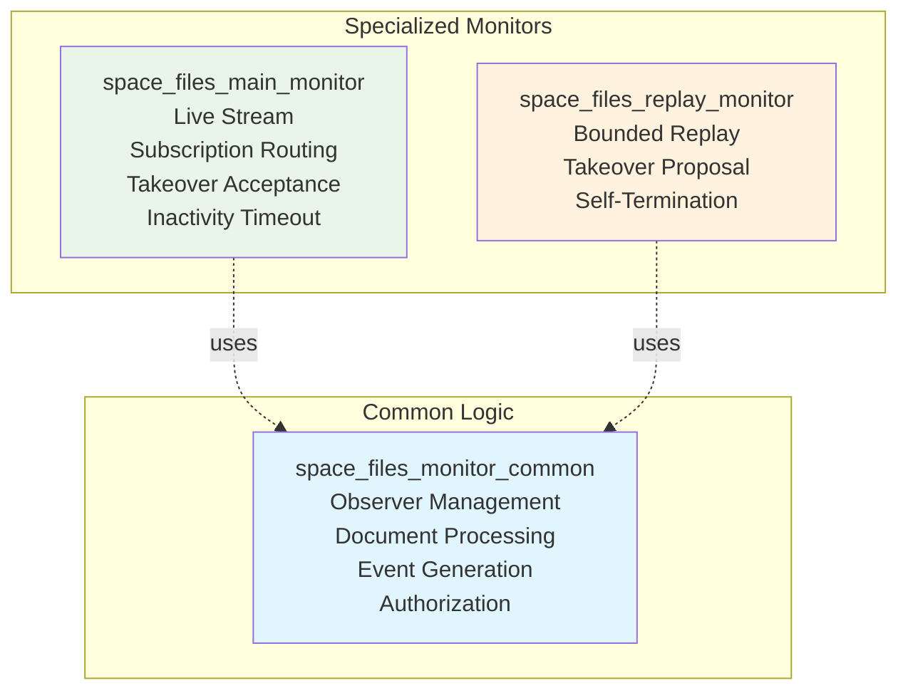
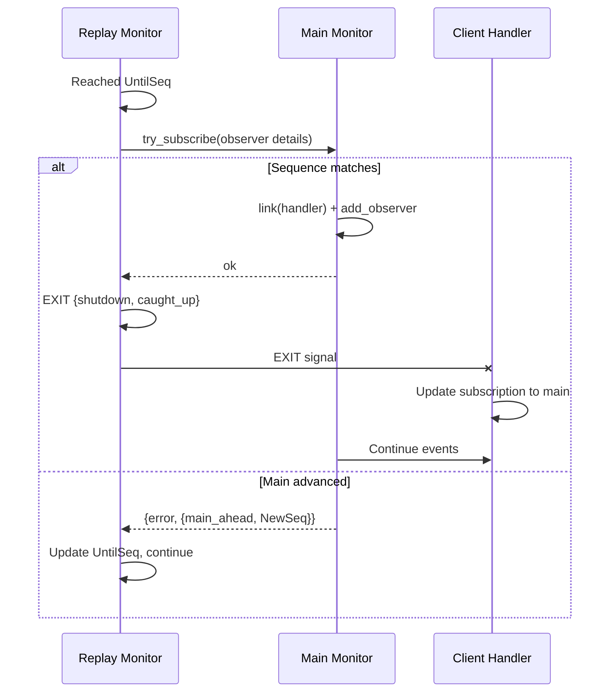

# Space Files Monitoring - Monitors

Overview of monitor types and their responsibilities in the space files monitoring system.

---

## Overview

The monitoring system uses two types of monitors that share common logic but serve 
different purposes:

Both monitors share the same core logic for managing observers, processing documents, 
generating events, and performing authorization checks. They differ only in their 
lifecycle and coordination behavior.

## Monitor types

### Main Monitor

The **main monitor** is the primary, long-lived monitor process for a space.

**Responsibilities**:
- Stream live events from current Couchbase sequence
- Accept or reject client subscriptions based on `Last-Event-Id`
- Accept takeover proposals from replay monitors
- Timeout after inactivity when no observers are connected

**Lifecycle**:
- One per actively monitored space
- Starts from current database sequence
- Runs until space becomes inactive (no observers + no replay monitors)

**Key Decision**: `try_subscribe` atomically determines if a client should:
- Connect directly to main (if caught up)
- Start a replay monitor (if behind)

See [Reconnection](reconnection.md#routing-decision) for detailed routing logic.

### Replay Monitor

A **replay monitor** is a temporary monitor that replays historical events for 
reconnecting clients who are behind.

**Responsibilities**:
- Replay events from `SinceSeq` to `UntilSeq` (bounded range)
- Propose takeover to main monitor when caught up
- Retry if main advances during takeover
- Die gracefully after successful takeover

**Lifecycle**:
- Created on-demand per reconnecting client that is behind
- Replays bounded sequence range
- Dies with `{shutdown, caught_up}` after successful takeover

**Automatic Extension**: If main monitor advances while replay is replaying, 
replay automatically extends its target sequence and continues until caught up.

See [Reconnection](reconnection.md#replay-monitor-lifecycle) for detailed lifecycle.

## Shared logic

Both monitor types use the same implementation for core functionality:

### Observer management

**Observers** are clients subscribed to a monitor. Each observer has:
- Session ID (for authorization)
- Monitoring specification (which directories and attributes to watch)
- Last seen sequence (for heartbeat mechanism)

**Directory Tracking**: The system maintains a mapping of:
- Which directories are being observed
- Which observers are watching each directory
- Which attributes are needed (union of all observers' requests)

This enables efficient filtering - only files in observed directories generate events.

### Document processing

When Couchbase reports document changes, monitors:

1. **Filter observable documents**: Only `file_meta`, `times`, `file_location`
2. **Check if file is observed**: Is the file's parent in observed directories?
3. **Infer event type**: `deleted` or `changedOrCreated`
4. **Authorize observers**: Which observers have permission to see this event?
5. **Generate event**: Create event with requested attributes
6. **Broadcast**: Send event to authorized observers
7. **Update tracking**: Update each observer's `last_seen_seq`

After each batch, monitors check if heartbeat events should be sent.

See [Event Streaming](event_streaming.md) for detailed event generation.

### Authorization

Every event is subject to live authorization checks:

**Two-level authorization**:
1. **File-level**: Observer must have `TRAVERSE_ANCESTORS` permission
2. **Attribute-level**: Observer must have permissions for requested attributes

**Live checks**: Authorization uses current permissions, not historical. This means:
- Observers who lose access stop receiving events (security)
- Replay monitors check current permissions during replay (not stale)
- Same observer may receive different events depending on current access

Authorization checks run in parallel (up to 20 concurrent checks) to prevent blocking 
when multiple observers watch the same directory.

See [Event Streaming - Authorization](event_streaming.md#authorization-model) for details.

### Heartbeat generation

**Problem**: Observers watching inactive directories may have stale `Last-Event-Id` 
even though the space is active elsewhere.

**Solution**: Send heartbeat events when gap between current sequence and observer's 
`last_seen_seq` exceeds threshold (default: 100).

**Per-Observer**: Each observer has independent `last_seen_seq` tracking, so 
heartbeats are sent individually based on activity patterns.

**Opportunistic**: Heartbeats are checked after processing each document batch, 
not on a timer.

See [Reconnection - Heartbeat Mechanism](reconnection.md#heartbeat-mechanism) for 
detailed explanation.

### Couchbase stream throttling

Monitors use a call/reply pattern with Couchbase changes stream to prevent flooding:

**Pattern**:
1. Couchbase stream calls monitor with documents
2. Monitor replies immediately (stream can prepare next batch)
3. Monitor processes documents (stream blocks waiting)
4. Repeat

**Benefits**:
- Natural backpressure - stream waits for monitor
- No flooding - monitor never gets more than one batch ahead
- Parallel preparation - stream prepares while monitor processes

## Key differences

| Aspect | Main Monitor | Replay Monitor |
|---|---|---|
| **Couchbase Stream** | Unbounded (from current sequence) | Bounded (SinceSeq to UntilSeq) |
| **Observers** | Multiple | Single |
| **Restart Strategy** | Permanent | Temporary (one-time use) |
| **Inactivity Timeout** | Yes (after no observers) | No (dies after takeover) |
| **Takeover Role** | Accepts proposals | Proposes to main |
| **EXIT Trapping** | Traps exits (multiple observers) | Doesn't trap (single observer) |

## Takeover protocol

When a replay monitor reaches its target sequence, it proposes takeover to the 
main monitor. This seamlessly transfers the client from replay to main.

**High-level flow**:

**Guarantees**:
- No gaps: Replay streams `[SinceSeq, UntilSeq)`, Main streams `[UntilSeq, ∞)`
- No duplicates: Ranges are disjoint
- Seamless: Client receives continuous stream with no interruption

See [Reconnection - Takeover Protocol](reconnection.md#takeover-protocol) for complete details.

## Design patterns

### Stateless common logic

The `space_files_monitor_common` module is pure Erlang - no process state. All 
functions take a `monitoring()` record and return an updated record. This makes 
the logic easy to test and reuse between monitor types.

### Process vs. monitoring context

**Process State** (`#state{}`): Monitor-specific concerns
- Space ID
- Couchbase stream PID
- Main monitor PID (replay only)
- Until sequence (replay only)
- Inactivity timer (main only)

**Monitoring Context** (`#monitoring{}`): Shared monitoring logic
- Current sequence
- Observers map
- Directory monitoring specs

This separation allows common module to focus on pure monitoring logic while 
monitors handle their specific lifecycle concerns.

### Error isolation

Authorization failures for one observer don't affect others. Each observer's 
authorization is checked independently in parallel, so one failure doesn't block 
or crash the monitor.

### Idempotent operations

Many operations are designed to be idempotent:
- Adding an observer that already exists returns an error (doesn't crash)
- Removing an observer that doesn't exist is a no-op
- Sending multiple heartbeats with the same sequence is safe

This makes the system resilient to race conditions and retry scenarios.

## Related documentation

- **[Architecture](architecture.md)** - Supervisor hierarchy and process relationships
- **[Reconnection](reconnection.md)** - Takeover protocol and heartbeat mechanism
- **[Event Streaming](event_streaming.md)** - Event types and authorization
- **[Glossary](glossary.md)** - Term definitions
