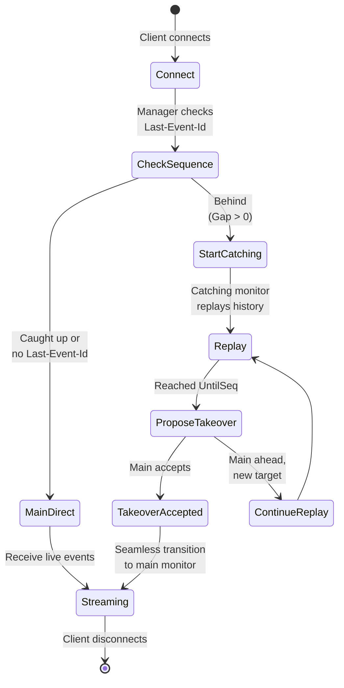
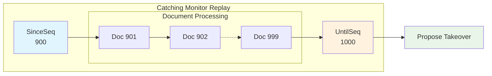
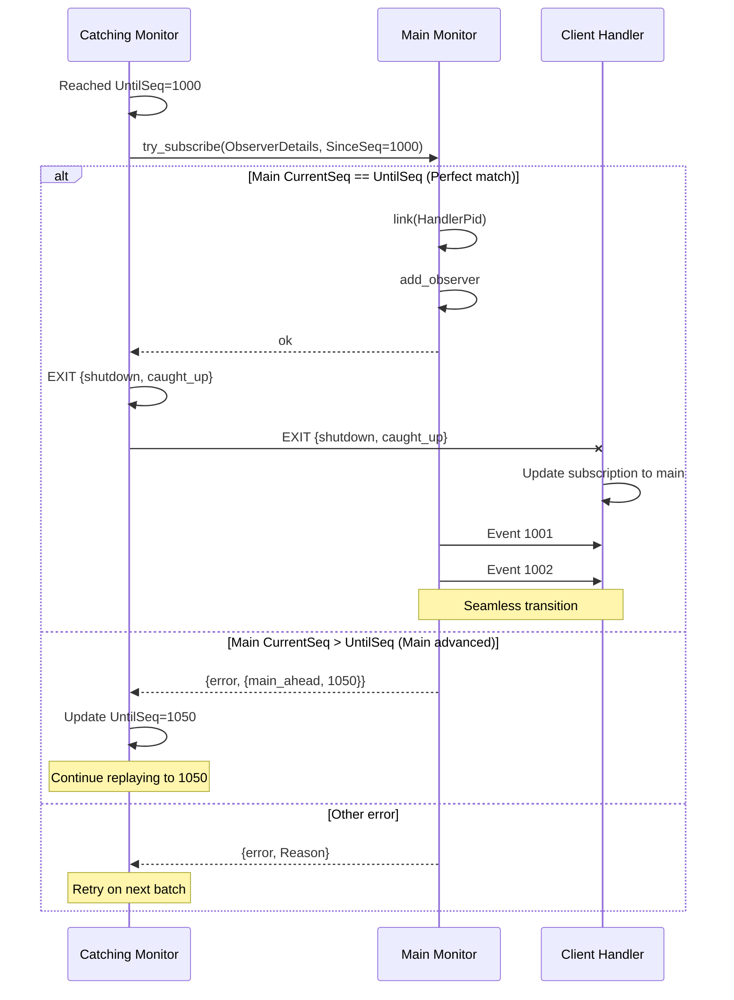
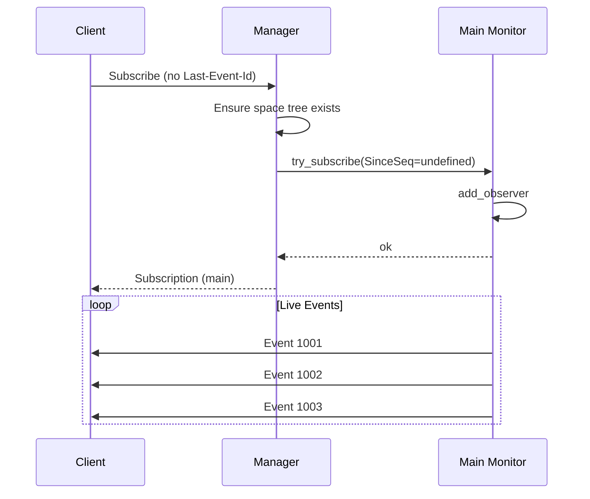
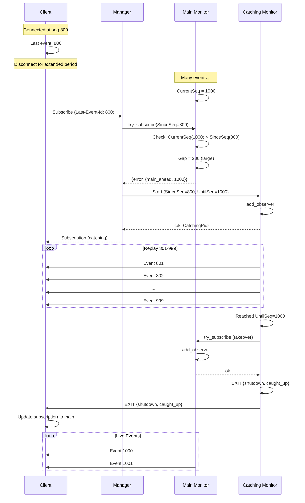
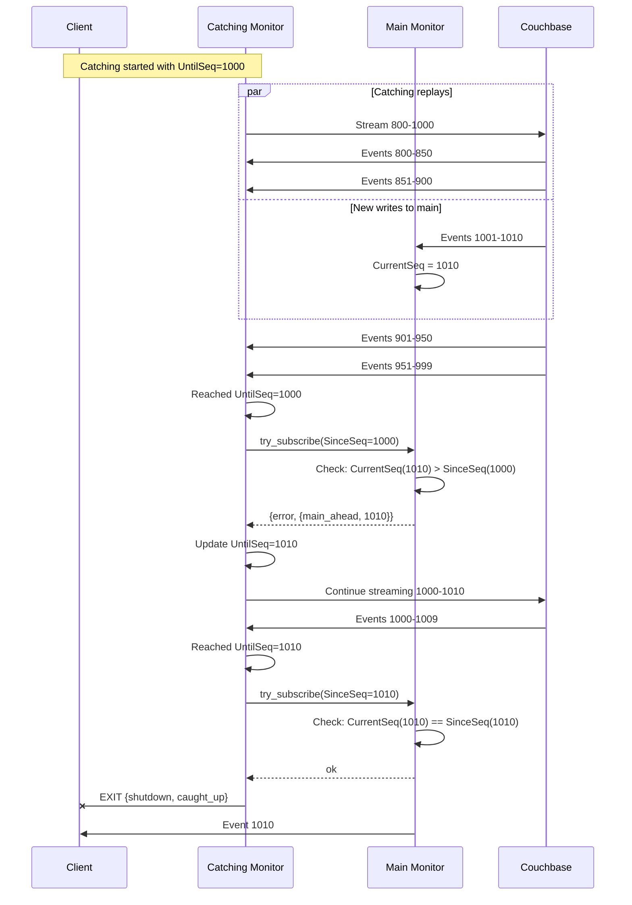
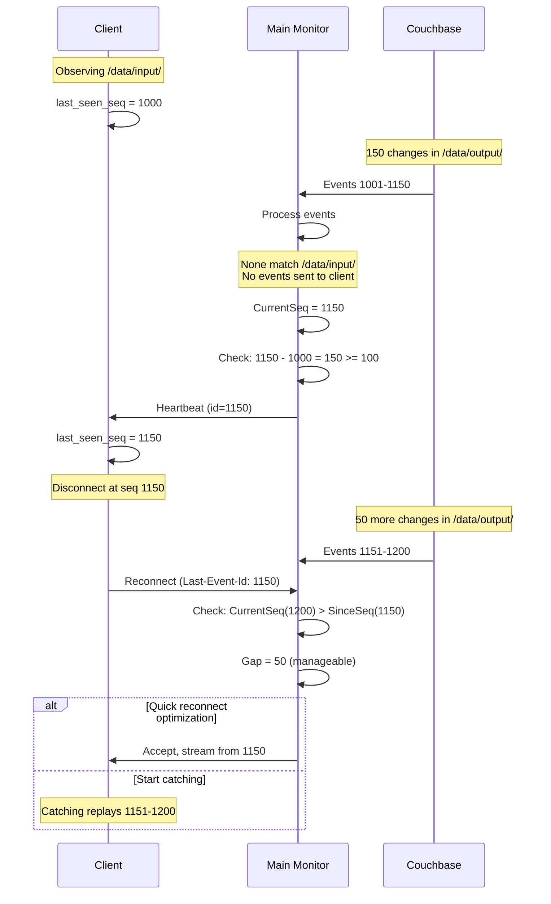

# Space Files Monitoring - Reconnection

Complete guide to Last-Event-Id support, catching monitor lifecycle, takeover 
protocol, and heartbeat mechanism.

---

## Overview

The reconnection system ensures clients never miss events when disconnecting and 
reconnecting. Using the SSE standard `Last-Event-Id` header, clients can resume 
from exactly where they left off, with the system seamlessly handling historical 
replay and transition to live streaming.



## Last-Event-Id support

The `Last-Event-Id` header is part of the SSE specification, designed exactly 
for this use case: resumable event streams.

### SSE standard

When an SSE client receives an event:
```
id: 12345
event: changedOrCreated
data: {...}
```

The client stores `id: 12345` as the last event it received.

On reconnect, the client sends:
```http
GET /api/v3/oneprovider/spaces/{spaceId}/events/files HTTP/1.1
Last-Event-Id: 12345
```

The server interprets this as "I last received sequence 12345, resume from 12346".

### Event IDs are sequence numbers

In this system, event IDs are **Couchbase sequence numbers** converted to strings:
```erlang
#file_changed_or_created_event{
    id = str_utils:to_binary(ChangedDoc#document.seq),
    ...
}
```

**Properties of Sequence Numbers**:
- Monotonically increasing integers
- Globally unique per space
- Persistent across provider restarts
- No gaps within a single document type
- May have gaps across document types (other docs changed)

**Example**:
```
Sequence 1000: file_meta changed → event id: "1000"
Sequence 1001: times changed → event id: "1001"
Sequence 1002: unrelated doc → no event
Sequence 1003: file_location changed → event id: "1003"
```

Client receives events 1000, 1001, 1003. Gap at 1002 is normal (not an observable document).

### Parsing Last-Event-Id

Server parses the header value as an integer:
```erlang
case SubscribeReq#subscribe_req.since_seq of
    undefined -> % No Last-Event-Id - first connection
        ok;
    SinceSeq when is_integer(SinceSeq) ->
        % Client wants to resume from SinceSeq + 1
        check_if_behind(SinceSeq)
end.
```

**Validation**:
- Must be a non-negative integer
- Parsed during request validation
- Invalid values rejected with `400 Bad Request`

## Routing decision

The manager coordinates with the main monitor to determine if a client needs 
historical replay:

```mermaid
sequenceDiagram
    participant C as Client
    participant Mgr as Manager
    participant Main as Main Monitor
    participant CS as Catching Supervisor
    participant Catch as Catching Monitor
    
    C->>Mgr: Subscribe with Last-Event-Id=900
    Mgr->>Mgr: Ensure space tree exists
    Mgr->>Main: try_subscribe(SinceSeq=900)
    
    alt Main CurrentSeq <= SinceSeq (Caught up)
        Main->>Main: add_observer(client)
        Main-->>Mgr: ok
        Mgr-->>C: Subscription (main)
        Note over C,Main: Stream live events
        
    else Main CurrentSeq > SinceSeq (Behind)
        Main-->>Mgr: {error, {main_ahead, 1000}}
        Mgr->>CS: start_catching_monitor(SinceSeq=900, UntilSeq=1000)
        CS->>Catch: Start
        Catch->>Catch: add_observer(client)
        Catch-->>Mgr: {ok, CatchingPid}
        Mgr-->>C: Subscription (catching)
        Note over C,Catch: Replay historical events
    end
```



### Routing logic

**Main Monitor Decision** (`try_subscribe`):
```erlang
handle_call(#subscribe_req{since_seq = SinceSeq}, _From, State) 
        when is_integer(SinceSeq) andalso CurrentSeq > SinceSeq ->
    % Client is behind
    reply({error, {main_ahead, CurrentSeq}}, State);

handle_call(SubscribeReq = #subscribe_req{}, _From, State) ->
    % Client is caught up (or no SinceSeq)
    {ok, NewMonitoring} = add_observer(State#state.monitoring, SubscribeReq),
    reply(ok, State#state{monitoring = NewMonitoring}).
```

**Decision Matrix**:

| Client SinceSeq | Main CurrentSeq | Gap | Decision | Next Step |
|---|---|---|---|---|
| undefined | 1000 | N/A | Caught up | Connect to main |
| 1000 | 1000 | 0 | Caught up | Connect to main |
| 1001 | 1000 | -1 | Ahead | Connect to main (treat as caught up) |
| 900 | 1000 | 100 | Behind | Start catching monitor |
| 500 | 1000 | 500 | Behind | Start catching monitor |

**Why treat "ahead" as caught up?**

Client claims to be ahead (SinceSeq=1001, CurrentSeq=1000). This can happen if:
- Clock skew or sequence rollback (rare)
- Client connected to different provider with slightly different sequence
- Race condition during takeover

Safest approach: Connect to main and stream from current sequence forward. Client 
won't receive duplicate events (sequence only increases).

## Catching monitor lifecycle

When a client is behind, the manager creates a catching monitor to replay missed events.

### Replay phase

Catching monitor processes documents identically to main monitor:
- Filter observable documents
- Check if files are in observed directories
- Perform live authorization checks
- Generate and send events to the single observer



## Takeover protocol

The takeover protocol transfers a client from catching monitor to main monitor 
without gaps or duplicates in the event stream.

### Protocol steps



### Sequence continuity proof

**Catching Range**: `[SinceSeq, UntilSeq)` - **exclusive** upper bound
```
SinceSeq=900, UntilSeq=1000
Catching streams: 900, 901, 902, ..., 999
```

**Main Range**: `[UntilSeq, ∞)` - **inclusive** lower bound
```
UntilSeq=1000
Main streams: 1000, 1001, 1002, ...
```

**Disjoint Ranges**: No overlap
- Catching's last event: 999
- Main's first event: 1000
- No gap: 999 + 1 = 1000 ✓
- No duplicate: 999 ≠ 1000 ✓

**Mathematical Guarantee**:
```
∀ seq ∈ ℤ⁺:
  (seq < UntilSeq → seq in Catching's range) XOR 
  (seq ≥ UntilSeq → seq in Main's range)
```

### Handler EXIT interpretation

When catching monitor dies with `{shutdown, caught_up}`, handler interprets this:
```erlang
handle_monitor_exit(
    CatchingPid,
    {shutdown, caught_up},
    Subscription = #subscription{catching_pid = CatchingPid}
) ->
    % Takeover successful - switch to main
    {ok, Subscription#subscription{
        monitor_type = main,
        catching_pid = undefined
    }}.
```

**No Explicit Handoff Message**: Takeover completion is signaled via process EXIT, 
not a custom message. This is simpler and more robust than a two-message protocol.

### Retry on main ahead

If main monitor advances between catching reaching UntilSeq and proposing takeover:

```
1. Catching reaches UntilSeq=1000 at time T1
2. Meanwhile, new changes arrive at main
3. Main's CurrentSeq advances to 1050 at time T2
4. Catching proposes takeover at time T3
5. Main checks: CurrentSeq(1050) > SinceSeq(1000)
6. Main replies: {error, {main_ahead, 1050}}
7. Catching updates: UntilSeq := 1050
8. Catching continues streaming 1000-1049
9. Catching proposes again when reaching 1050
```

**Convergence**: Eventually catching will catch up to main's sequence (new changes 
can't arrive faster than catching processes old ones, assuming bounded load).

### Graceful termination

Catching monitor's terminate callback:
```erlang
terminate(Reason, State) ->
    couchbase_changes:cancel_stream(ChangesStreamPid),
    ?log_terminate(Reason, State).
```

Cancel the bounded Couchbase stream to free resources.

**Automatic Cleanup**: Catching monitor's supervisor detects termination and 
removes the child spec (temporary restart strategy).

## Heartbeat mechanism

Heartbeat events solve the "stale Last-Event-Id" problem during periods of 
inactivity.

### The problem

**Scenario**:
1. Client observes `/data/input/` directory
2. No files change in `/data/input/` for 24 hours
3. Meanwhile, changes happen in `/data/output/`, `/data/temp/`, etc.
4. Space sequence advances from 1000 to 50000 (49000 changes elsewhere)
5. Client disconnects at sequence 1000
6. Client reconnects with Last-Event-Id: 1000
7. System replays 1001-50000 → 49000 events
8. Client filters and discards 49000 events (none in `/data/input/`)
9. Wasted bandwidth, processing, time

**Root Cause**: Client's Last-Event-Id becomes stale when observed directories 
are inactive, even though the space is active overall.

### The solution

Periodically send "heartbeat" events with current sequence number to keep clients 
up-to-date:
```
id: 15000
event: heartbeat
data: null
```

Client stores `15000` as Last-Event-Id. On reconnect, replay starts from 15001 
instead of 1001.

**Per-Observer**: Each observer has independent `last_seen_seq`, so heartbeats 
are sent individually based on each observer's activity pattern.

**Example**:
```
Observer A observes /active/ (receives events often)
Observer B observes /inactive/ (rarely receives events)

Time T1: Both at seq 1000
Time T2: Events 1001-1050 in /active/
  → Observer A: last_seen_seq = 1050
  → Observer B: last_seen_seq = 1000 (no events in /inactive/)

Time T3: CurrentSeq = 1100, process batch
  Gap for A: 1100 - 1050 = 50 < 100 → No heartbeat
  Gap for B: 1100 - 1000 = 100 >= 100 → Send heartbeat

Observer B receives heartbeat with id=1100
Observer B: last_seen_seq = 1100
```

### When heartbeats are sent

**After Each Batch**: Heartbeats are checked and sent synchronously after processing 
each document batch.

**No Timer**: Heartbeats are **opportunistic**, triggered by document processing 
activity, not by a timer.

**Rationale**: 
- Simpler: No timer management, no timer cancellation
- Natural: Heartbeats piggybacked on existing document processing
- Efficient: No wakeups when system is truly idle
- Sufficient: If space is active (advancing sequence), heartbeats will be sent

**Trade-off**: If space becomes completely idle (no documents changing anywhere), 
no heartbeats are sent. This is acceptable - clients will have fresh Last-Event-Id 
up to the point of space-wide inactivity.

## Flow scenarios

### Scenario 1: First Connection



**Key Points**:
- No Last-Event-Id header → `SinceSeq = undefined`
- Main always accepts undefined SinceSeq
- Streaming starts from current sequence
- Client builds up Last-Event-Id history

### Scenario 2: Slow Reconnect (Behind)



**Key Points**:
- Gap of 200 triggers catching monitor
- Catching replays 199 events (801-999)
- Seamless takeover to main at 1000
- No gaps: Catching's last (999) + 1 = Main's first (1000)
- No duplicates: Ranges are disjoint

### Scenario 3: Concurrent Writes During Catching



**Key Points**:
- Concurrent writes during replay are normal
- Catching automatically extends replay range
- Eventually converges (catching is faster than new writes)
- Client receives all events in order without gaps

### Scenario 4: Heartbeat During Inactivity



**Impact**: Without heartbeat, client would have Last-Event-Id=1000 and would 
replay 1001-1200 (200 events). With heartbeat, client has Last-Event-Id=1150 
and replays only 50 events.

## Related documentation

- **[Architecture](architecture.md)** - Supervisor hierarchy and lifecycle
- **[Monitors](monitors.md)** - Main and catching monitor implementations
- **[Event Streaming](event_streaming.md)** - Event types and generation
- **[Glossary](glossary.md)** - Term definitions
